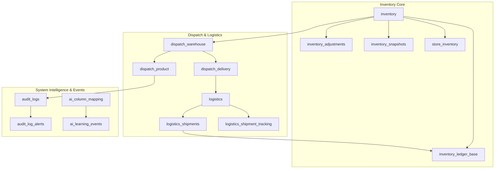
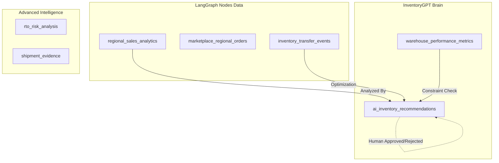

# Database AI Readiness Analysis: InventoryGPT Phase 1

This document analyzes the current state of the database, maps its architecture visually, and compares it against the required architecture for the **InventoryGPT Phase 1** (AI Redistribution & Optimization Engine).

---

## 1. Current Database Architecture Analysis

Your current database is highly advanced and operational. It already tracks complex movements, logistics, auditing, and has early AI mappings. Below is the visual representation of your current core modules.

### Core Architecture Diagram (Current)

**Strengths of Current Architecture:**
- **Ledger & Snapshots:** `inventory_ledger_base` and `inventory_snapshots` provide the historical timeline that AI needs for time-series forecasting.
- **Logistics & Dispatch:** Complete tracking from dispatch creation (`dispatch_warehouse`) to final logistics tracking (`logistics_shipment_tracking`).
- **Audit Stream:** High-quality event streaming via `audit_logs` which captures operations (like `DISPATCH_CREATE`, `DAMAGE_CREATE`) which acts as the perfect trigger for LangGraph agents.

---

## 2. Comparison: Current DB vs. InventoryGPT Requirements

While the current DB excels at *recording operations*, it lacks the tables required for *AI decision-making, scoring, and memory*.

LangGraph agents (like the `stockBalancer` or `regionalDemandClusterer`) need places to store their calculations, their recommendations, and feedback on whether humans accepted or rejected their advice.

### The Gap Analysis

| Category | Current DB Has | Missing for InventoryGPT Phase 1 |
| :--- | :--- | :--- |
| **Sales Analytics** | Website Orders, Products | 🔴 `regional_sales_analytics`, `marketplace_regional_orders` |
| **Transfers** | `self_transfer`, `dispatch_warehouse` | 🔴 `inventory_transfer_events` (Cost & AI reasonings) |
| **Warehouse KPI** | `warehouses`, stock tables | 🔴 `warehouse_performance_metrics` (Speed, dead stock ratio) |
| **AI Memory** | `ai_learning_events` (Basic) | 🔴 `ai_inventory_recommendations` (Core Brain Memory) |
| **RTO/Fraud** | Basic Shipment tracking | 🔴 `rto_risk_analysis`, `shipment_evidence` (For Vision AI) |

---

## 3. What is Pending in the Database? (The Action Plan)

To support the **Priority 1 (Inventory Redistribution AI)**, we must create the following 7 tables. Without these, the LangGraph agents will have to recalculate everything on the fly (very slow and expensive) and won't remember their past decisions.

### Target AI Architecture Diagram (Future State)

### Exact Pending Tables to Create:

1. **`regional_sales_analytics`** (Pending)
   - *Why:* The AI needs to know *where* products are selling to recommend stock redistribution.
2. **`inventory_transfer_events`** (Pending)
   - *Why:* To track if a transfer was AI-recommended, and calculate transfer costs vs expected savings.
3. **`warehouse_performance_metrics`** (Pending)
   - *Why:* To prevent the AI from sending stock to a warehouse with high dead-stock ratios or slow fulfillment speed.
4. **`ai_inventory_recommendations`** (Pending)
   - *Why:* The most critical table. LangGraph will write its advice here. If a manager clicks "Approve", the system executes it. If "Reject", the AI learns not to recommend it again.
5. **`marketplace_regional_orders`** (Pending)
   - *Why:* Aggregates Amazon/Flipkart/Website data into one unified region mapping.
6. **`rto_risk_analysis`** (Pending)
   - *Why:* Stores risk scores calculated by the AI to flag risky orders before dispatch.
7. **`shipment_evidence`** (Pending)
   - *Why:* Stores URLs for top/left/right/package images for camera-based proof and computer vision verification.

## 4. Conclusion & Next Steps

Your operational foundation is perfect. The next step is strictly to execute the SQL commands to create these 7 tables. 

Once these tables exist, the database is ready. We can then move to the backend codebase and begin writing the LangGraph logic (using the Langflow setup you have) to populate these tables.
