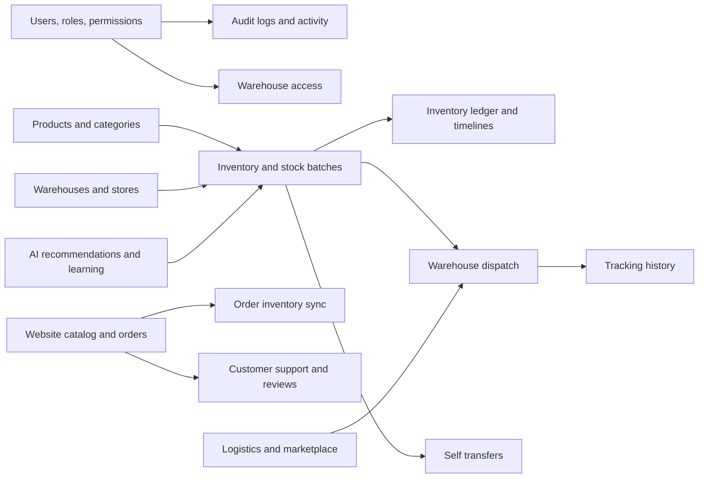
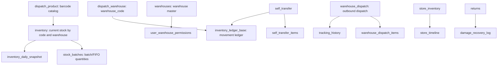
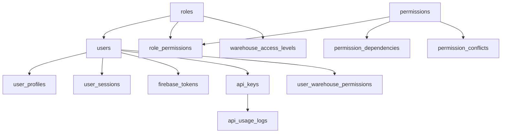
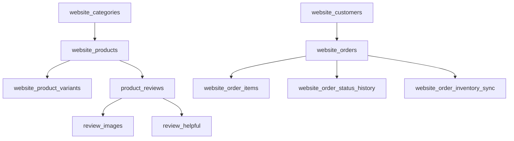

# inventory_db Database Analysis

Generated: 2026-05-13 01:10:15 +05:30

Source: SSH to `ubuntu@13.62.99.152`, then `sudo mysql` against `inventory_db`. This document uses schema metadata, row counts, indexes, views, triggers, routines, and declared foreign keys. It does not include live business/customer row data.

## Executive Summary

- Database: `inventory_db`
- Base tables: 119
- Views: 9
- Declared foreign-key links: 49
- Triggers: 4
- Stored routines/functions: 6
- Exact rows across base tables: 302222

The schema is a mixed operational database. It contains the live inventory/warehouse system, ecommerce website tables, staff authentication and permissions, audit logging, chat/support, logistics, AI/recommendation tables, event/recovery tables, and several legacy or compatibility objects.

## Quick Mental Model



## Main Domains

### AI recommendations and learning

| Table | Type | Rows | Purpose |
|---|---:|---:|---|
| `ai_column_mapping` | BASE TABLE | 12 | AI/automation support table. |
| `ai_inventory_recommendations` | BASE TABLE | 0 | AI/automation support table. |
| `ai_learning_events` | BASE TABLE | 7 | AI/automation support table. |
| `ai_operational_memory` | BASE TABLE | 0 | AI/automation support table. |
| `ai_predictive_alerts` | BASE TABLE | 0 | AI/automation support table. |
| `ai_recommendation_accuracy` | BASE TABLE | 4 | AI/automation support table. |
| `ai_recommendation_results` | BASE TABLE | 0 | AI/automation support table. |
| `ai_warehouse_reputation` | BASE TABLE | 0 | AI/automation support table. |

### Audit and activity logging

| Table | Type | Rows | Purpose |
|---|---:|---:|---|
| `audit_log_alerts` | BASE TABLE | 8 | Purpose inferred from table name and relationships. |
| `audit_log_stats` | BASE TABLE | 8 | Purpose inferred from table name and relationships. |
| `audit_logs` | BASE TABLE | 85 | Detailed application audit trail. |
| `recent_audit_activity` | VIEW |  | Read model/view over one or more base tables. |

### Auth, roles, permissions, and API access

| Table | Type | Rows | Purpose |
|---|---:|---:|---|
| `api_keys` | BASE TABLE | 3 | API key records for programmatic access. |
| `api_usage_logs` | BASE TABLE | 0 | Purpose inferred from table name and relationships. |
| `firebase_tokens` | BASE TABLE | 1 | Purpose inferred from table name and relationships. |
| `permission_conflicts` | BASE TABLE | 2 | Purpose inferred from table name and relationships. |
| `permission_dependencies` | BASE TABLE | 31 | Purpose inferred from table name and relationships. |
| `permission_templates` | BASE TABLE | 7 | Purpose inferred from table name and relationships. |
| `permissions` | BASE TABLE | 155 | Granular permission catalog, including hierarchy through parent_permission_id. |
| `permissions_backup_final` | BASE TABLE | 28 | Purpose inferred from table name and relationships. |
| `role_permissions` | BASE TABLE | 247 | Join table assigning permissions to roles. |
| `roles` | BASE TABLE | 12 | Role definitions used by users and access controls. |
| `user_activity_log` | BASE TABLE | 0 | Purpose inferred from table name and relationships. |
| `user_profiles` | BASE TABLE | 5 | Purpose inferred from table name and relationships. |
| `user_sessions` | BASE TABLE | 0 | Purpose inferred from table name and relationships. |
| `user_warehouse_access` | VIEW |  | Read model/view over one or more base tables. |
| `user_warehouse_permissions` | BASE TABLE | 0 | Purpose inferred from table name and relationships. |
| `users` | BASE TABLE | 2 | Application staff/users for the inventory admin system. |
| `users_compat` | VIEW |  | Read model/view over one or more base tables. |
| `warehouse_access_levels` | BASE TABLE | 0 | Purpose inferred from table name and relationships. |

### Events, workflow, and recovery

| Table | Type | Rows | Purpose |
|---|---:|---:|---|
| `dead_letter_events` | BASE TABLE | 0 | Purpose inferred from table name and relationships. |
| `distributed_lock_tracking` | BASE TABLE | 0 | Purpose inferred from table name and relationships. |
| `event_consistency_audits` | BASE TABLE | 0 | Purpose inferred from table name and relationships. |
| `event_retry_queue` | BASE TABLE | 0 | Purpose inferred from table name and relationships. |
| `operational_event_metrics` | BASE TABLE | 0 | Purpose inferred from table name and relationships. |
| `operational_event_store` | BASE TABLE | 0 | Purpose inferred from table name and relationships. |
| `system_recovery_checkpoints` | BASE TABLE | 0 | Purpose inferred from table name and relationships. |
| `workflow_saga_tracking` | BASE TABLE | 0 | Purpose inferred from table name and relationships. |

### Inventory, warehouse, dispatch, store, and returns

| Table | Type | Rows | Purpose |
|---|---:|---:|---|
| `bills` | BASE TABLE | 17 | Billing/invoice records with items stored as JSON. |
| `cost_ledger` | BASE TABLE | 1 | Purpose inferred from table name and relationships. |
| `damage_recovery_log` | BASE TABLE | 85 | Purpose inferred from table name and relationships. |
| `dispatch_delivery` | BASE TABLE | 7 | Purpose inferred from table name and relationships. |
| `dispatch_product` | BASE TABLE | 201 | Dispatch-side product catalog keyed by barcode. |
| `dispatch_warehouse` | BASE TABLE | 5 | Legacy/dispatch warehouse master keyed by warehouse_code. |
| `inventory` | BASE TABLE | 0 | Current inventory quantity by product/code and warehouse. |
| `inventory_adjustments` | BASE TABLE | 0 | Purpose inferred from table name and relationships. |
| `inventory_daily_snapshot` | BASE TABLE | 0 | Purpose inferred from table name and relationships. |
| `inventory_ledger_base` | BASE TABLE | 406 | Append-only movement ledger for stock events. |
| `inventory_reconciliation_logs` | BASE TABLE | 0 | Purpose inferred from table name and relationships. |
| `inventory_snapshots` | BASE TABLE | 0 | Purpose inferred from table name and relationships. |
| `inventory_state_tracking` | BASE TABLE | 2 | Purpose inferred from table name and relationships. |
| `inventory_transfer_events` | BASE TABLE | 0 | Purpose inferred from table name and relationships. |
| `inventory_transfer_tasks` | BASE TABLE | 0 | Purpose inferred from table name and relationships. |
| `locations_geo` | BASE TABLE | 31 | Purpose inferred from table name and relationships. |
| `payment_mode` | BASE TABLE | 5 | Purpose inferred from table name and relationships. |
| `product_categories` | BASE TABLE | 9 | Purpose inferred from table name and relationships. |
| `product_headquatory` | BASE TABLE | 2679 | Purpose inferred from table name and relationships. |
| `product_parts` | BASE TABLE | 0 | Purpose inferred from table name and relationships. |
| `product_reviews` | BASE TABLE | 6 | Purpose inferred from table name and relationships. |
| `products` | BASE TABLE | 1 | Purpose inferred from table name and relationships. |
| `products_compat` | VIEW |  | Read model/view over one or more base tables. |
| `return_parts` | BASE TABLE | 0 | Purpose inferred from table name and relationships. |
| `returns` | BASE TABLE | 147 | Returns records in the active returns flow. |
| `returns_main` | BASE TABLE | 1 | Purpose inferred from table name and relationships. |
| `self_transfer` | BASE TABLE | 29 | Internal stock transfer header records. |
| `self_transfer_items` | BASE TABLE | 29 | Line items for internal stock transfers. |
| `stock_batches` | BASE TABLE | 378 | Batch/FIFO style stock lots for product inventory. |
| `stock_delta_view` | VIEW |  | Read model/view over one or more base tables. |
| `stock_transactions` | BASE TABLE | 0 | Purpose inferred from table name and relationships. |
| `store_inventory` | BASE TABLE | 6 | Current store-side inventory by barcode and store_code. |
| `store_inventory_logs` | BASE TABLE | 0 | Purpose inferred from table name and relationships. |
| `store_timeline` | BASE TABLE | 13 | Store inventory movement timeline/audit table. |
| `stores` | BASE TABLE | 9 | Purpose inferred from table name and relationships. |
| `tracking_history` | BASE TABLE | 694 | Shipment tracking scan history. |
| `tracking_history_backup` | BASE TABLE | 294794 | Large backup/archive copy of tracking history. |
| `warehouse_dispatch` | BASE TABLE | 8 | Outbound warehouse dispatch/order records. |
| `warehouse_dispatch_items` | BASE TABLE | 17 | Line items for warehouse_dispatch. |
| `warehouse_order_activity` | BASE TABLE | 14 | Purpose inferred from table name and relationships. |
| `warehouse_performance_metrics` | BASE TABLE | 0 | Purpose inferred from table name and relationships. |
| `warehousestaff_processed` | BASE TABLE | 12 | Purpose inferred from table name and relationships. |

### Logistics, marketplace, and fulfillment intelligence

| Table | Type | Rows | Purpose |
|---|---:|---:|---|
| `fulfillment_economic_analysis` | BASE TABLE | 0 | Purpose inferred from table name and relationships. |
| `logistics` | BASE TABLE | 4 | Shipping/logistics integration table. |
| `logistics_courier_configs` | BASE TABLE | 0 | Shipping/logistics integration table. |
| `logistics_shipment_tracking` | BASE TABLE | 0 | Shipping/logistics integration table. |
| `logistics_shipments` | BASE TABLE | 0 | Shipping/logistics integration table. |
| `logistics_wallet_transactions` | BASE TABLE | 0 | Shipping/logistics integration table. |
| `logistics_wallets` | BASE TABLE | 0 | Shipping/logistics integration table. |
| `marketplace_regional_orders` | BASE TABLE | 0 | Purpose inferred from table name and relationships. |
| `marketplace_sync_failures` | BASE TABLE | 0 | Purpose inferred from table name and relationships. |
| `rto_risk_analysis` | BASE TABLE | 0 | Purpose inferred from table name and relationships. |
| `shipment_evidence` | BASE TABLE | 0 | Purpose inferred from table name and relationships. |

### Messaging, notifications, and support

| Table | Type | Rows | Purpose |
|---|---:|---:|---|
| `conversation_invites` | BASE TABLE | 0 | Purpose inferred from table name and relationships. |
| `conversation_participants` | BASE TABLE | 0 | Purpose inferred from table name and relationships. |
| `conversations` | BASE TABLE | 70 | Purpose inferred from table name and relationships. |
| `customer_support_bot_responses` | BASE TABLE | 12 | Purpose inferred from table name and relationships. |
| `customer_support_conversations` | BASE TABLE | 109 | Customer support conversation headers. |
| `customer_support_messages` | BASE TABLE | 515 | Messages inside customer support conversations. |
| `customer_support_ratings` | BASE TABLE | 0 | Purpose inferred from table name and relationships. |
| `message_reads` | BASE TABLE | 196 | Purpose inferred from table name and relationships. |
| `messages` | BASE TABLE | 314 | Purpose inferred from table name and relationships. |
| `notification_preferences` | BASE TABLE | 10 | Purpose inferred from table name and relationships. |
| `notification_settings` | BASE TABLE | 0 | Purpose inferred from table name and relationships. |
| `notifications` | BASE TABLE | 564 | User notification records. |
| `ticket_attachments` | BASE TABLE | 0 | Purpose inferred from table name and relationships. |
| `ticket_followups` | BASE TABLE | 30 | Purpose inferred from table name and relationships. |
| `tickets` | BASE TABLE | 12 | Internal support/task tickets. |

### Other / legacy

| Table | Type | Rows | Purpose |
|---|---:|---:|---|
| `customer_loyalty_scores` | BASE TABLE | 2 | Purpose inferred from table name and relationships. |
| `regional_sales_analytics` | BASE TABLE | 0 | Purpose inferred from table name and relationships. |
| `review_helpful` | BASE TABLE | 0 | Purpose inferred from table name and relationships. |
| `review_images` | BASE TABLE | 0 | Purpose inferred from table name and relationships. |
| `storeinventory` | BASE TABLE | 0 | Purpose inferred from table name and relationships. |
| `warehouses` | BASE TABLE | 6 | Canonical warehouse master data. |

### Tenancy and utility

| Table | Type | Rows | Purpose |
|---|---:|---:|---|
| `processed_persons` | BASE TABLE | 4 | Purpose inferred from table name and relationships. |
| `tenants` | BASE TABLE | 1 | Purpose inferred from table name and relationships. |

### Website and ecommerce

| Table | Type | Rows | Purpose |
|---|---:|---:|---|
| `website` | BASE TABLE | 8 | Purpose inferred from table name and relationships. |
| `website_bulk_uploads` | BASE TABLE | 0 | Purpose inferred from table name and relationships. |
| `website_categories` | BASE TABLE | 18 | Website storefront category tree. |
| `website_customers` | BASE TABLE | 11 | Customer accounts for the website storefront. |
| `website_featured_products` | VIEW |  | Read model/view over one or more base tables. |
| `website_low_stock_products` | VIEW |  | Read model/view over one or more base tables. |
| `website_order_details` | VIEW |  | Read model/view over one or more base tables. |
| `website_order_inventory_sync` | BASE TABLE | 0 | Purpose inferred from table name and relationships. |
| `website_order_items` | BASE TABLE | 29 | Website order line items. |
| `website_order_status_history` | BASE TABLE | 3 | Purpose inferred from table name and relationships. |
| `website_orders` | BASE TABLE | 23 | Website order headers. |
| `website_product_variants` | BASE TABLE | 0 | Purpose inferred from table name and relationships. |
| `website_products` | BASE TABLE | 58 | Website storefront product catalog. |
| `website_products_with_category` | VIEW |  | Read model/view over one or more base tables. |

## Largest Tables By Exact Row Count

| Table | Rows |
|---|---:|
| `tracking_history_backup` | 294794 |
| `product_headquatory` | 2679 |
| `tracking_history` | 694 |
| `notifications` | 564 |
| `customer_support_messages` | 515 |
| `inventory_ledger_base` | 406 |
| `stock_batches` | 378 |
| `messages` | 314 |
| `role_permissions` | 247 |
| `dispatch_product` | 201 |
| `message_reads` | 196 |
| `permissions` | 155 |

## Declared Foreign-Key Diagram

This diagram shows only relationships enforced by the database. Several important business links are stored as plain columns and are listed later as inferred relationships.

```mermaid
erDiagram
  ai_inventory_recommendations ||--o{ ai_recommendation_results : recommendation_id_to_id
  api_keys ||--o{ api_usage_logs : api_key_id_to_id
  conversations ||--o{ conversation_participants : conversation_id_to_id
  conversations ||--o{ messages : conversation_id_to_id
  customer_support_conversations ||--o{ customer_support_messages : conversation_id_to_conversation_id
  customer_support_conversations ||--o{ customer_support_ratings : conversation_id_to_conversation_id
  dispatch_warehouse ||--o{ inventory_ledger_base : location_code_to_warehouse_code
  logistics_shipments ||--o{ logistics_shipment_tracking : shipment_id_to_shipment_id
  logistics_wallets ||--o{ logistics_wallet_transactions : wallet_id_to_wallet_id
  messages ||--o{ message_reads : message_id_to_id
  permissions ||--o{ permissions : parent_permission_id_to_id
  permissions ||--o{ permission_conflicts : conflicting_permission_id_to_id
  permissions ||--o{ permission_conflicts : permission_id_to_id
  permissions ||--o{ permission_dependencies : permission_id_to_id
  permissions ||--o{ permission_dependencies : required_permission_id_to_id
  permissions ||--o{ role_permissions : permission_id_to_id
  products ||--o{ stock_transactions : product_id_to_product_id
  product_categories ||--o{ dispatch_product : category_id_to_id
  product_categories ||--o{ product_categories : parent_id_to_id
  product_reviews ||--o{ review_helpful : review_id_to_id
  product_reviews ||--o{ review_images : review_id_to_id
  returns_main ||--o{ return_parts : return_id_to_id
  roles ||--o{ role_permissions : role_id_to_id
  roles ||--o{ users : role_id_to_id
  roles ||--o{ warehouse_access_levels : role_id_to_id
  self_transfer ||--o{ self_transfer_items : transfer_id_to_id
  tickets ||--o{ ticket_attachments : ticket_id_to_id
  tickets ||--o{ ticket_followups : ticket_id_to_id
  users ||--o{ audit_logs : user_id_to_id
  users ||--o{ conversations : created_by_to_id
  users ||--o{ conversation_participants : user_id_to_id
  users ||--o{ firebase_tokens : user_id_to_id
  users ||--o{ messages : sender_id_to_id
  users ||--o{ message_reads : user_id_to_id
  users ||--o{ notification_preferences : user_id_to_id
  users ||--o{ permission_templates : created_by_to_id
  users ||--o{ users : disabled_by_to_id
  users ||--o{ user_profiles : user_id_to_id
  users ||--o{ user_sessions : user_id_to_id
  users ||--o{ user_warehouse_permissions : user_id_to_id
  users ||--o{ warehouse_order_activity : created_by_to_id
  warehouse_dispatch ||--o{ warehouse_dispatch_items : dispatch_id_to_id
  website_categories ||--o{ website_categories : parent_id_to_id
  website_categories ||--o{ website_products : category_id_to_id
  website_customers ||--o{ review_helpful : user_id_to_id
  website_orders ||--o{ website_order_inventory_sync : website_order_id_to_id
  website_orders ||--o{ website_order_items : order_id_to_id
  website_orders ||--o{ website_order_status_history : order_id_to_id
  website_products ||--o{ website_product_variants : product_id_to_id
```



## Important Declared Relationships

| Child table | Column | Parent table | Parent column | On update | On delete | Constraint |
|---|---|---|---|---|---|---|
| `ai_recommendation_results` | `recommendation_id` | `ai_inventory_recommendations` | `id` | RESTRICT | RESTRICT | `ai_recommendation_results_ibfk_1` |
| `api_usage_logs` | `api_key_id` | `api_keys` | `id` | RESTRICT | CASCADE | `fk_api_usage_logs_api_key` |
| `conversation_participants` | `conversation_id` | `conversations` | `id` | RESTRICT | RESTRICT | `conversation_participants_ibfk_1` |
| `messages` | `conversation_id` | `conversations` | `id` | RESTRICT | RESTRICT | `messages_ibfk_1` |
| `customer_support_messages` | `conversation_id` | `customer_support_conversations` | `conversation_id` | RESTRICT | CASCADE | `customer_support_messages_ibfk_1` |
| `customer_support_ratings` | `conversation_id` | `customer_support_conversations` | `conversation_id` | RESTRICT | CASCADE | `customer_support_ratings_ibfk_1` |
| `inventory_ledger_base` | `location_code` | `dispatch_warehouse` | `warehouse_code` | CASCADE | RESTRICT | `fk_inventory_warehouse` |
| `logistics_shipment_tracking` | `shipment_id` | `logistics_shipments` | `shipment_id` | RESTRICT | RESTRICT | `logistics_shipment_tracking_ibfk_1` |
| `logistics_wallet_transactions` | `wallet_id` | `logistics_wallets` | `wallet_id` | RESTRICT | RESTRICT | `logistics_wallet_transactions_ibfk_1` |
| `message_reads` | `message_id` | `messages` | `id` | RESTRICT | CASCADE | `message_reads_ibfk_1` |
| `permissions` | `parent_permission_id` | `permissions` | `id` | RESTRICT | SET NULL | `fk_parent_permission` |
| `permission_conflicts` | `conflicting_permission_id` | `permissions` | `id` | RESTRICT | CASCADE | `permission_conflicts_ibfk_2` |
| `permission_conflicts` | `permission_id` | `permissions` | `id` | RESTRICT | CASCADE | `permission_conflicts_ibfk_1` |
| `permission_dependencies` | `permission_id` | `permissions` | `id` | RESTRICT | CASCADE | `permission_dependencies_ibfk_1` |
| `permission_dependencies` | `required_permission_id` | `permissions` | `id` | RESTRICT | CASCADE | `permission_dependencies_ibfk_2` |
| `role_permissions` | `permission_id` | `permissions` | `id` | RESTRICT | CASCADE | `role_permissions_ibfk_2` |
| `stock_transactions` | `product_id` | `products` | `product_id` | RESTRICT | RESTRICT | `stock_transactions_ibfk_1` |
| `dispatch_product` | `category_id` | `product_categories` | `id` | RESTRICT | SET NULL | `fk_product_category` |
| `product_categories` | `parent_id` | `product_categories` | `id` | RESTRICT | SET NULL | `fk_parent_category` |
| `review_helpful` | `review_id` | `product_reviews` | `id` | RESTRICT | CASCADE | `review_helpful_ibfk_1` |
| `review_images` | `review_id` | `product_reviews` | `id` | RESTRICT | CASCADE | `review_images_ibfk_1` |
| `return_parts` | `return_id` | `returns_main` | `id` | RESTRICT | CASCADE | `fk_return_id` |
| `role_permissions` | `role_id` | `roles` | `id` | RESTRICT | CASCADE | `role_permissions_ibfk_1` |
| `users` | `role_id` | `roles` | `id` | RESTRICT | RESTRICT | `fk_users_role_id` |
| `warehouse_access_levels` | `role_id` | `roles` | `id` | RESTRICT | CASCADE | `warehouse_access_levels_ibfk_1` |
| `self_transfer_items` | `transfer_id` | `self_transfer` | `id` | RESTRICT | CASCADE | `self_transfer_items_ibfk_1` |
| `ticket_attachments` | `ticket_id` | `tickets` | `id` | RESTRICT | CASCADE | `ticket_attachments_ibfk_1` |
| `ticket_followups` | `ticket_id` | `tickets` | `id` | RESTRICT | CASCADE | `ticket_followups_ibfk_1` |
| `audit_logs` | `user_id` | `users` | `id` | RESTRICT | SET NULL | `audit_logs_ibfk_1` |
| `conversations` | `created_by` | `users` | `id` | RESTRICT | RESTRICT | `conversations_ibfk_1` |
| `conversation_participants` | `user_id` | `users` | `id` | RESTRICT | RESTRICT | `conversation_participants_ibfk_2` |
| `firebase_tokens` | `user_id` | `users` | `id` | RESTRICT | CASCADE | `firebase_tokens_ibfk_1` |
| `messages` | `sender_id` | `users` | `id` | RESTRICT | RESTRICT | `messages_ibfk_2` |
| `message_reads` | `user_id` | `users` | `id` | RESTRICT | CASCADE | `message_reads_ibfk_2` |
| `notification_preferences` | `user_id` | `users` | `id` | RESTRICT | CASCADE | `notification_preferences_ibfk_1` |
| `permission_templates` | `created_by` | `users` | `id` | RESTRICT | SET NULL | `permission_templates_ibfk_1` |
| `users` | `disabled_by` | `users` | `id` | RESTRICT | SET NULL | `fk_users_disabled_by` |
| `user_profiles` | `user_id` | `users` | `id` | RESTRICT | CASCADE | `fk_user_profiles_user` |
| `user_sessions` | `user_id` | `users` | `id` | RESTRICT | CASCADE | `user_sessions_ibfk_1` |
| `user_warehouse_permissions` | `user_id` | `users` | `id` | RESTRICT | CASCADE | `user_warehouse_permissions_ibfk_1` |
| `warehouse_order_activity` | `created_by` | `users` | `id` | RESTRICT | SET NULL | `warehouse_order_activity_ibfk_1` |
| `warehouse_dispatch_items` | `dispatch_id` | `warehouse_dispatch` | `id` | RESTRICT | CASCADE | `fk_dispatch` |
| `website_categories` | `parent_id` | `website_categories` | `id` | RESTRICT | SET NULL | `website_categories_ibfk_1` |
| `website_products` | `category_id` | `website_categories` | `id` | RESTRICT | RESTRICT | `website_products_ibfk_1` |
| `review_helpful` | `user_id` | `website_customers` | `id` | RESTRICT | CASCADE | `review_helpful_ibfk_2` |
| `website_order_inventory_sync` | `website_order_id` | `website_orders` | `id` | RESTRICT | CASCADE | `website_order_inventory_sync_ibfk_1` |
| `website_order_items` | `order_id` | `website_orders` | `id` | RESTRICT | CASCADE | `website_order_items_ibfk_1` |
| `website_order_status_history` | `order_id` | `website_orders` | `id` | RESTRICT | CASCADE | `website_order_status_history_ibfk_1` |
| `website_product_variants` | `product_id` | `website_products` | `id` | RESTRICT | CASCADE | `website_product_variants_ibfk_1` |

## Core Inventory Flow



## Auth And Permission Flow



## Website / Ecommerce Flow



## Views

### `products_compat`

```sql
select `inventory_db`.`products`.`product_id` AS `p_id`,`inventory_db`.`products`.`product_id` AS `product_id`,`inventory_db`.`products`.`product_name` AS `product_name`,`inventory_db`.`products`.`sku` AS `sku`,`inventory_db`.`products`.`price` AS `price`,`inventory_db`.`products`.`created_at` AS `created_at`,`inventory_db`.`products`.`updated_at` AS `updated_at` from `inventory_db`.`products`
```

### `recent_audit_activity`

```sql
select `al`.`id` AS `id`,`al`.`event_type` AS `event_type`,`al`.`action` AS `action`,`al`.`resource_type` AS `resource_type`,`al`.`resource_id` AS `resource_id`,`al`.`user_id` AS `user_id`,`u`.`name` AS `user_name`,`u`.`email` AS `user_email`,`al`.`ip_address` AS `ip_address`,`al`.`location_country` AS `location_country`,`al`.`location_city` AS `location_city`,`al`.`severity` AS `severity`,`al`.`status` AS `status`,`al`.`created_at` AS `created_at` from (`inventory_db`.`audit_logs` `al` left join `inventory_db`.`users` `u` on(`al`.`user_id` = `u`.`id`)) order by `al`.`created_at` desc limit 1000
```

### `stock_delta_view`

```sql
select 1 AS `id`,1 AS `event_time`,1 AS `barcode`,1 AS `product_name`,1 AS `location_code`,1 AS `movement_type`,1 AS `reference`,1 AS `delta_qty`
```

### `users_compat`

```sql
select `inventory_db`.`website_customers`.`id` AS `id`,`inventory_db`.`website_customers`.`name` AS `username`,`inventory_db`.`website_customers`.`name` AS `name`,`inventory_db`.`website_customers`.`email` AS `email`,`inventory_db`.`website_customers`.`phone` AS `phone`,`inventory_db`.`website_customers`.`password_hash` AS `password_hash`,`inventory_db`.`website_customers`.`google_id` AS `google_id`,`inventory_db`.`website_customers`.`is_active` AS `is_active`,`inventory_db`.`website_customers`.`created_at` AS `created_at`,`inventory_db`.`website_customers`.`updated_at` AS `updated_at`,`inventory_db`.`website_customers`.`last_login` AS `last_login` from `inventory_db`.`website_customers`
```

### `user_warehouse_access`

```sql
select `u`.`id` AS `user_id`,`u`.`name` AS `user_name`,`u`.`email` AS `user_email`,`r`.`name` AS `role_name`,`w`.`code` AS `warehouse_code`,`w`.`name` AS `warehouse_name`,`uwp`.`permission_type` AS `permission_type`,`uwp`.`is_active` AS `access_active` from (((`inventory_db`.`users` `u` join `inventory_db`.`roles` `r` on(`u`.`role_id` = `r`.`id`)) left join `inventory_db`.`user_warehouse_permissions` `uwp` on(`u`.`id` = `uwp`.`user_id`)) left join `inventory_db`.`warehouses` `w` on(`uwp`.`warehouse_code` = `w`.`code`)) where `u`.`is_active` = 1 and `r`.`is_active` = 1
```

### `website_featured_products`

```sql
select `p`.`id` AS `id`,`p`.`product_name` AS `product_name`,`p`.`description` AS `description`,`p`.`short_description` AS `short_description`,`p`.`price` AS `price`,`p`.`offer_price` AS `offer_price`,`p`.`offer_percentage` AS `offer_percentage`,`p`.`image_url` AS `image_url`,`p`.`additional_images` AS `additional_images`,`p`.`category_id` AS `category_id`,`p`.`sku` AS `sku`,`p`.`stock_quantity` AS `stock_quantity`,`p`.`min_stock_level` AS `min_stock_level`,`p`.`weight` AS `weight`,`p`.`dimensions` AS `dimensions`,`p`.`is_active` AS `is_active`,`p`.`is_featured` AS `is_featured`,`p`.`meta_title` AS `meta_title`,`p`.`meta_description` AS `meta_description`,`p`.`tags` AS `tags`,`p`.`attributes` AS `attributes`,`p`.`created_by` AS `created_by`,`p`.`created_at` AS `created_at`,`p`.`updated_at` AS `updated_at`,`c`.`name` AS `category_name`,`c`.`slug` AS `category_slug`,case when `p`.`offer_price` is not null and `p`.`offer_price` < `p`.`price` then `p`.`offer_price` else `p`.`price` end AS `final_price` from (`inventory_db`.`website_products` `p` join `inventory_db`.`website_categories` `c` on(`p`.`category_id` = `c`.`id`)) where `p`.`is_featured` = 1 and `p`.`is_active` = 1 order by `p`.`created_at` desc
```

### `website_low_stock_products`

```sql
select `p`.`id` AS `id`,`p`.`product_name` AS `product_name`,`p`.`description` AS `description`,`p`.`short_description` AS `short_description`,`p`.`price` AS `price`,`p`.`offer_price` AS `offer_price`,`p`.`offer_percentage` AS `offer_percentage`,`p`.`image_url` AS `image_url`,`p`.`additional_images` AS `additional_images`,`p`.`category_id` AS `category_id`,`p`.`sku` AS `sku`,`p`.`stock_quantity` AS `stock_quantity`,`p`.`min_stock_level` AS `min_stock_level`,`p`.`weight` AS `weight`,`p`.`dimensions` AS `dimensions`,`p`.`is_active` AS `is_active`,`p`.`is_featured` AS `is_featured`,`p`.`meta_title` AS `meta_title`,`p`.`meta_description` AS `meta_description`,`p`.`tags` AS `tags`,`p`.`attributes` AS `attributes`,`p`.`created_by` AS `created_by`,`p`.`created_at` AS `created_at`,`p`.`updated_at` AS `updated_at`,`c`.`name` AS `category_name` from (`inventory_db`.`website_products` `p` join `inventory_db`.`website_categories` `c` on(`p`.`category_id` = `c`.`id`)) where `p`.`stock_quantity` <= `p`.`min_stock_level` and `p`.`is_active` = 1
```

### `website_order_details`

```sql
select `o`.`id` AS `order_id`,`o`.`order_number` AS `order_number`,`o`.`status` AS `order_status`,`o`.`total_amount` AS `total_amount`,`oi`.`id` AS `item_id`,`oi`.`product_id` AS `product_id`,`oi`.`product_name` AS `product_name`,`oi`.`quantity` AS `quantity`,`oi`.`unit_price` AS `unit_price`,`oi`.`total_price` AS `total_price`,`oi`.`customization` AS `customization`,json_unquote(json_extract(`o`.`shipping_address`,'$.name')) AS `customer_name` from (`inventory_db`.`website_orders` `o` join `inventory_db`.`website_order_items` `oi` on(`o`.`id` = `oi`.`order_id`))
```

### `website_products_with_category`

```sql
select `p`.`id` AS `id`,`p`.`product_name` AS `product_name`,`p`.`description` AS `description`,`p`.`short_description` AS `short_description`,`p`.`price` AS `price`,`p`.`offer_price` AS `offer_price`,`p`.`offer_percentage` AS `offer_percentage`,`p`.`image_url` AS `image_url`,`p`.`additional_images` AS `additional_images`,`p`.`category_id` AS `category_id`,`p`.`sku` AS `sku`,`p`.`stock_quantity` AS `stock_quantity`,`p`.`min_stock_level` AS `min_stock_level`,`p`.`weight` AS `weight`,`p`.`dimensions` AS `dimensions`,`p`.`is_active` AS `is_active`,`p`.`is_featured` AS `is_featured`,`p`.`meta_title` AS `meta_title`,`p`.`meta_description` AS `meta_description`,`p`.`tags` AS `tags`,`p`.`attributes` AS `attributes`,`p`.`created_by` AS `created_by`,`p`.`created_at` AS `created_at`,`p`.`updated_at` AS `updated_at`,`c`.`name` AS `category_name`,`c`.`slug` AS `category_slug`,case when `p`.`offer_price` is not null and `p`.`offer_price` < `p`.`price` then `p`.`offer_price` else `p`.`price` end AS `final_price`,case when `p`.`offer_price` is not null and `p`.`offer_price` < `p`.`price` then round((`p`.`price` - `p`.`offer_price`) / `p`.`price` * 100,2) else 0 end AS `discount_percentage` from (`inventory_db`.`website_products` `p` join `inventory_db`.`website_categories` `c` on(`p`.`category_id` = `c`.`id`))
```

## Triggers

| Trigger | Timing | Event | Table | Action summary |
|---|---|---|---|---|
| `after_warehouse_delete` | AFTER | DELETE | `warehouses` | BEGIN     CALL sync_warehouse_permissions(); END |
| `after_warehouse_insert` | AFTER | INSERT | `warehouses` | BEGIN     IF NEW.is_active = TRUE THEN         CALL sync_warehouse_permissions();     END IF; END |
| `after_warehouse_update` | AFTER | UPDATE | `warehouses` | BEGIN     IF OLD.is_active != NEW.is_active OR OLD.code != NEW.code OR OLD.name != NEW.name THEN         CALL sync_warehouse_permissions();     END IF; END |
| `website_order_status_change_log` | AFTER | UPDATE | `website_orders` | BEGIN     IF OLD.status != NEW.status THEN         INSERT INTO website_order_status_history (             id,             order_id,             old_status,             new_status, ... |

## Stored Routines

| Routine | Type | Created | Last altered | Notes |
|---|---|---|---|---|
| `GetUserWarehouses` | FUNCTION | 2026-05-05 04:27:21 | 2026-05-05 04:27:21 |  |
| `AssignWarehouseAccess` | PROCEDURE | 2026-05-05 04:27:21 | 2026-05-05 04:27:21 |  |
| `cleanup_old_audit_logs` | PROCEDURE | 2026-05-09 07:02:49 | 2026-05-09 07:02:49 |  |
| `get_audit_statistics` | PROCEDURE | 2026-05-09 07:02:49 | 2026-05-09 07:02:49 |  |
| `RemoveWarehouseAccess` | PROCEDURE | 2026-05-05 04:27:21 | 2026-05-05 04:27:21 |  |
| `sync_warehouse_permissions` | PROCEDURE | 2026-05-05 11:06:37 | 2026-05-05 11:06:37 |  |

## Inferred Business Relationships Not Enforced As FKs

- `inventory.code`, `stock_batches.barcode`, `inventory_ledger_base.barcode`, `warehouse_dispatch.barcode`, `store_inventory.barcode`, and `dispatch_product.barcode` appear to describe the same product/barcode concept, but most of these links are not enforced by foreign keys.
- `inventory.warehouse`, `inventory.warehouse_code`, `stock_batches.warehouse`, `warehouse_dispatch.warehouse`, `store_inventory.store_code`, and `dispatch_warehouse.warehouse_code` are related location identifiers with mixed naming and mixed enforcement.
- `website_orders.user_id` is a `varchar(255)` and likely points to `website_customers.id`, but the database does not declare that FK.
- `product_reviews.product_id` and `product_reviews.user_id` are indexed but not declared as FKs to `website_products` / `website_customers`.
- `notifications.user_id`, `tickets.created_by`, `tickets.assigned_to`, and `website_bulk_uploads.uploaded_by` are user-like links, but only some user relationships are enforced.
- `tenants.id` exists and many tables have `tenant_id`, but tenant foreign keys are mostly absent.

## Observations And Cleanup Notes

- There are parallel or legacy inventory tables: `inventory`, `storeinventory`, `store_inventory`, `inventory_state_tracking`, `stock_batches`, and `inventory_ledger_base`. Treat `inventory_ledger_base` as the best source for movement history and verify which current-stock table each feature uses before changing stock logic.
- `tracking_history_backup` is the largest table by far. It looks archival and should be excluded from normal operational queries unless explicitly needed.
- `stock_delta_view` is currently a placeholder view returning constant `1` values, not a real stock movement view.
- Several tables use JSON stored in `longtext` with `json_valid` checks. Validate JSON shape in the application because MySQL only checks syntax.
- Collations are mixed between `utf8mb4_unicode_ci`, `utf8mb4_0900_ai_ci`, and related variants. That can cause join/comparison issues if string columns from different tables are compared directly.
- The schema has many useful indexes, but FK coverage is incomplete for business-critical links such as barcodes, website customers, tenant IDs, and some user references.

## Full Table Catalog

### `ai_column_mapping`

- Domain: AI recommendations and learning
- Type: `BASE TABLE`
- Exact rows: 12
- Engine: `InnoDB`
- Estimated size: 0.05 MB
- Purpose: AI/automation support table.

| # | Column | Type | Null | Key | Default | Extra |
|---:|---|---|---|---|---|---|
| 1 | `id` | `int(11)` | NO | PRI | <NULL> | auto_increment |
| 2 | `client_id` | `bigint(20)` | YES | MUL | NULL |  |
| 3 | `column_name` | `varchar(64)` | NO | MUL | <NULL> |  |
| 4 | `keyword` | `varchar(255)` | NO |  | <NULL> |  |
| 5 | `confidence` | `decimal(3,2)` | YES |  | 0.50 |  |
| 6 | `source` | `enum('system','user','llm')` | YES |  | 'system' |  |
| 7 | `created_at` | `timestamp` | YES |  | current_timestamp() |  |

| Index | Unique | Columns |
|---|---|---|
| `PRIMARY` | yes | `id` |
| `idx_ai_column_mapping_client` | no | `client_id` |
| `uniq_column_keyword` | yes | `column_name, keyword` |

### `ai_inventory_recommendations`

- Domain: AI recommendations and learning
- Type: `BASE TABLE`
- Engine: `InnoDB`
- Estimated size: 0.02 MB
- Purpose: AI/automation support table.

| # | Column | Type | Null | Key | Default | Extra |
|---:|---|---|---|---|---|---|
| 1 | `id` | `bigint(20)` | NO | PRI | <NULL> | auto_increment |
| 2 | `recommendation_type` | `varchar(100)` | YES |  | NULL |  |
| 3 | `sku_id` | `bigint(20)` | YES |  | NULL |  |
| 4 | `source_location` | `bigint(20)` | YES |  | NULL |  |
| 5 | `target_location` | `bigint(20)` | YES |  | NULL |  |
| 6 | `confidence_score` | `decimal(5,2)` | YES |  | NULL |  |
| 7 | `expected_savings` | `decimal(12,2)` | YES |  | NULL |  |
| 8 | `recommendation` | `text` | YES |  | NULL |  |
| 9 | `status` | `enum('pending','accepted','rejected','executed','measured','closed')` | YES |  | 'pending' |  |
| 10 | `created_at` | `timestamp` | YES |  | current_timestamp() |  |

| Index | Unique | Columns |
|---|---|---|
| `PRIMARY` | yes | `id` |

Referenced by:
- `ai_recommendation_results.recommendation_id` -> `id` (`ai_recommendation_results_ibfk_1`)

### `ai_learning_events`

- Domain: AI recommendations and learning
- Type: `BASE TABLE`
- Exact rows: 7
- Engine: `InnoDB`
- Estimated size: 0.08 MB
- Purpose: AI/automation support table.

| # | Column | Type | Null | Key | Default | Extra |
|---:|---|---|---|---|---|---|
| 1 | `id` | `bigint(20) unsigned` | NO | PRI | <NULL> | auto_increment |
| 2 | `client_id` | `bigint(20) unsigned` | YES | MUL | NULL |  |
| 3 | `question` | `text` | NO |  | <NULL> |  |
| 4 | `resolved_column` | `varchar(100)` | YES | MUL | NULL |  |
| 5 | `confidence` | `decimal(4,3)` | YES |  | NULL |  |
| 6 | `source` | `enum('rule','user','llm')` | NO | MUL | <NULL> |  |
| 7 | `success` | `tinyint(1)` | NO |  | 0 |  |
| 8 | `created_at` | `timestamp` | YES | MUL | current_timestamp() |  |

| Index | Unique | Columns |
|---|---|---|
| `PRIMARY` | yes | `id` |
| `idx_client_id` | no | `client_id` |
| `idx_created_at` | no | `created_at` |
| `idx_resolved_column` | no | `resolved_column` |
| `idx_source` | no | `source` |

### `ai_operational_memory`

- Domain: AI recommendations and learning
- Type: `BASE TABLE`
- Engine: `InnoDB`
- Estimated size: 0.02 MB
- Purpose: AI/automation support table.

| # | Column | Type | Null | Key | Default | Extra |
|---:|---|---|---|---|---|---|
| 1 | `memory_id` | `int(11)` | NO | PRI | <NULL> | auto_increment |
| 2 | `entity_type` | `enum('REGION','WAREHOUSE','SKU','COURIER')` | NO |  | <NULL> |  |
| 3 | `entity_id` | `varchar(100)` | NO |  | <NULL> |  |
| 4 | `pattern_description` | `text` | NO |  | <NULL> |  |
| 5 | `confidence_in_pattern` | `decimal(5,2)` | YES |  | 90.00 |  |
| 6 | `first_detected_at` | `timestamp` | YES |  | current_timestamp() |  |
| 7 | `last_applied_at` | `timestamp` | YES |  | current_timestamp() | on update current_timestamp() |

| Index | Unique | Columns |
|---|---|---|
| `PRIMARY` | yes | `memory_id` |

### `ai_predictive_alerts`

- Domain: AI recommendations and learning
- Type: `BASE TABLE`
- Engine: `InnoDB`
- Estimated size: 0.02 MB
- Purpose: AI/automation support table.

| # | Column | Type | Null | Key | Default | Extra |
|---:|---|---|---|---|---|---|
| 1 | `alert_id` | `int(11)` | NO | PRI | <NULL> | auto_increment |
| 2 | `entity_type` | `enum('REGION','WAREHOUSE','SKU')` | NO |  | <NULL> |  |
| 3 | `entity_id` | `varchar(100)` | NO |  | <NULL> |  |
| 4 | `predicted_event` | `text` | NO |  | <NULL> |  |
| 5 | `estimated_days_to_impact` | `int(11)` | YES |  | NULL |  |
| 6 | `confidence_score` | `decimal(5,2)` | YES |  | NULL |  |
| 7 | `status` | `enum('active','mitigated','ignored')` | YES |  | 'active' |  |
| 8 | `created_at` | `timestamp` | YES |  | current_timestamp() |  |

| Index | Unique | Columns |
|---|---|---|
| `PRIMARY` | yes | `alert_id` |

### `ai_recommendation_accuracy`

- Domain: AI recommendations and learning
- Type: `BASE TABLE`
- Exact rows: 4
- Engine: `InnoDB`
- Estimated size: 0.02 MB
- Purpose: AI/automation support table.

| # | Column | Type | Null | Key | Default | Extra |
|---:|---|---|---|---|---|---|
| 1 | `agent_type` | `varchar(100)` | NO | PRI | <NULL> |  |
| 2 | `total_recommendations` | `int(11)` | YES |  | 0 |  |
| 3 | `successful_executions` | `int(11)` | YES |  | 0 |  |
| 4 | `running_accuracy_score` | `decimal(5,2)` | YES |  | 100.00 |  |
| 5 | `last_updated` | `timestamp` | YES |  | current_timestamp() | on update current_timestamp() |

| Index | Unique | Columns |
|---|---|---|
| `PRIMARY` | yes | `agent_type` |

### `ai_recommendation_results`

- Domain: AI recommendations and learning
- Type: `BASE TABLE`
- Engine: `InnoDB`
- Estimated size: 0.03 MB
- Purpose: AI/automation support table.

| # | Column | Type | Null | Key | Default | Extra |
|---:|---|---|---|---|---|---|
| 1 | `result_id` | `int(11)` | NO | PRI | <NULL> | auto_increment |
| 2 | `recommendation_id` | `bigint(20)` | NO | MUL | <NULL> |  |
| 3 | `confidence_score` | `decimal(5,2)` | YES |  | NULL |  |
| 4 | `estimated_savings` | `decimal(10,2)` | YES |  | NULL |  |
| 5 | `actual_savings` | `decimal(10,2)` | YES |  | NULL |  |
| 6 | `execution_success` | `tinyint(1)` | YES |  | 0 |  |
| 7 | `outcome_measured_at` | `timestamp` | YES |  | current_timestamp() |  |

| Index | Unique | Columns |
|---|---|---|
| `PRIMARY` | yes | `result_id` |
| `recommendation_id` | no | `recommendation_id` |

References:
- `recommendation_id` -> `ai_inventory_recommendations.id` (`ai_recommendation_results_ibfk_1`, delete RESTRICT)

### `ai_warehouse_reputation`

- Domain: AI recommendations and learning
- Type: `BASE TABLE`
- Engine: `InnoDB`
- Estimated size: 0.02 MB
- Purpose: AI/automation support table.

| # | Column | Type | Null | Key | Default | Extra |
|---:|---|---|---|---|---|---|
| 1 | `warehouse_id` | `varchar(100)` | NO | PRI | <NULL> |  |
| 2 | `health_score` | `int(11)` | YES |  | 100 |  |
| 3 | `delay_risk_level` | `enum('LOW','MEDIUM','HIGH','CRITICAL')` | YES |  | 'LOW' |  |
| 4 | `rto_risk_level` | `enum('LOW','MEDIUM','HIGH','CRITICAL')` | YES |  | 'LOW' |  |
| 5 | `operational_stability` | `enum('LOW','MEDIUM','HIGH')` | YES |  | 'HIGH' |  |
| 6 | `last_evaluated` | `timestamp` | YES |  | current_timestamp() | on update current_timestamp() |

| Index | Unique | Columns |
|---|---|---|
| `PRIMARY` | yes | `warehouse_id` |

### `api_keys`

- Domain: Auth, roles, permissions, and API access
- Type: `BASE TABLE`
- Exact rows: 3
- Engine: `InnoDB`
- Estimated size: 0.08 MB
- Purpose: API key records for programmatic access.

| # | Column | Type | Null | Key | Default | Extra |
|---:|---|---|---|---|---|---|
| 1 | `id` | `int(11)` | NO | PRI | <NULL> | auto_increment |
| 2 | `user_id` | `int(11)` | NO | MUL | <NULL> |  |
| 3 | `name` | `varchar(255)` | NO |  | <NULL> |  |
| 4 | `description` | `text` | YES |  | NULL |  |
| 5 | `api_key` | `varchar(255)` | NO | UNI | <NULL> |  |
| 6 | `rate_limit_per_hour` | `int(11)` | YES |  | 1000 |  |
| 7 | `usage_count` | `int(11)` | YES |  | 0 |  |
| 8 | `last_used_at` | `timestamp` | YES |  | NULL |  |
| 9 | `is_active` | `tinyint(1)` | YES | MUL | 1 |  |
| 10 | `created_at` | `timestamp` | YES |  | current_timestamp() |  |
| 11 | `updated_at` | `timestamp` | YES |  | current_timestamp() | on update current_timestamp() |

| Index | Unique | Columns |
|---|---|---|
| `PRIMARY` | yes | `id` |
| `api_key` | yes | `api_key` |
| `idx_api_key` | no | `api_key` |
| `idx_is_active` | no | `is_active` |
| `idx_user_id` | no | `user_id` |

Referenced by:
- `api_usage_logs.api_key_id` -> `id` (`fk_api_usage_logs_api_key`)

### `api_usage_logs`

- Domain: Auth, roles, permissions, and API access
- Type: `BASE TABLE`
- Engine: `InnoDB`
- Estimated size: 0.06 MB
- Purpose: Purpose inferred from table name and relationships.

| # | Column | Type | Null | Key | Default | Extra |
|---:|---|---|---|---|---|---|
| 1 | `id` | `bigint(20) unsigned` | NO | PRI | <NULL> | auto_increment |
| 2 | `api_key_id` | `int(11)` | NO | MUL | <NULL> |  |
| 3 | `endpoint` | `varchar(500)` | NO | MUL | <NULL> |  |
| 4 | `method` | `varchar(16)` | NO |  | <NULL> |  |
| 5 | `ip_address` | `varchar(64)` | YES |  | NULL |  |
| 6 | `user_agent` | `text` | YES |  | NULL |  |
| 7 | `status_code` | `int(11)` | YES |  | NULL |  |
| 8 | `created_at` | `timestamp` | YES | MUL | current_timestamp() |  |

| Index | Unique | Columns |
|---|---|---|
| `PRIMARY` | yes | `id` |
| `idx_api_usage_created` | no | `created_at` |
| `idx_api_usage_endpoint` | no | `endpoint` |
| `idx_api_usage_key_created` | no | `api_key_id, created_at` |

References:
- `api_key_id` -> `api_keys.id` (`fk_api_usage_logs_api_key`, delete CASCADE)

### `audit_log_alerts`

- Domain: Audit and activity logging
- Type: `BASE TABLE`
- Exact rows: 8
- Engine: `InnoDB`
- Estimated size: 0.06 MB
- Purpose: Purpose inferred from table name and relationships.

| # | Column | Type | Null | Key | Default | Extra |
|---:|---|---|---|---|---|---|
| 1 | `id` | `int(11)` | NO | PRI | <NULL> | auto_increment |
| 2 | `alert_type` | `varchar(100)` | NO | MUL | <NULL> |  |
| 3 | `event_type` | `varchar(100)` | YES | MUL | NULL |  |
| 4 | `threshold_value` | `int(11)` | YES |  | NULL |  |
| 5 | `threshold_period` | `varchar(50)` | YES |  | NULL |  |
| 6 | `is_active` | `tinyint(1)` | YES | MUL | 1 |  |
| 7 | `notification_channels` | `longtext` | YES |  | NULL |  |
| 8 | `last_triggered_at` | `timestamp` | YES |  | NULL |  |
| 9 | `created_at` | `timestamp` | YES |  | current_timestamp() |  |
| 10 | `updated_at` | `timestamp` | YES |  | current_timestamp() | on update current_timestamp() |

| Index | Unique | Columns |
|---|---|---|
| `PRIMARY` | yes | `id` |
| `idx_alert_type` | no | `alert_type` |
| `idx_event_type` | no | `event_type` |
| `idx_is_active` | no | `is_active` |

### `audit_log_stats`

- Domain: Audit and activity logging
- Type: `BASE TABLE`
- Exact rows: 8
- Engine: `InnoDB`
- Estimated size: 0.09 MB
- Purpose: Purpose inferred from table name and relationships.

| # | Column | Type | Null | Key | Default | Extra |
|---:|---|---|---|---|---|---|
| 1 | `id` | `int(11)` | NO | PRI | <NULL> | auto_increment |
| 2 | `date` | `date` | NO | MUL | <NULL> |  |
| 3 | `event_type` | `varchar(100)` | YES | MUL | NULL |  |
| 4 | `action` | `varchar(50)` | YES | MUL | NULL |  |
| 5 | `resource_type` | `varchar(100)` | YES | MUL | NULL |  |
| 6 | `count` | `int(11)` | YES |  | 0 |  |
| 7 | `success_count` | `int(11)` | YES |  | 0 |  |
| 8 | `failure_count` | `int(11)` | YES |  | 0 |  |
| 9 | `unique_users` | `int(11)` | YES |  | 0 |  |
| 10 | `unique_ips` | `int(11)` | YES |  | 0 |  |
| 11 | `created_at` | `timestamp` | YES |  | current_timestamp() |  |
| 12 | `updated_at` | `timestamp` | YES |  | current_timestamp() | on update current_timestamp() |

| Index | Unique | Columns |
|---|---|---|
| `PRIMARY` | yes | `id` |
| `idx_action` | no | `action` |
| `idx_date` | no | `date` |
| `idx_event_type` | no | `event_type` |
| `idx_resource_type` | no | `resource_type` |
| `unique_stat` | yes | `date, event_type, action, resource_type` |

### `audit_logs`

- Domain: Audit and activity logging
- Type: `BASE TABLE`
- Exact rows: 85
- Engine: `InnoDB`
- Estimated size: 0.25 MB
- Purpose: Detailed application audit trail.

| # | Column | Type | Null | Key | Default | Extra |
|---:|---|---|---|---|---|---|
| 1 | `id` | `int(11)` | NO | PRI | <NULL> | auto_increment |
| 2 | `event_type` | `varchar(100)` | YES | MUL | NULL |  |
| 3 | `user_id` | `int(11)` | YES | MUL | NULL |  |
| 4 | `user_name` | `varchar(255)` | YES |  | NULL |  |
| 5 | `user_email` | `varchar(255)` | YES |  | NULL |  |
| 6 | `user_role` | `varchar(100)` | YES |  | NULL |  |
| 7 | `action` | `varchar(50)` | NO | MUL | <NULL> |  |
| 8 | `resource_type` | `varchar(50)` | NO | MUL | <NULL> |  |
| 9 | `resource_id` | `int(11)` | YES |  | NULL |  |
| 10 | `resource_name` | `varchar(255)` | YES |  | NULL |  |
| 11 | `description` | `text` | YES |  | NULL |  |
| 12 | `details` | `longtext` | YES |  | NULL |  |
| 13 | `old_values` | `longtext` | YES |  | NULL |  |
| 14 | `new_values` | `longtext` | YES |  | NULL |  |
| 15 | `status` | `enum('SUCCESS','FAILURE','PENDING')` | YES | MUL | 'SUCCESS' |  |
| 16 | `error_message` | `text` | YES |  | NULL |  |
| 17 | `severity` | `enum('LOW','MEDIUM','HIGH','CRITICAL')` | YES | MUL | 'MEDIUM' |  |
| 18 | `ip_address` | `varchar(45)` | YES |  | NULL |  |
| 19 | `location_country` | `varchar(100)` | YES | MUL | NULL |  |
| 20 | `location_city` | `varchar(100)` | YES |  | NULL |  |
| 21 | `location_region` | `varchar(100)` | YES |  | NULL |  |
| 22 | `location_coordinates` | `varchar(50)` | YES |  | NULL |  |
| 23 | `location_timezone` | `varchar(50)` | YES |  | NULL |  |
| 24 | `location_isp` | `varchar(255)` | YES |  | NULL |  |
| 25 | `user_agent` | `text` | YES |  | NULL |  |
| 26 | `request_method` | `varchar(10)` | YES |  | NULL |  |
| 27 | `request_url` | `varchar(500)` | YES |  | NULL |  |
| 28 | `request_body` | `longtext` | YES |  | NULL |  |
| 29 | `response_status` | `int(11)` | YES |  | NULL |  |
| 30 | `created_at` | `timestamp` | YES | MUL | current_timestamp() |  |
| 31 | `before_state_json` | `longtext` | YES |  | NULL |  |
| 32 | `after_state_json` | `longtext` | YES |  | NULL |  |
| 33 | `bulk_operation_id` | `varchar(36)` | YES | MUL | NULL |  |

| Index | Unique | Columns |
|---|---|---|
| `PRIMARY` | yes | `id` |
| `idx_action` | no | `action` |
| `idx_bulk_operation` | no | `bulk_operation_id` |
| `idx_created_at` | no | `created_at` |
| `idx_event_type` | no | `event_type` |
| `idx_location_country` | no | `location_country` |
| `idx_resource` | no | `resource_type` |
| `idx_resource_action` | no | `resource_type, action` |
| `idx_severity` | no | `severity` |
| `idx_status` | no | `status` |
| `idx_user` | no | `user_id` |
| `idx_user_action` | no | `user_id, action` |

References:
- `user_id` -> `users.id` (`audit_logs_ibfk_1`, delete SET NULL)

### `bills`

- Domain: Inventory, warehouse, dispatch, store, and returns
- Type: `BASE TABLE`
- Exact rows: 17
- Engine: `InnoDB`
- Estimated size: 0.11 MB
- Purpose: Billing/invoice records with items stored as JSON.

| # | Column | Type | Null | Key | Default | Extra |
|---:|---|---|---|---|---|---|
| 1 | `id` | `int(11)` | NO | PRI | <NULL> | auto_increment |
| 2 | `invoice_number` | `varchar(100)` | NO | UNI | <NULL> |  |
| 3 | `bill_type` | `enum('B2B','B2C')` | NO | MUL | 'B2C' |  |
| 4 | `customer_name` | `varchar(255)` | NO |  | <NULL> |  |
| 5 | `customer_phone` | `varchar(30)` | NO | MUL | <NULL> |  |
| 6 | `customer_email` | `varchar(255)` | YES |  | NULL |  |
| 7 | `billing_address` | `text` | YES |  | NULL |  |
| 8 | `shipping_address` | `text` | YES |  | NULL |  |
| 9 | `gstin` | `varchar(50)` | YES |  | NULL |  |
| 10 | `business_name` | `varchar(255)` | YES |  | NULL |  |
| 11 | `place_of_supply` | `varchar(100)` | YES |  | NULL |  |
| 12 | `subtotal` | `decimal(12,2)` | NO |  | 0.00 |  |
| 13 | `discount` | `decimal(12,2)` | NO |  | 0.00 |  |
| 14 | `shipping` | `decimal(12,2)` | NO |  | 0.00 |  |
| 15 | `gst_amount` | `decimal(12,2)` | NO |  | 0.00 |  |
| 16 | `grand_total` | `decimal(12,2)` | NO |  | 0.00 |  |
| 17 | `payment_mode` | `enum('cash','upi','card','bank','internal_transfer')` | NO |  | 'cash' |  |
| 18 | `payment_status` | `enum('paid','partial','unpaid','completed')` | NO | MUL | 'paid' |  |
| 19 | `items` | `longtext` | NO |  | <NULL> |  |
| 20 | `total_items` | `int(11)` | NO |  | 0 |  |
| 21 | `created_at` | `timestamp` | YES | MUL | current_timestamp() |  |
| 22 | `updated_at` | `timestamp` | YES |  | current_timestamp() | on update current_timestamp() |

| Index | Unique | Columns |
|---|---|---|
| `PRIMARY` | yes | `id` |
| `idx_bill_type` | no | `bill_type` |
| `idx_created_at` | no | `created_at` |
| `idx_customer_phone` | no | `customer_phone` |
| `idx_invoice_number` | no | `invoice_number` |
| `idx_payment_status` | no | `payment_status` |
| `invoice_number` | yes | `invoice_number` |

### `conversation_invites`

- Domain: Messaging, notifications, and support
- Type: `BASE TABLE`
- Engine: `InnoDB`
- Estimated size: 0.03 MB
- Purpose: Purpose inferred from table name and relationships.

| # | Column | Type | Null | Key | Default | Extra |
|---:|---|---|---|---|---|---|
| 1 | `id` | `int(11)` | NO | PRI | <NULL> | auto_increment |
| 2 | `conversation_id` | `int(11)` | NO | MUL | <NULL> |  |
| 3 | `invited_user_id` | `int(11)` | NO |  | <NULL> |  |
| 4 | `invited_by` | `int(11)` | NO |  | <NULL> |  |
| 5 | `status` | `enum('pending','accepted','rejected')` | YES |  | 'pending' |  |
| 6 | `invited_at` | `timestamp` | YES |  | current_timestamp() |  |
| 7 | `responded_at` | `timestamp` | YES |  | NULL |  |

| Index | Unique | Columns |
|---|---|---|
| `PRIMARY` | yes | `id` |
| `conversation_id` | yes | `conversation_id, invited_user_id` |

### `conversation_participants`

- Domain: Messaging, notifications, and support
- Type: `BASE TABLE`
- Engine: `InnoDB`
- Estimated size: 0.05 MB
- Purpose: Purpose inferred from table name and relationships.

| # | Column | Type | Null | Key | Default | Extra |
|---:|---|---|---|---|---|---|
| 1 | `id` | `int(11)` | NO | PRI | <NULL> | auto_increment |
| 2 | `conversation_id` | `int(11)` | NO | MUL | <NULL> |  |
| 3 | `user_id` | `int(11)` | NO | MUL | <NULL> |  |
| 4 | `joined_at` | `timestamp` | YES |  | current_timestamp() |  |

| Index | Unique | Columns |
|---|---|---|
| `PRIMARY` | yes | `id` |
| `conversation_id` | no | `conversation_id` |
| `user_id` | no | `user_id` |

References:
- `conversation_id` -> `conversations.id` (`conversation_participants_ibfk_1`, delete RESTRICT)
- `user_id` -> `users.id` (`conversation_participants_ibfk_2`, delete RESTRICT)

### `conversations`

- Domain: Messaging, notifications, and support
- Type: `BASE TABLE`
- Exact rows: 70
- Engine: `InnoDB`
- Estimated size: 0.05 MB
- Purpose: Purpose inferred from table name and relationships.

| # | Column | Type | Null | Key | Default | Extra |
|---:|---|---|---|---|---|---|
| 1 | `id` | `int(11)` | NO | PRI | <NULL> | auto_increment |
| 2 | `type` | `enum('direct','group','channel','single')` | NO |  | <NULL> |  |
| 3 | `created_by` | `int(11)` | NO | MUL | <NULL> |  |
| 4 | `created_at` | `timestamp` | YES |  | current_timestamp() |  |
| 5 | `name` | `varchar(100)` | YES |  | NULL |  |
| 6 | `description` | `varchar(255)` | YES |  | NULL |  |
| 7 | `is_private` | `tinyint(1)` | YES |  | 0 |  |
| 8 | `is_dev_only` | `tinyint(1)` | YES |  | 0 |  |
| 9 | `is_archived` | `tinyint(1)` | YES |  | 0 |  |
| 10 | `archived_at` | `datetime` | YES |  | NULL |  |
| 11 | `channel_name_only` | `varchar(100)` | YES | UNI | NULL | STORED GENERATED |

| Index | Unique | Columns |
|---|---|---|
| `PRIMARY` | yes | `id` |
| `created_by` | no | `created_by` |
| `uniq_channel_name` | yes | `channel_name_only` |

References:
- `created_by` -> `users.id` (`conversations_ibfk_1`, delete RESTRICT)

Referenced by:
- `conversation_participants.conversation_id` -> `id` (`conversation_participants_ibfk_1`)
- `messages.conversation_id` -> `id` (`messages_ibfk_1`)

### `cost_ledger`

- Domain: Inventory, warehouse, dispatch, store, and returns
- Type: `BASE TABLE`
- Exact rows: 1
- Engine: `InnoDB`
- Estimated size: 0.03 MB
- Purpose: Purpose inferred from table name and relationships.

| # | Column | Type | Null | Key | Default | Extra |
|---:|---|---|---|---|---|---|
| 1 | `id` | `bigint(20)` | NO | PRI | <NULL> | auto_increment |
| 2 | `barcode` | `varchar(50)` | YES |  | NULL |  |
| 3 | `qty` | `decimal(10,2)` | YES |  | NULL |  |
| 4 | `total_cost` | `decimal(12,4)` | YES |  | NULL |  |
| 5 | `reference` | `varchar(100)` | YES | MUL | NULL |  |
| 6 | `created_at` | `timestamp` | YES |  | current_timestamp() |  |

| Index | Unique | Columns |
|---|---|---|
| `PRIMARY` | yes | `id` |
| `idx_cost_reference` | no | `reference` |

### `customer_loyalty_scores`

- Domain: Other / legacy
- Type: `BASE TABLE`
- Exact rows: 2
- Engine: `InnoDB`
- Estimated size: 0.02 MB
- Purpose: Purpose inferred from table name and relationships.

| # | Column | Type | Null | Key | Default | Extra |
|---:|---|---|---|---|---|---|
| 1 | `customer_id` | `varchar(50)` | NO | PRI | <NULL> |  |
| 2 | `lifetime_value` | `decimal(10,2)` | YES |  | NULL |  |
| 3 | `loyalty_duration_days` | `int(11)` | YES |  | NULL |  |
| 4 | `retention_probability` | `decimal(5,2)` | YES |  | NULL |  |
| 5 | `loyalty_tier` | `enum('STANDARD','VIP','PLATINUM')` | YES |  | 'STANDARD' |  |

| Index | Unique | Columns |
|---|---|---|
| `PRIMARY` | yes | `customer_id` |

### `customer_support_bot_responses`

- Domain: Messaging, notifications, and support
- Type: `BASE TABLE`
- Exact rows: 12
- Engine: `InnoDB`
- Estimated size: 0.06 MB
- Purpose: Purpose inferred from table name and relationships.

| # | Column | Type | Null | Key | Default | Extra |
|---:|---|---|---|---|---|---|
| 1 | `id` | `int(11)` | NO | PRI | <NULL> | auto_increment |
| 2 | `keyword` | `varchar(255)` | NO | MUL | <NULL> |  |
| 3 | `response` | `text` | NO |  | <NULL> |  |
| 4 | `category` | `varchar(100)` | YES | MUL | NULL |  |
| 5 | `is_active` | `tinyint(1)` | YES | MUL | 1 |  |
| 6 | `usage_count` | `int(11)` | YES |  | 0 |  |
| 7 | `created_at` | `timestamp` | YES |  | current_timestamp() |  |
| 8 | `updated_at` | `timestamp` | YES |  | current_timestamp() | on update current_timestamp() |

| Index | Unique | Columns |
|---|---|---|
| `PRIMARY` | yes | `id` |
| `idx_category` | no | `category` |
| `idx_is_active` | no | `is_active` |
| `idx_keyword` | no | `keyword` |

### `customer_support_conversations`

- Domain: Messaging, notifications, and support
- Type: `BASE TABLE`
- Exact rows: 109
- Engine: `InnoDB`
- Estimated size: 0.09 MB
- Purpose: Customer support conversation headers.

| # | Column | Type | Null | Key | Default | Extra |
|---:|---|---|---|---|---|---|
| 1 | `id` | `int(11)` | NO | PRI | <NULL> | auto_increment |
| 2 | `conversation_id` | `varchar(50)` | NO | UNI | <NULL> |  |
| 3 | `customer_id` | `int(11)` | YES |  | NULL |  |
| 4 | `customer_name` | `varchar(255)` | YES |  | NULL |  |
| 5 | `customer_email` | `varchar(255)` | NO | MUL | <NULL> |  |
| 6 | `customer_phone` | `varchar(20)` | YES |  | NULL |  |
| 7 | `subject` | `varchar(255)` | YES |  | NULL |  |
| 8 | `status` | `enum('open','in_progress','resolved','closed')` | YES | MUL | 'open' |  |
| 9 | `priority` | `enum('low','medium','high','urgent')` | YES |  | 'medium' |  |
| 10 | `assigned_to` | `int(11)` | YES |  | NULL |  |
| 11 | `created_at` | `timestamp` | YES | MUL | current_timestamp() |  |
| 12 | `updated_at` | `timestamp` | YES |  | current_timestamp() | on update current_timestamp() |
| 13 | `closed_at` | `timestamp` | YES |  | NULL |  |
| 14 | `preferred_language` | `varchar(10)` | YES |  | 'en' |  |
| 15 | `inquiry_type` | `varchar(100)` | YES |  | NULL |  |
| 16 | `description` | `text` | YES |  | NULL |  |
| 17 | `resolution` | `text` | YES |  | NULL |  |
| 18 | `highlighted` | `varchar(100)` | YES |  | NULL |  |

| Index | Unique | Columns |
|---|---|---|
| `PRIMARY` | yes | `id` |
| `conversation_id` | yes | `conversation_id` |
| `idx_conversation_id` | no | `conversation_id` |
| `idx_created_at` | no | `created_at` |
| `idx_customer_email` | no | `customer_email` |
| `idx_status` | no | `status` |

Referenced by:
- `customer_support_messages.conversation_id` -> `conversation_id` (`customer_support_messages_ibfk_1`)
- `customer_support_ratings.conversation_id` -> `conversation_id` (`customer_support_ratings_ibfk_1`)

### `customer_support_messages`

- Domain: Messaging, notifications, and support
- Type: `BASE TABLE`
- Exact rows: 515
- Engine: `InnoDB`
- Estimated size: 0.17 MB
- Purpose: Messages inside customer support conversations.

| # | Column | Type | Null | Key | Default | Extra |
|---:|---|---|---|---|---|---|
| 1 | `id` | `int(11)` | NO | PRI | <NULL> | auto_increment |
| 2 | `conversation_id` | `varchar(50)` | NO | MUL | <NULL> |  |
| 3 | `sender_type` | `enum('customer','support','bot')` | NO | MUL | <NULL> |  |
| 4 | `sender_id` | `int(11)` | YES |  | NULL |  |
| 5 | `sender_name` | `varchar(255)` | YES |  | NULL |  |
| 6 | `message` | `text` | NO |  | <NULL> |  |
| 7 | `message_original` | `text` | YES |  | NULL |  |
| 8 | `message_translated` | `text` | YES |  | NULL |  |
| 9 | `is_read` | `tinyint(1)` | YES |  | 0 |  |
| 10 | `created_at` | `timestamp` | YES | MUL | current_timestamp() |  |

| Index | Unique | Columns |
|---|---|---|
| `PRIMARY` | yes | `id` |
| `idx_conversation_id` | no | `conversation_id` |
| `idx_created_at` | no | `created_at` |
| `idx_sender_type` | no | `sender_type` |

References:
- `conversation_id` -> `customer_support_conversations.conversation_id` (`customer_support_messages_ibfk_1`, delete CASCADE)

### `customer_support_ratings`

- Domain: Messaging, notifications, and support
- Type: `BASE TABLE`
- Engine: `InnoDB`
- Estimated size: 0.05 MB
- Purpose: Purpose inferred from table name and relationships.

| # | Column | Type | Null | Key | Default | Extra |
|---:|---|---|---|---|---|---|
| 1 | `id` | `int(11)` | NO | PRI | <NULL> | auto_increment |
| 2 | `conversation_id` | `varchar(50)` | NO | MUL | <NULL> |  |
| 3 | `rating` | `int(11)` | NO | MUL | <NULL> |  |
| 4 | `feedback` | `text` | YES |  | NULL |  |
| 5 | `created_at` | `timestamp` | YES |  | current_timestamp() |  |

| Index | Unique | Columns |
|---|---|---|
| `PRIMARY` | yes | `id` |
| `idx_conversation_id` | no | `conversation_id` |
| `idx_rating` | no | `rating` |

References:
- `conversation_id` -> `customer_support_conversations.conversation_id` (`customer_support_ratings_ibfk_1`, delete CASCADE)

### `damage_recovery_log`

- Domain: Inventory, warehouse, dispatch, store, and returns
- Type: `BASE TABLE`
- Exact rows: 85
- Engine: `InnoDB`
- Estimated size: 0.02 MB
- Purpose: Purpose inferred from table name and relationships.

| # | Column | Type | Null | Key | Default | Extra |
|---:|---|---|---|---|---|---|
| 1 | `id` | `int(11)` | NO | PRI | <NULL> | auto_increment |
| 2 | `product_type` | `varchar(255)` | NO |  | <NULL> |  |
| 3 | `barcode` | `varchar(64)` | NO |  | <NULL> |  |
| 4 | `inventory_location` | `varchar(100)` | NO |  | <NULL> |  |
| 5 | `action_type` | `enum('damage','recover')` | NO |  | <NULL> |  |
| 6 | `quantity` | `int(11)` | YES |  | 1 |  |
| 7 | `timestamp` | `datetime` | YES |  | current_timestamp() |  |

| Index | Unique | Columns |
|---|---|---|
| `PRIMARY` | yes | `id` |

### `dead_letter_events`

- Domain: Events, workflow, and recovery
- Type: `BASE TABLE`
- Engine: `InnoDB`
- Estimated size: 0.02 MB
- Purpose: Purpose inferred from table name and relationships.

| # | Column | Type | Null | Key | Default | Extra |
|---:|---|---|---|---|---|---|
| 1 | `id` | `bigint(20)` | NO | PRI | <NULL> | auto_increment |
| 2 | `event_id` | `varchar(64)` | NO |  | <NULL> |  |
| 3 | `event_type` | `varchar(128)` | NO |  | <NULL> |  |
| 4 | `source_service` | `varchar(128)` | NO |  | <NULL> |  |
| 5 | `payload` | `longtext` | YES |  | NULL |  |
| 6 | `timestamp` | `datetime` | NO |  | <NULL> |  |
| 7 | `correlation_id` | `varchar(128)` | YES |  | NULL |  |
| 8 | `last_error` | `text` | YES |  | NULL |  |
| 9 | `version` | `varchar(32)` | YES |  | NULL |  |
| 10 | `moved_at` | `datetime` | YES |  | current_timestamp() |  |

| Index | Unique | Columns |
|---|---|---|
| `PRIMARY` | yes | `id` |

### `dispatch_delivery`

- Domain: Inventory, warehouse, dispatch, store, and returns
- Type: `BASE TABLE`
- Exact rows: 7
- Engine: `InnoDB`
- Estimated size: 0.02 MB
- Purpose: Purpose inferred from table name and relationships.

| # | Column | Type | Null | Key | Default | Extra |
|---:|---|---|---|---|---|---|
| 1 | `d_id` | `int(11)` | NO | PRI | <NULL> |  |
| 2 | `Logistics` | `varchar(255)` | NO |  | <NULL> |  |

| Index | Unique | Columns |
|---|---|---|
| `PRIMARY` | yes | `d_id` |

### `dispatch_product`

- Domain: Inventory, warehouse, dispatch, store, and returns
- Type: `BASE TABLE`
- Exact rows: 201
- Engine: `InnoDB`
- Estimated size: 0.11 MB
- Purpose: Dispatch-side product catalog keyed by barcode.

| # | Column | Type | Null | Key | Default | Extra |
|---:|---|---|---|---|---|---|
| 1 | `p_id` | `int(10) unsigned` | NO | PRI | <NULL> | auto_increment |
| 2 | `product_name` | `varchar(255)` | NO |  | <NULL> |  |
| 3 | `product_variant` | `varchar(255)` | YES |  | NULL |  |
| 4 | `barcode` | `varchar(100)` | NO | UNI | <NULL> |  |
| 5 | `description` | `text` | YES |  | NULL |  |
| 6 | `category_id` | `int(10) unsigned` | YES | MUL | NULL |  |
| 7 | `price` | `decimal(10,2)` | YES |  | NULL |  |
| 8 | `cost_price` | `decimal(10,2)` | YES |  | NULL |  |
| 9 | `weight` | `decimal(10,3)` | YES |  | NULL |  |
| 10 | `dimensions` | `varchar(255)` | YES |  | NULL |  |
| 11 | `is_active` | `tinyint(1)` | YES |  | 1 |  |
| 12 | `created_at` | `datetime` | YES |  | current_timestamp() |  |
| 13 | `updated_at` | `datetime` | YES |  | current_timestamp() | on update current_timestamp() |
| 14 | `tenant_id` | `int(10) unsigned` | NO |  | 1 |  |

| Index | Unique | Columns |
|---|---|---|
| `PRIMARY` | yes | `p_id` |
| `barcode` | yes | `barcode` |
| `idx_barcode` | no | `barcode` |
| `idx_category` | no | `category_id` |

References:
- `category_id` -> `product_categories.id` (`fk_product_category`, delete SET NULL)

### `dispatch_warehouse`

- Domain: Inventory, warehouse, dispatch, store, and returns
- Type: `BASE TABLE`
- Exact rows: 5
- Engine: `InnoDB`
- Estimated size: 0.03 MB
- Purpose: Legacy/dispatch warehouse master keyed by warehouse_code.

| # | Column | Type | Null | Key | Default | Extra |
|---:|---|---|---|---|---|---|
| 1 | `w_id` | `int(11)` | NO | PRI | <NULL> |  |
| 2 | `warehouse_code` | `varchar(50)` | YES | UNI | NULL |  |
| 3 | `Warehouse_name` | `varchar(255)` | NO |  | <NULL> |  |
| 4 | `address` | `text` | YES |  | NULL |  |

| Index | Unique | Columns |
|---|---|---|
| `PRIMARY` | yes | `w_id` |
| `ux_warehouse_code` | yes | `warehouse_code` |

Referenced by:
- `inventory_ledger_base.location_code` -> `warehouse_code` (`fk_inventory_warehouse`)

### `distributed_lock_tracking`

- Domain: Events, workflow, and recovery
- Type: `BASE TABLE`
- Engine: `InnoDB`
- Estimated size: 0.02 MB
- Purpose: Purpose inferred from table name and relationships.

| # | Column | Type | Null | Key | Default | Extra |
|---:|---|---|---|---|---|---|
| 1 | `lock_key` | `varchar(255)` | NO | PRI | <NULL> |  |
| 2 | `lock_token` | `varchar(255)` | YES |  | NULL |  |
| 3 | `acquired_at` | `datetime` | NO |  | <NULL> |  |
| 4 | `expires_at` | `datetime` | NO |  | <NULL> |  |
| 5 | `owner` | `varchar(255)` | YES |  | NULL |  |

| Index | Unique | Columns |
|---|---|---|
| `PRIMARY` | yes | `lock_key` |

### `event_consistency_audits`

- Domain: Events, workflow, and recovery
- Type: `BASE TABLE`
- Engine: `InnoDB`
- Estimated size: 0.02 MB
- Purpose: Purpose inferred from table name and relationships.

| # | Column | Type | Null | Key | Default | Extra |
|---:|---|---|---|---|---|---|
| 1 | `id` | `bigint(20)` | NO | PRI | <NULL> | auto_increment |
| 2 | `event_id` | `varchar(64)` | YES |  | NULL |  |
| 3 | `payload` | `longtext` | YES |  | NULL |  |
| 4 | `drift_detected` | `tinyint(1)` | YES |  | 0 |  |
| 5 | `audit_time` | `datetime` | NO |  | <NULL> |  |

| Index | Unique | Columns |
|---|---|---|
| `PRIMARY` | yes | `id` |

### `event_retry_queue`

- Domain: Events, workflow, and recovery
- Type: `BASE TABLE`
- Engine: `InnoDB`
- Estimated size: 0.02 MB
- Purpose: Purpose inferred from table name and relationships.

| # | Column | Type | Null | Key | Default | Extra |
|---:|---|---|---|---|---|---|
| 1 | `event_id` | `varchar(64)` | NO | PRI | <NULL> |  |
| 2 | `retry_count` | `int(11)` | NO |  | <NULL> |  |
| 3 | `next_attempt_at` | `datetime` | NO |  | <NULL> |  |
| 4 | `last_error` | `text` | YES |  | NULL |  |
| 5 | `status` | `varchar(32)` | YES |  | 'PENDING' |  |

| Index | Unique | Columns |
|---|---|---|
| `PRIMARY` | yes | `event_id` |

### `firebase_tokens`

- Domain: Auth, roles, permissions, and API access
- Type: `BASE TABLE`
- Exact rows: 1
- Engine: `InnoDB`
- Estimated size: 0.06 MB
- Purpose: Purpose inferred from table name and relationships.

| # | Column | Type | Null | Key | Default | Extra |
|---:|---|---|---|---|---|---|
| 1 | `id` | `int(11)` | NO | PRI | <NULL> | auto_increment |
| 2 | `user_id` | `int(11)` | NO | MUL | <NULL> |  |
| 3 | `token` | `varchar(500)` | NO |  | <NULL> |  |
| 4 | `device_type` | `enum('web','android','ios')` | YES |  | 'web' |  |
| 5 | `device_info` | `longtext` | YES |  | NULL |  |
| 6 | `is_active` | `tinyint(1)` | YES | MUL | 1 |  |
| 7 | `created_at` | `timestamp` | YES |  | current_timestamp() |  |
| 8 | `updated_at` | `timestamp` | YES |  | current_timestamp() | on update current_timestamp() |
| 9 | `last_used_at` | `timestamp` | YES |  | current_timestamp() |  |

| Index | Unique | Columns |
|---|---|---|
| `PRIMARY` | yes | `id` |
| `idx_is_active` | no | `is_active` |
| `idx_user_id` | no | `user_id` |
| `unique_user_token` | yes | `user_id, token` |

References:
- `user_id` -> `users.id` (`firebase_tokens_ibfk_1`, delete CASCADE)

### `fulfillment_economic_analysis`

- Domain: Logistics, marketplace, and fulfillment intelligence
- Type: `BASE TABLE`
- Engine: `InnoDB`
- Estimated size: 0.02 MB
- Purpose: Purpose inferred from table name and relationships.

| # | Column | Type | Null | Key | Default | Extra |
|---:|---|---|---|---|---|---|
| 1 | `analysis_id` | `int(11)` | NO | PRI | <NULL> | auto_increment |
| 2 | `task_id` | `varchar(50)` | YES |  | NULL |  |
| 3 | `product_margin` | `decimal(10,2)` | YES |  | NULL |  |
| 4 | `transfer_cost` | `decimal(10,2)` | YES |  | NULL |  |
| 5 | `net_profit` | `decimal(10,2)` | YES |  | NULL |  |
| 6 | `economically_viable` | `tinyint(1)` | YES |  | NULL |  |
| 7 | `loyalty_override_applied` | `tinyint(1)` | YES |  | 0 |  |
| 8 | `created_at` | `timestamp` | YES |  | current_timestamp() |  |

| Index | Unique | Columns |
|---|---|---|
| `PRIMARY` | yes | `analysis_id` |

### `inventory`

- Domain: Inventory, warehouse, dispatch, store, and returns
- Type: `BASE TABLE`
- Engine: `InnoDB`
- Estimated size: 0.11 MB
- Purpose: Current inventory quantity by product/code and warehouse.

| # | Column | Type | Null | Key | Default | Extra |
|---:|---|---|---|---|---|---|
| 1 | `id` | `int(10) unsigned` | NO | PRI | <NULL> | auto_increment |
| 2 | `product` | `varchar(255)` | NO |  | <NULL> |  |
| 3 | `code` | `varchar(100)` | NO | MUL | <NULL> |  |
| 4 | `variant` | `varchar(255)` | YES |  | NULL |  |
| 5 | `warehouse` | `varchar(100)` | NO | MUL | <NULL> |  |
| 6 | `warehouse_code` | `varchar(50)` | YES |  | NULL |  |
| 7 | `stock` | `int(10) unsigned` | NO |  | 0 |  |
| 8 | `opening` | `int(10) unsigned` | YES |  | 0 |  |
| 9 | `return` | `int(10) unsigned` | YES |  | 0 |  |
| 10 | `created_at` | `datetime` | NO |  | current_timestamp() |  |
| 11 | `updated_at` | `datetime` | NO |  | current_timestamp() | on update current_timestamp() |
| 12 | `tenant_id` | `int(10) unsigned` | NO | MUL | 1 |  |
| 13 | `qty_reserved` | `int(10) unsigned` | YES |  | 0 |  |

| Index | Unique | Columns |
|---|---|---|
| `PRIMARY` | yes | `id` |
| `idx_code` | no | `code` |
| `idx_inventory_unique` | yes | `code, warehouse_code` |
| `idx_tenant_inv` | no | `tenant_id` |
| `idx_warehouse` | no | `warehouse` |
| `uniq_inventory_code_warehouse` | yes | `code, warehouse_code` |
| `uniq_product_warehouse` | yes | `code, warehouse` |

### `inventory_adjustments`

- Domain: Inventory, warehouse, dispatch, store, and returns
- Type: `BASE TABLE`
- Engine: `InnoDB`
- Estimated size: 0.08 MB
- Purpose: Purpose inferred from table name and relationships.

| # | Column | Type | Null | Key | Default | Extra |
|---:|---|---|---|---|---|---|
| 1 | `id` | `int(10) unsigned` | NO | PRI | <NULL> | auto_increment |
| 2 | `product_type` | `varchar(255)` | NO |  | <NULL> |  |
| 3 | `barcode` | `varchar(100)` | NO | MUL | <NULL> |  |
| 4 | `warehouse` | `varchar(100)` | NO | MUL | <NULL> |  |
| 5 | `adjustment_type` | `varchar(20)` | NO | MUL | <NULL> |  |
| 6 | `quantity` | `int(10) unsigned` | NO |  | 1 |  |
| 7 | `timestamp` | `datetime` | NO | MUL | current_timestamp() |  |

| Index | Unique | Columns |
|---|---|---|
| `PRIMARY` | yes | `id` |
| `idx_barcode` | no | `barcode` |
| `idx_timestamp` | no | `timestamp` |
| `idx_type` | no | `adjustment_type` |
| `idx_warehouse` | no | `warehouse` |

### `inventory_daily_snapshot`

- Domain: Inventory, warehouse, dispatch, store, and returns
- Type: `BASE TABLE`
- Engine: `InnoDB`
- Estimated size: 0.08 MB
- Purpose: Purpose inferred from table name and relationships.

| # | Column | Type | Null | Key | Default | Extra |
|---:|---|---|---|---|---|---|
| 1 | `id` | `int(10) unsigned` | NO | PRI | <NULL> | auto_increment |
| 2 | `product_code` | `varchar(100)` | NO | MUL | <NULL> |  |
| 3 | `product_name` | `varchar(255)` | NO |  | <NULL> |  |
| 4 | `warehouse` | `varchar(100)` | NO | MUL | <NULL> |  |
| 5 | `inventory_date` | `date` | NO | MUL | <NULL> |  |
| 6 | `opening_stock` | `int(10) unsigned` | NO |  | 0 |  |
| 7 | `dispatch_qty` | `int(10) unsigned` | NO |  | 0 |  |
| 8 | `damage_qty` | `int(10) unsigned` | NO |  | 0 |  |
| 9 | `return_qty` | `int(10) unsigned` | NO |  | 0 |  |
| 10 | `recover_qty` | `int(10) unsigned` | NO |  | 0 |  |
| 11 | `closing_stock` | `int(10) unsigned` | NO |  | 0 |  |
| 12 | `created_at` | `datetime` | NO |  | current_timestamp() |  |
| 13 | `tenant_id` | `int(10) unsigned` | NO |  | 1 |  |

| Index | Unique | Columns |
|---|---|---|
| `PRIMARY` | yes | `id` |
| `idx_date` | no | `inventory_date` |
| `idx_product` | no | `product_code` |
| `idx_warehouse` | no | `warehouse` |
| `uniq_product_warehouse_date` | yes | `product_code, warehouse, inventory_date` |

### `inventory_ledger_base`

- Domain: Inventory, warehouse, dispatch, store, and returns
- Type: `BASE TABLE`
- Exact rows: 406
- Engine: `InnoDB`
- Estimated size: 0.17 MB
- Purpose: Append-only movement ledger for stock events.

| # | Column | Type | Null | Key | Default | Extra |
|---:|---|---|---|---|---|---|
| 1 | `id` | `bigint(20)` | NO | PRI | <NULL> | auto_increment |
| 2 | `event_time` | `datetime` | NO |  | <NULL> |  |
| 3 | `movement_type` | `varchar(30)` | YES |  | NULL |  |
| 4 | `barcode` | `varchar(50)` | YES | MUL | NULL |  |
| 5 | `product_name` | `varchar(255)` | YES |  | NULL |  |
| 6 | `location_code` | `varchar(50)` | YES | MUL | NULL |  |
| 7 | `qty` | `decimal(10,2)` | YES |  | NULL |  |
| 8 | `direction` | `enum('IN','OUT')` | YES |  | NULL |  |
| 9 | `reference` | `varchar(100)` | YES | MUL | NULL |  |
| 10 | `created_at` | `timestamp` | YES |  | current_timestamp() |  |
| 11 | `reversed_qty` | `decimal(10,2)` | YES |  | 0.00 |  |
| 12 | `tenant_id` | `int(10) unsigned` | NO |  | 1 |  |

| Index | Unique | Columns |
|---|---|---|
| `PRIMARY` | yes | `id` |
| `fk_inventory_warehouse` | no | `location_code` |
| `idx_ledger_barcode_time` | no | `barcode, event_time` |
| `idx_ledger_reference` | no | `reference` |

References:
- `location_code` -> `dispatch_warehouse.warehouse_code` (`fk_inventory_warehouse`, delete RESTRICT)

### `inventory_reconciliation_logs`

- Domain: Inventory, warehouse, dispatch, store, and returns
- Type: `BASE TABLE`
- Engine: `InnoDB`
- Estimated size: 0.02 MB
- Purpose: Purpose inferred from table name and relationships.

| # | Column | Type | Null | Key | Default | Extra |
|---:|---|---|---|---|---|---|
| 1 | `id` | `bigint(20)` | NO | PRI | <NULL> | auto_increment |
| 2 | `issue_type` | `varchar(128)` | YES |  | NULL |  |
| 3 | `source_reference` | `varchar(255)` | YES |  | NULL |  |
| 4 | `payload` | `longtext` | YES |  | NULL |  |
| 5 | `detected_at` | `datetime` | NO |  | <NULL> |  |

| Index | Unique | Columns |
|---|---|---|
| `PRIMARY` | yes | `id` |

### `inventory_snapshots`

- Domain: Inventory, warehouse, dispatch, store, and returns
- Type: `BASE TABLE`
- Engine: `InnoDB`
- Estimated size: 0.03 MB
- Purpose: Purpose inferred from table name and relationships.

| # | Column | Type | Null | Key | Default | Extra |
|---:|---|---|---|---|---|---|
| 1 | `id` | `bigint(20)` | NO | PRI | <NULL> | auto_increment |
| 2 | `snapshot_time` | `date` | YES | MUL | NULL |  |
| 3 | `barcode` | `varchar(100)` | NO |  | <NULL> |  |
| 4 | `product_name` | `varchar(255)` | YES |  | NULL |  |
| 5 | `warehouse` | `varchar(100)` | NO |  | <NULL> |  |
| 6 | `qty` | `bigint(20)` | NO |  | <NULL> |  |
| 7 | `source` | `enum('AUTO','MANUAL','EOD','MONTH_END')` | YES |  | 'AUTO' |  |
| 8 | `created_at` | `timestamp` | YES |  | current_timestamp() |  |

| Index | Unique | Columns |
|---|---|---|
| `PRIMARY` | yes | `id` |
| `uniq_snapshot` | yes | `snapshot_time, barcode, warehouse` |

### `inventory_state_tracking`

- Domain: Inventory, warehouse, dispatch, store, and returns
- Type: `BASE TABLE`
- Exact rows: 2
- Engine: `InnoDB`
- Estimated size: 0.02 MB
- Purpose: Purpose inferred from table name and relationships.

| # | Column | Type | Null | Key | Default | Extra |
|---:|---|---|---|---|---|---|
| 1 | `sku` | `varchar(100)` | NO | PRI | <NULL> |  |
| 2 | `location_id` | `varchar(100)` | NO | PRI | <NULL> |  |
| 3 | `physical_stock` | `int(11)` | YES |  | 0 |  |
| 4 | `planned_stock` | `int(11)` | YES |  | 0 |  |
| 5 | `in_transit_stock` | `int(11)` | YES |  | 0 |  |
| 6 | `reserved_stock` | `int(11)` | YES |  | 0 |  |
| 7 | `sellable_stock` | `int(11)` | YES |  | 0 |  |
| 8 | `last_verified_at` | `timestamp` | YES |  | current_timestamp() |  |

| Index | Unique | Columns |
|---|---|---|
| `PRIMARY` | yes | `sku, location_id` |

### `inventory_transfer_events`

- Domain: Inventory, warehouse, dispatch, store, and returns
- Type: `BASE TABLE`
- Engine: `InnoDB`
- Estimated size: 0.02 MB
- Purpose: Purpose inferred from table name and relationships.

| # | Column | Type | Null | Key | Default | Extra |
|---:|---|---|---|---|---|---|
| 1 | `id` | `bigint(20)` | NO | PRI | <NULL> | auto_increment |
| 2 | `source_warehouse` | `bigint(20)` | YES |  | NULL |  |
| 3 | `destination_warehouse` | `bigint(20)` | YES |  | NULL |  |
| 4 | `sku_id` | `bigint(20)` | YES |  | NULL |  |
| 5 | `quantity` | `int(11)` | YES |  | NULL |  |
| 6 | `transfer_cost` | `decimal(10,2)` | YES |  | NULL |  |
| 7 | `ai_recommended` | `tinyint(1)` | YES |  | 0 |  |
| 8 | `reason` | `text` | YES |  | NULL |  |
| 9 | `created_at` | `timestamp` | YES |  | current_timestamp() |  |

| Index | Unique | Columns |
|---|---|---|
| `PRIMARY` | yes | `id` |

### `inventory_transfer_tasks`

- Domain: Inventory, warehouse, dispatch, store, and returns
- Type: `BASE TABLE`
- Engine: `InnoDB`
- Estimated size: 0.02 MB
- Purpose: Purpose inferred from table name and relationships.

| # | Column | Type | Null | Key | Default | Extra |
|---:|---|---|---|---|---|---|
| 1 | `task_id` | `varchar(50)` | NO | PRI | <NULL> |  |
| 2 | `recommendation_id` | `bigint(20)` | YES |  | NULL |  |
| 3 | `source_warehouse` | `varchar(100)` | YES |  | NULL |  |
| 4 | `target_destination` | `varchar(100)` | YES |  | NULL |  |
| 5 | `sku` | `varchar(100)` | YES |  | NULL |  |
| 6 | `quantity` | `int(11)` | YES |  | NULL |  |
| 7 | `status` | `enum('RECOMMENDED','APPROVED','TASK_CREATED','DISPATCH_PENDING','DISPATCHED','IN_TRANSIT','RECEIVED','VERIFIED','COMPLETED','FAILED','CANCELLED','DELAYED')` | YES |  | 'RECOMMENDED' |  |
| 8 | `created_at` | `timestamp` | YES |  | current_timestamp() |  |
| 9 | `updated_at` | `timestamp` | YES |  | current_timestamp() | on update current_timestamp() |

| Index | Unique | Columns |
|---|---|---|
| `PRIMARY` | yes | `task_id` |

### `locations_geo`

- Domain: Inventory, warehouse, dispatch, store, and returns
- Type: `BASE TABLE`
- Exact rows: 31
- Engine: `InnoDB`
- Estimated size: 0.03 MB
- Purpose: Purpose inferred from table name and relationships.

| # | Column | Type | Null | Key | Default | Extra |
|---:|---|---|---|---|---|---|
| 1 | `id` | `int(11)` | NO | PRI | <NULL> | auto_increment |
| 2 | `location_string` | `varchar(255)` | NO | UNI | <NULL> |  |
| 3 | `latitude` | `decimal(10,6)` | NO |  | <NULL> |  |
| 4 | `longitude` | `decimal(10,6)` | NO |  | <NULL> |  |
| 5 | `created_at` | `timestamp` | YES |  | current_timestamp() |  |

| Index | Unique | Columns |
|---|---|---|
| `PRIMARY` | yes | `id` |
| `location_string` | yes | `location_string` |

### `logistics`

- Domain: Logistics, marketplace, and fulfillment intelligence
- Type: `BASE TABLE`
- Exact rows: 4
- Engine: `InnoDB`
- Estimated size: 0.02 MB
- Purpose: Shipping/logistics integration table.

| # | Column | Type | Null | Key | Default | Extra |
|---:|---|---|---|---|---|---|
| 1 | `id` | `int(11)` | NO | PRI | <NULL> | auto_increment |
| 2 | `name` | `varchar(100)` | NO |  | <NULL> |  |

| Index | Unique | Columns |
|---|---|---|
| `PRIMARY` | yes | `id` |

### `logistics_courier_configs`

- Domain: Logistics, marketplace, and fulfillment intelligence
- Type: `BASE TABLE`
- Engine: `InnoDB`
- Estimated size: 0.02 MB
- Purpose: Shipping/logistics integration table.

| # | Column | Type | Null | Key | Default | Extra |
|---:|---|---|---|---|---|---|
| 1 | `tenant_id` | `varchar(50)` | NO | PRI | <NULL> |  |
| 2 | `courier_name` | `varchar(50)` | NO | PRI | <NULL> |  |
| 3 | `api_key` | `text` | YES |  | NULL |  |
| 4 | `api_secret` | `text` | YES |  | NULL |  |
| 5 | `is_active` | `tinyint(1)` | YES |  | 1 |  |
| 6 | `created_at` | `timestamp` | YES |  | current_timestamp() |  |

| Index | Unique | Columns |
|---|---|---|
| `PRIMARY` | yes | `tenant_id, courier_name` |

### `logistics_shipment_tracking`

- Domain: Logistics, marketplace, and fulfillment intelligence
- Type: `BASE TABLE`
- Engine: `InnoDB`
- Estimated size: 0.03 MB
- Purpose: Shipping/logistics integration table.

| # | Column | Type | Null | Key | Default | Extra |
|---:|---|---|---|---|---|---|
| 1 | `id` | `int(11)` | NO | PRI | <NULL> | auto_increment |
| 2 | `shipment_id` | `varchar(50)` | NO | MUL | <NULL> |  |
| 3 | `status` | `varchar(50)` | NO |  | <NULL> |  |
| 4 | `location` | `varchar(100)` | YES |  | NULL |  |
| 5 | `remarks` | `text` | YES |  | NULL |  |
| 6 | `event_time` | `timestamp` | NO |  | <NULL> |  |
| 7 | `created_at` | `timestamp` | YES |  | current_timestamp() |  |

| Index | Unique | Columns |
|---|---|---|
| `PRIMARY` | yes | `id` |
| `shipment_id` | no | `shipment_id` |

References:
- `shipment_id` -> `logistics_shipments.shipment_id` (`logistics_shipment_tracking_ibfk_1`, delete RESTRICT)

### `logistics_shipments`

- Domain: Logistics, marketplace, and fulfillment intelligence
- Type: `BASE TABLE`
- Engine: `InnoDB`
- Estimated size: 0.03 MB
- Purpose: Shipping/logistics integration table.

| # | Column | Type | Null | Key | Default | Extra |
|---:|---|---|---|---|---|---|
| 1 | `shipment_id` | `varchar(50)` | NO | PRI | <NULL> |  |
| 2 | `tenant_id` | `varchar(50)` | NO |  | <NULL> |  |
| 3 | `order_id` | `varchar(100)` | NO | MUL | <NULL> |  |
| 4 | `courier_name` | `varchar(50)` | NO |  | <NULL> |  |
| 5 | `awb_number` | `varchar(100)` | YES |  | NULL |  |
| 6 | `courier_shipment_id` | `varchar(100)` | YES |  | NULL |  |
| 7 | `customer_name` | `varchar(100)` | YES |  | NULL |  |
| 8 | `customer_phone` | `varchar(20)` | YES |  | NULL |  |
| 9 | `shipping_address` | `text` | YES |  | NULL |  |
| 10 | `city` | `varchar(50)` | YES |  | NULL |  |
| 11 | `state` | `varchar(50)` | YES |  | NULL |  |
| 12 | `pincode` | `varchar(20)` | YES |  | NULL |  |
| 13 | `weight` | `decimal(8,3)` | YES |  | NULL |  |
| 14 | `length` | `decimal(8,2)` | YES |  | NULL |  |
| 15 | `width` | `decimal(8,2)` | YES |  | NULL |  |
| 16 | `height` | `decimal(8,2)` | YES |  | NULL |  |
| 17 | `payment_mode` | `enum('COD','PREPAID')` | NO |  | <NULL> |  |
| 18 | `cod_amount` | `decimal(10,2)` | YES |  | 0.00 |  |
| 19 | `shipping_cost` | `decimal(10,2)` | NO |  | <NULL> |  |
| 20 | `status` | `varchar(50)` | YES |  | 'CREATED' |  |
| 21 | `label_url` | `text` | YES |  | NULL |  |
| 22 | `created_at` | `timestamp` | YES |  | current_timestamp() |  |
| 23 | `updated_at` | `timestamp` | YES |  | current_timestamp() | on update current_timestamp() |

| Index | Unique | Columns |
|---|---|---|
| `PRIMARY` | yes | `shipment_id` |
| `order_id` | yes | `order_id, tenant_id` |

Referenced by:
- `logistics_shipment_tracking.shipment_id` -> `shipment_id` (`logistics_shipment_tracking_ibfk_1`)

### `logistics_wallet_transactions`

- Domain: Logistics, marketplace, and fulfillment intelligence
- Type: `BASE TABLE`
- Engine: `InnoDB`
- Estimated size: 0.03 MB
- Purpose: Shipping/logistics integration table.

| # | Column | Type | Null | Key | Default | Extra |
|---:|---|---|---|---|---|---|
| 1 | `transaction_id` | `varchar(50)` | NO | PRI | <NULL> |  |
| 2 | `wallet_id` | `varchar(50)` | NO | MUL | <NULL> |  |
| 3 | `amount` | `decimal(10,2)` | NO |  | <NULL> |  |
| 4 | `type` | `enum('RECHARGE','DEDUCTION','REFUND','COD_SETTLEMENT')` | NO |  | <NULL> |  |
| 5 | `reference_id` | `varchar(100)` | YES |  | NULL |  |
| 6 | `status` | `enum('PENDING','SUCCESS','FAILED')` | YES |  | 'PENDING' |  |
| 7 | `description` | `text` | YES |  | NULL |  |
| 8 | `created_at` | `timestamp` | YES |  | current_timestamp() |  |

| Index | Unique | Columns |
|---|---|---|
| `PRIMARY` | yes | `transaction_id` |
| `wallet_id` | no | `wallet_id` |

References:
- `wallet_id` -> `logistics_wallets.wallet_id` (`logistics_wallet_transactions_ibfk_1`, delete RESTRICT)

### `logistics_wallets`

- Domain: Logistics, marketplace, and fulfillment intelligence
- Type: `BASE TABLE`
- Engine: `InnoDB`
- Estimated size: 0.03 MB
- Purpose: Shipping/logistics integration table.

| # | Column | Type | Null | Key | Default | Extra |
|---:|---|---|---|---|---|---|
| 1 | `wallet_id` | `varchar(50)` | NO | PRI | <NULL> |  |
| 2 | `tenant_id` | `varchar(50)` | NO | UNI | <NULL> |  |
| 3 | `balance` | `decimal(10,2)` | YES |  | 0.00 |  |
| 4 | `currency` | `varchar(10)` | YES |  | 'INR' |  |
| 5 | `created_at` | `timestamp` | YES |  | current_timestamp() |  |
| 6 | `updated_at` | `timestamp` | YES |  | current_timestamp() | on update current_timestamp() |

| Index | Unique | Columns |
|---|---|---|
| `PRIMARY` | yes | `wallet_id` |
| `tenant_id` | yes | `tenant_id` |

Referenced by:
- `logistics_wallet_transactions.wallet_id` -> `wallet_id` (`logistics_wallet_transactions_ibfk_1`)

### `marketplace_regional_orders`

- Domain: Logistics, marketplace, and fulfillment intelligence
- Type: `BASE TABLE`
- Engine: `InnoDB`
- Estimated size: 0.02 MB
- Purpose: Purpose inferred from table name and relationships.

| # | Column | Type | Null | Key | Default | Extra |
|---:|---|---|---|---|---|---|
| 1 | `id` | `bigint(20)` | NO | PRI | <NULL> | auto_increment |
| 2 | `marketplace` | `varchar(50)` | YES |  | NULL |  |
| 3 | `order_id` | `varchar(100)` | YES |  | NULL |  |
| 4 | `sku_id` | `bigint(20)` | YES |  | NULL |  |
| 5 | `customer_region` | `varchar(50)` | YES |  | NULL |  |
| 6 | `fulfillment_center` | `varchar(100)` | YES |  | NULL |  |
| 7 | `shipping_cost` | `decimal(10,2)` | YES |  | NULL |  |
| 8 | `delivery_days` | `int(11)` | YES |  | NULL |  |
| 9 | `order_status` | `varchar(50)` | YES |  | NULL |  |
| 10 | `created_at` | `timestamp` | YES |  | current_timestamp() |  |

| Index | Unique | Columns |
|---|---|---|
| `PRIMARY` | yes | `id` |

### `marketplace_sync_failures`

- Domain: Logistics, marketplace, and fulfillment intelligence
- Type: `BASE TABLE`
- Engine: `InnoDB`
- Estimated size: 0.02 MB
- Purpose: Purpose inferred from table name and relationships.

| # | Column | Type | Null | Key | Default | Extra |
|---:|---|---|---|---|---|---|
| 1 | `id` | `bigint(20)` | NO | PRI | <NULL> | auto_increment |
| 2 | `marketplace` | `varchar(128)` | YES |  | NULL |  |
| 3 | `payload` | `longtext` | YES |  | NULL |  |
| 4 | `failure_reason` | `text` | YES |  | NULL |  |
| 5 | `occurred_at` | `datetime` | NO |  | <NULL> |  |

| Index | Unique | Columns |
|---|---|---|
| `PRIMARY` | yes | `id` |

### `message_reads`

- Domain: Messaging, notifications, and support
- Type: `BASE TABLE`
- Exact rows: 196
- Engine: `InnoDB`
- Estimated size: 0.05 MB
- Purpose: Purpose inferred from table name and relationships.

| # | Column | Type | Null | Key | Default | Extra |
|---:|---|---|---|---|---|---|
| 1 | `id` | `int(11)` | NO | PRI | <NULL> | auto_increment |
| 2 | `message_id` | `int(11)` | NO | MUL | <NULL> |  |
| 3 | `user_id` | `int(11)` | NO | MUL | <NULL> |  |
| 4 | `is_read` | `tinyint(1)` | YES |  | 0 |  |
| 5 | `read_at` | `timestamp` | YES |  | NULL |  |

| Index | Unique | Columns |
|---|---|---|
| `PRIMARY` | yes | `id` |
| `message_id` | no | `message_id` |
| `user_id` | no | `user_id` |

References:
- `message_id` -> `messages.id` (`message_reads_ibfk_1`, delete CASCADE)
- `user_id` -> `users.id` (`message_reads_ibfk_2`, delete CASCADE)

### `messages`

- Domain: Messaging, notifications, and support
- Type: `BASE TABLE`
- Exact rows: 314
- Engine: `InnoDB`
- Estimated size: 0.05 MB
- Purpose: Purpose inferred from table name and relationships.

| # | Column | Type | Null | Key | Default | Extra |
|---:|---|---|---|---|---|---|
| 1 | `id` | `int(11)` | NO | PRI | <NULL> | auto_increment |
| 2 | `conversation_id` | `int(11)` | NO | MUL | <NULL> |  |
| 3 | `sender_id` | `int(11)` | NO | MUL | <NULL> |  |
| 4 | `message_type` | `enum('text','image','file')` | YES |  | 'text' |  |
| 5 | `content` | `text` | YES |  | NULL |  |
| 6 | `media_url` | `varchar(255)` | YES |  | NULL |  |
| 7 | `created_at` | `timestamp` | YES |  | current_timestamp() |  |

| Index | Unique | Columns |
|---|---|---|
| `PRIMARY` | yes | `id` |
| `conversation_id` | no | `conversation_id` |
| `sender_id` | no | `sender_id` |

References:
- `conversation_id` -> `conversations.id` (`messages_ibfk_1`, delete RESTRICT)
- `sender_id` -> `users.id` (`messages_ibfk_2`, delete RESTRICT)

Referenced by:
- `message_reads.message_id` -> `id` (`message_reads_ibfk_1`)

### `notification_preferences`

- Domain: Messaging, notifications, and support
- Type: `BASE TABLE`
- Exact rows: 10
- Engine: `InnoDB`
- Estimated size: 0.03 MB
- Purpose: Purpose inferred from table name and relationships.

| # | Column | Type | Null | Key | Default | Extra |
|---:|---|---|---|---|---|---|
| 1 | `id` | `int(11)` | NO | PRI | <NULL> | auto_increment |
| 2 | `user_id` | `int(11)` | NO | MUL | <NULL> |  |
| 3 | `notification_type` | `varchar(50)` | NO |  | <NULL> |  |
| 4 | `enabled` | `tinyint(1)` | YES |  | 1 |  |
| 5 | `push_enabled` | `tinyint(1)` | YES |  | 1 |  |
| 6 | `email_enabled` | `tinyint(1)` | YES |  | 0 |  |
| 7 | `created_at` | `timestamp` | YES |  | current_timestamp() |  |
| 8 | `updated_at` | `timestamp` | YES |  | current_timestamp() | on update current_timestamp() |

| Index | Unique | Columns |
|---|---|---|
| `PRIMARY` | yes | `id` |
| `unique_user_type` | yes | `user_id, notification_type` |

References:
- `user_id` -> `users.id` (`notification_preferences_ibfk_1`, delete CASCADE)

### `notification_settings`

- Domain: Messaging, notifications, and support
- Type: `BASE TABLE`
- Engine: `InnoDB`
- Estimated size: 0.03 MB
- Purpose: Purpose inferred from table name and relationships.

| # | Column | Type | Null | Key | Default | Extra |
|---:|---|---|---|---|---|---|
| 1 | `id` | `int(11)` | NO | PRI | <NULL> | auto_increment |
| 2 | `user_id` | `int(11)` | NO | UNI | <NULL> |  |
| 3 | `login_notifications` | `tinyint(1)` | NO |  | 1 |  |
| 4 | `dispatch_notifications` | `tinyint(1)` | NO |  | 1 |  |
| 5 | `return_notifications` | `tinyint(1)` | NO |  | 1 |  |
| 6 | `damage_notifications` | `tinyint(1)` | NO |  | 1 |  |
| 7 | `product_notifications` | `tinyint(1)` | NO |  | 1 |  |
| 8 | `inventory_notifications` | `tinyint(1)` | NO |  | 1 |  |
| 9 | `system_notifications` | `tinyint(1)` | NO |  | 1 |  |
| 10 | `push_enabled` | `tinyint(1)` | NO |  | 1 |  |
| 11 | `email_enabled` | `tinyint(1)` | NO |  | 0 |  |
| 12 | `created_at` | `timestamp` | NO |  | current_timestamp() |  |
| 13 | `updated_at` | `timestamp` | NO |  | current_timestamp() | on update current_timestamp() |

| Index | Unique | Columns |
|---|---|---|
| `PRIMARY` | yes | `id` |
| `unique_user` | yes | `user_id` |

### `notifications`

- Domain: Messaging, notifications, and support
- Type: `BASE TABLE`
- Exact rows: 564
- Engine: `InnoDB`
- Estimated size: 0.28 MB
- Purpose: User notification records.

| # | Column | Type | Null | Key | Default | Extra |
|---:|---|---|---|---|---|---|
| 1 | `id` | `int(11)` | NO | PRI | <NULL> | auto_increment |
| 2 | `title` | `varchar(255)` | NO |  | <NULL> |  |
| 3 | `message` | `text` | NO |  | <NULL> |  |
| 4 | `type` | `enum('dispatch','return','status_change','data_insert','user_login','user_logout','inventory','order','product','system')` | NO | MUL | <NULL> |  |
| 5 | `priority` | `enum('low','medium','high','urgent')` | YES |  | 'medium' |  |
| 6 | `user_id` | `int(11)` | YES | MUL | NULL |  |
| 7 | `related_entity_type` | `varchar(50)` | YES | MUL | NULL |  |
| 8 | `related_entity_id` | `int(11)` | YES |  | NULL |  |
| 9 | `data` | `longtext` | YES |  | NULL |  |
| 10 | `is_read` | `tinyint(1)` | YES | MUL | 0 |  |
| 11 | `is_sent` | `tinyint(1)` | YES |  | 0 |  |
| 12 | `firebase_message_id` | `varchar(255)` | YES |  | NULL |  |
| 13 | `created_at` | `timestamp` | YES | MUL | current_timestamp() |  |
| 14 | `updated_at` | `timestamp` | NO |  | current_timestamp() | on update current_timestamp() |
| 15 | `read_at` | `timestamp` | YES |  | NULL |  |
| 16 | `expires_at` | `timestamp` | YES |  | NULL |  |

| Index | Unique | Columns |
|---|---|---|
| `PRIMARY` | yes | `id` |
| `idx_created_at` | no | `created_at` |
| `idx_is_read` | no | `is_read` |
| `idx_related_entity` | no | `related_entity_type, related_entity_id` |
| `idx_type` | no | `type` |
| `idx_user_id` | no | `user_id` |
| `idx_user_unread` | no | `user_id, is_read, created_at` |

### `operational_event_metrics`

- Domain: Events, workflow, and recovery
- Type: `BASE TABLE`
- Engine: `InnoDB`
- Estimated size: 0.02 MB
- Purpose: Purpose inferred from table name and relationships.

| # | Column | Type | Null | Key | Default | Extra |
|---:|---|---|---|---|---|---|
| 1 | `id` | `bigint(20)` | NO | PRI | <NULL> | auto_increment |
| 2 | `metric_name` | `varchar(128)` | YES |  | NULL |  |
| 3 | `metric_value` | `varchar(255)` | YES |  | NULL |  |
| 4 | `metadata` | `longtext` | YES |  | NULL |  |
| 5 | `recorded_at` | `datetime` | NO |  | <NULL> |  |

| Index | Unique | Columns |
|---|---|---|
| `PRIMARY` | yes | `id` |

### `operational_event_store`

- Domain: Events, workflow, and recovery
- Type: `BASE TABLE`
- Engine: `InnoDB`
- Estimated size: 0.02 MB
- Purpose: Purpose inferred from table name and relationships.

| # | Column | Type | Null | Key | Default | Extra |
|---:|---|---|---|---|---|---|
| 1 | `event_id` | `varchar(64)` | NO | PRI | <NULL> |  |
| 2 | `event_type` | `varchar(128)` | NO |  | <NULL> |  |
| 3 | `source_service` | `varchar(128)` | NO |  | <NULL> |  |
| 4 | `payload` | `longtext` | YES |  | NULL |  |
| 5 | `timestamp` | `datetime` | NO |  | <NULL> |  |
| 6 | `retry_count` | `int(11)` | YES |  | 0 |  |
| 7 | `status` | `varchar(64)` | YES |  | 'PENDING' |  |
| 8 | `correlation_id` | `varchar(128)` | YES |  | NULL |  |
| 9 | `idempotency_key` | `varchar(255)` | YES |  | NULL |  |
| 10 | `version` | `varchar(32)` | YES |  | 'v1' |  |
| 11 | `last_error` | `text` | YES |  | NULL |  |
| 12 | `updated_at` | `datetime` | YES |  | current_timestamp() | on update current_timestamp() |

| Index | Unique | Columns |
|---|---|---|
| `PRIMARY` | yes | `event_id` |

### `payment_mode`

- Domain: Inventory, warehouse, dispatch, store, and returns
- Type: `BASE TABLE`
- Exact rows: 5
- Engine: `InnoDB`
- Estimated size: 0.03 MB
- Purpose: Purpose inferred from table name and relationships.

| # | Column | Type | Null | Key | Default | Extra |
|---:|---|---|---|---|---|---|
| 1 | `mode_id` | `int(11)` | NO | PRI | <NULL> | auto_increment |
| 2 | `mode_name` | `varchar(50)` | NO | UNI | <NULL> |  |

| Index | Unique | Columns |
|---|---|---|
| `PRIMARY` | yes | `mode_id` |
| `mode_name` | yes | `mode_name` |

### `permission_conflicts`

- Domain: Auth, roles, permissions, and API access
- Type: `BASE TABLE`
- Exact rows: 2
- Engine: `InnoDB`
- Estimated size: 0.06 MB
- Purpose: Purpose inferred from table name and relationships.

| # | Column | Type | Null | Key | Default | Extra |
|---:|---|---|---|---|---|---|
| 1 | `id` | `int(11)` | NO | PRI | <NULL> | auto_increment |
| 2 | `permission_id` | `int(11)` | NO | MUL | <NULL> |  |
| 3 | `conflicting_permission_id` | `int(11)` | NO | MUL | <NULL> |  |
| 4 | `conflict_reason` | `varchar(255)` | YES |  | NULL |  |
| 5 | `created_at` | `timestamp` | YES |  | current_timestamp() |  |

| Index | Unique | Columns |
|---|---|---|
| `PRIMARY` | yes | `id` |
| `idx_conflicting` | no | `conflicting_permission_id` |
| `idx_permission` | no | `permission_id` |
| `unique_conflict` | yes | `permission_id, conflicting_permission_id` |

References:
- `conflicting_permission_id` -> `permissions.id` (`permission_conflicts_ibfk_2`, delete CASCADE)
- `permission_id` -> `permissions.id` (`permission_conflicts_ibfk_1`, delete CASCADE)

### `permission_dependencies`

- Domain: Auth, roles, permissions, and API access
- Type: `BASE TABLE`
- Exact rows: 31
- Engine: `InnoDB`
- Estimated size: 0.06 MB
- Purpose: Purpose inferred from table name and relationships.

| # | Column | Type | Null | Key | Default | Extra |
|---:|---|---|---|---|---|---|
| 1 | `id` | `int(11)` | NO | PRI | <NULL> | auto_increment |
| 2 | `permission_id` | `int(11)` | NO | MUL | <NULL> |  |
| 3 | `required_permission_id` | `int(11)` | NO | MUL | <NULL> |  |
| 4 | `created_at` | `timestamp` | YES |  | current_timestamp() |  |

| Index | Unique | Columns |
|---|---|---|
| `PRIMARY` | yes | `id` |
| `idx_permission` | no | `permission_id` |
| `idx_required` | no | `required_permission_id` |
| `unique_dependency` | yes | `permission_id, required_permission_id` |

References:
- `permission_id` -> `permissions.id` (`permission_dependencies_ibfk_1`, delete CASCADE)
- `required_permission_id` -> `permissions.id` (`permission_dependencies_ibfk_2`, delete CASCADE)

### `permission_templates`

- Domain: Auth, roles, permissions, and API access
- Type: `BASE TABLE`
- Exact rows: 7
- Engine: `InnoDB`
- Estimated size: 0.08 MB
- Purpose: Purpose inferred from table name and relationships.

| # | Column | Type | Null | Key | Default | Extra |
|---:|---|---|---|---|---|---|
| 1 | `id` | `int(11)` | NO | PRI | <NULL> | auto_increment |
| 2 | `name` | `varchar(100)` | NO | UNI | <NULL> |  |
| 3 | `description` | `text` | YES |  | NULL |  |
| 4 | `permissions_json` | `longtext` | NO |  | <NULL> |  |
| 5 | `is_builtin` | `tinyint(1)` | YES | MUL | 0 |  |
| 6 | `created_by` | `int(11)` | YES | MUL | NULL |  |
| 7 | `created_at` | `timestamp` | YES |  | current_timestamp() |  |
| 8 | `updated_at` | `timestamp` | YES |  | current_timestamp() | on update current_timestamp() |

| Index | Unique | Columns |
|---|---|---|
| `PRIMARY` | yes | `id` |
| `created_by` | no | `created_by` |
| `idx_builtin` | no | `is_builtin` |
| `idx_name` | no | `name` |
| `name` | yes | `name` |

References:
- `created_by` -> `users.id` (`permission_templates_ibfk_1`, delete SET NULL)

### `permissions`

- Domain: Auth, roles, permissions, and API access
- Type: `BASE TABLE`
- Exact rows: 155
- Engine: `InnoDB`
- Estimated size: 0.16 MB
- Purpose: Granular permission catalog, including hierarchy through parent_permission_id.

| # | Column | Type | Null | Key | Default | Extra |
|---:|---|---|---|---|---|---|
| 1 | `id` | `int(11)` | NO | PRI | <NULL> | auto_increment |
| 2 | `name` | `varchar(100)` | NO | UNI | <NULL> |  |
| 3 | `display_name` | `varchar(150)` | NO |  | <NULL> |  |
| 4 | `description` | `text` | YES |  | NULL |  |
| 5 | `category` | `varchar(50)` | NO | MUL | <NULL> |  |
| 6 | `is_active` | `tinyint(1)` | YES | MUL | 1 |  |
| 7 | `created_at` | `timestamp` | YES |  | current_timestamp() |  |
| 8 | `updated_at` | `timestamp` | YES |  | current_timestamp() | on update current_timestamp() |
| 9 | `parent_permission_id` | `int(11)` | YES | MUL | NULL |  |
| 10 | `permission_level` | `int(11)` | YES |  | 1 |  |
| 11 | `is_dangerous` | `tinyint(1)` | YES | MUL | 0 |  |
| 12 | `feature_section` | `varchar(50)` | YES | MUL | NULL |  |

| Index | Unique | Columns |
|---|---|---|
| `PRIMARY` | yes | `id` |
| `fk_parent_permission` | no | `parent_permission_id` |
| `idx_active` | no | `is_active` |
| `idx_category` | no | `category` |
| `idx_dangerous` | no | `is_dangerous` |
| `idx_feature_section` | no | `feature_section` |
| `idx_name` | no | `name` |
| `name` | yes | `name` |

References:
- `parent_permission_id` -> `permissions.id` (`fk_parent_permission`, delete SET NULL)

Referenced by:
- `permissions.parent_permission_id` -> `id` (`fk_parent_permission`)
- `permission_conflicts.conflicting_permission_id` -> `id` (`permission_conflicts_ibfk_2`)
- `permission_conflicts.permission_id` -> `id` (`permission_conflicts_ibfk_1`)
- `permission_dependencies.permission_id` -> `id` (`permission_dependencies_ibfk_1`)
- `permission_dependencies.required_permission_id` -> `id` (`permission_dependencies_ibfk_2`)
- `role_permissions.permission_id` -> `id` (`role_permissions_ibfk_2`)

### `permissions_backup_final`

- Domain: Auth, roles, permissions, and API access
- Type: `BASE TABLE`
- Exact rows: 28
- Engine: `InnoDB`
- Estimated size: 0.02 MB
- Purpose: Purpose inferred from table name and relationships.

| # | Column | Type | Null | Key | Default | Extra |
|---:|---|---|---|---|---|---|
| 1 | `id` | `int(11)` | NO |  | 0 |  |
| 2 | `name` | `varchar(100)` | NO |  | <NULL> |  |
| 3 | `display_name` | `varchar(150)` | NO |  | <NULL> |  |
| 4 | `description` | `text` | YES |  | NULL |  |
| 5 | `category` | `varchar(50)` | NO |  | <NULL> |  |
| 6 | `is_active` | `tinyint(1)` | YES |  | 1 |  |
| 7 | `created_at` | `timestamp` | YES |  | current_timestamp() |  |
| 8 | `updated_at` | `timestamp` | YES |  | current_timestamp() | on update current_timestamp() |

### `processed_persons`

- Domain: Tenancy and utility
- Type: `BASE TABLE`
- Exact rows: 4
- Engine: `InnoDB`
- Estimated size: 0.02 MB
- Purpose: Purpose inferred from table name and relationships.

| # | Column | Type | Null | Key | Default | Extra |
|---:|---|---|---|---|---|---|
| 1 | `id` | `int(11)` | NO | PRI | <NULL> | auto_increment |
| 2 | `name` | `varchar(100)` | NO |  | <NULL> |  |

| Index | Unique | Columns |
|---|---|---|
| `PRIMARY` | yes | `id` |

### `product_categories`

- Domain: Inventory, warehouse, dispatch, store, and returns
- Type: `BASE TABLE`
- Exact rows: 9
- Engine: `InnoDB`
- Estimated size: 0.05 MB
- Purpose: Purpose inferred from table name and relationships.

| # | Column | Type | Null | Key | Default | Extra |
|---:|---|---|---|---|---|---|
| 1 | `id` | `int(10) unsigned` | NO | PRI | <NULL> | auto_increment |
| 2 | `name` | `varchar(100)` | NO | UNI | <NULL> |  |
| 3 | `display_name` | `varchar(150)` | NO |  | <NULL> |  |
| 4 | `description` | `text` | YES |  | NULL |  |
| 5 | `parent_id` | `int(10) unsigned` | YES | MUL | NULL |  |
| 6 | `is_active` | `tinyint(1)` | YES |  | 1 |  |
| 7 | `created_at` | `datetime` | YES |  | current_timestamp() |  |
| 8 | `updated_at` | `datetime` | YES |  | current_timestamp() | on update current_timestamp() |
| 9 | `tenant_id` | `int(10) unsigned` | NO |  | 1 |  |

| Index | Unique | Columns |
|---|---|---|
| `PRIMARY` | yes | `id` |
| `idx_parent` | no | `parent_id` |
| `name` | yes | `name` |

References:
- `parent_id` -> `product_categories.id` (`fk_parent_category`, delete SET NULL)

Referenced by:
- `dispatch_product.category_id` -> `id` (`fk_product_category`)
- `product_categories.parent_id` -> `id` (`fk_parent_category`)

### `product_headquatory`

- Domain: Inventory, warehouse, dispatch, store, and returns
- Type: `BASE TABLE`
- Exact rows: 2679
- Engine: `InnoDB`
- Estimated size: 0.36 MB
- Purpose: Purpose inferred from table name and relationships.

| # | Column | Type | Null | Key | Default | Extra |
|---:|---|---|---|---|---|---|
| 1 | `id` | `int(11)` | NO | PRI | <NULL> | auto_increment |
| 2 | `product` | `varchar(255)` | YES |  | NULL |  |
| 3 | `variant` | `varchar(255)` | YES |  | NULL |  |
| 4 | `category` | `varchar(255)` | YES |  | NULL |  |
| 5 | `hsn_sac_code` | `varchar(50)` | YES |  | NULL |  |
| 6 | `barcode` | `varchar(100)` | YES |  | NULL |  |
| 7 | `type` | `varchar(50)` | YES |  | NULL |  |
| 8 | `unit_price` | `decimal(12,2)` | YES |  | NULL |  |
| 9 | `price_with_tax` | `decimal(12,2)` | YES |  | NULL |  |
| 10 | `tax` | `decimal(6,2)` | YES |  | NULL |  |
| 11 | `qty` | `int(11)` | YES |  | NULL |  |
| 12 | `units` | `varchar(50)` | YES |  | NULL |  |
| 13 | `show_online` | `tinyint(1)` | YES |  | NULL |  |
| 14 | `purchase_unit_price` | `decimal(12,2)` | YES |  | NULL |  |
| 15 | `purchase_price_with_tax` | `decimal(12,2)` | YES |  | NULL |  |
| 16 | `description` | `text` | YES |  | NULL |  |
| 17 | `deleted` | `tinyint(1)` | YES |  | NULL |  |
| 18 | `dispatch` | `tinyint(1)` | YES |  | NULL |  |
| 19 | `not_for_sale` | `tinyint(1)` | YES |  | NULL |  |
| 20 | `created_at` | `timestamp` | YES |  | current_timestamp() |  |

| Index | Unique | Columns |
|---|---|---|
| `PRIMARY` | yes | `id` |

### `product_parts`

- Domain: Inventory, warehouse, dispatch, store, and returns
- Type: `BASE TABLE`
- Engine: `InnoDB`
- Estimated size: 0.05 MB
- Purpose: Purpose inferred from table name and relationships.

| # | Column | Type | Null | Key | Default | Extra |
|---:|---|---|---|---|---|---|
| 1 | `id` | `int(10) unsigned` | NO | PRI | <NULL> | auto_increment |
| 2 | `parent_barcode` | `varchar(100)` | NO | MUL | <NULL> |  |
| 3 | `part_name` | `varchar(255)` | NO |  | <NULL> |  |
| 4 | `created_at` | `datetime` | NO |  | current_timestamp() |  |

| Index | Unique | Columns |
|---|---|---|
| `PRIMARY` | yes | `id` |
| `idx_parent` | no | `parent_barcode` |
| `uniq_part` | yes | `parent_barcode, part_name` |

### `product_reviews`

- Domain: Inventory, warehouse, dispatch, store, and returns
- Type: `BASE TABLE`
- Exact rows: 6
- Engine: `InnoDB`
- Estimated size: 0.11 MB
- Purpose: Purpose inferred from table name and relationships.

| # | Column | Type | Null | Key | Default | Extra |
|---:|---|---|---|---|---|---|
| 1 | `id` | `int(11)` | NO | PRI | <NULL> | auto_increment |
| 2 | `product_id` | `int(11)` | NO | MUL | <NULL> |  |
| 3 | `user_id` | `int(11)` | NO | MUL | <NULL> |  |
| 4 | `rating` | `int(11)` | NO | MUL | <NULL> |  |
| 5 | `comment` | `text` | NO |  | <NULL> |  |
| 6 | `helpful_count` | `int(11)` | YES |  | 0 |  |
| 7 | `is_verified_purchase` | `tinyint(1)` | YES |  | 0 |  |
| 8 | `status` | `enum('pending','approved','rejected')` | YES | MUL | 'pending' |  |
| 9 | `created_at` | `timestamp` | YES | MUL | current_timestamp() |  |
| 10 | `updated_at` | `timestamp` | YES |  | current_timestamp() | on update current_timestamp() |

| Index | Unique | Columns |
|---|---|---|
| `PRIMARY` | yes | `id` |
| `idx_created_at` | no | `created_at` |
| `idx_product_id` | no | `product_id` |
| `idx_rating` | no | `rating` |
| `idx_status` | no | `status` |
| `idx_user_id` | no | `user_id` |
| `unique_user_product_review` | yes | `user_id, product_id` |

Referenced by:
- `review_helpful.review_id` -> `id` (`review_helpful_ibfk_1`)
- `review_images.review_id` -> `id` (`review_images_ibfk_1`)

### `products`

- Domain: Inventory, warehouse, dispatch, store, and returns
- Type: `BASE TABLE`
- Exact rows: 1
- Engine: `InnoDB`
- Estimated size: 0.05 MB
- Purpose: Purpose inferred from table name and relationships.

| # | Column | Type | Null | Key | Default | Extra |
|---:|---|---|---|---|---|---|
| 1 | `product_id` | `int(11)` | NO | PRI | <NULL> | auto_increment |
| 2 | `product_name` | `varchar(255)` | NO |  | <NULL> |  |
| 3 | `sku` | `varchar(100)` | NO | UNI | <NULL> |  |
| 4 | `price` | `decimal(10,2)` | NO |  | <NULL> |  |
| 5 | `created_at` | `timestamp` | YES |  | current_timestamp() |  |
| 6 | `updated_at` | `timestamp` | YES |  | current_timestamp() | on update current_timestamp() |
| 7 | `p_id` | `int(11)` | YES | MUL | NULL |  |
| 8 | `gst_percentage` | `decimal(5,2)` | YES |  | 18.00 |  |

| Index | Unique | Columns |
|---|---|---|
| `PRIMARY` | yes | `product_id` |
| `idx_p_id` | no | `p_id` |
| `sku` | yes | `sku` |

Referenced by:
- `stock_transactions.product_id` -> `product_id` (`stock_transactions_ibfk_1`)

### `products_compat`

- Domain: Inventory, warehouse, dispatch, store, and returns
- Type: `VIEW`
- Estimated size: 0.00 MB
- Purpose: Read model/view over one or more base tables.
- DB comment: VIEW

| # | Column | Type | Null | Key | Default | Extra |
|---:|---|---|---|---|---|---|
| 1 | `p_id` | `int(11)` | NO |  | 0 |  |
| 2 | `product_id` | `int(11)` | NO |  | 0 |  |
| 3 | `product_name` | `varchar(255)` | NO |  | <NULL> |  |
| 4 | `sku` | `varchar(100)` | NO |  | <NULL> |  |
| 5 | `price` | `decimal(10,2)` | NO |  | <NULL> |  |
| 6 | `created_at` | `timestamp` | YES |  | current_timestamp() |  |
| 7 | `updated_at` | `timestamp` | YES |  | current_timestamp() |  |

### `recent_audit_activity`

- Domain: Audit and activity logging
- Type: `VIEW`
- Estimated size: 0.00 MB
- Purpose: Read model/view over one or more base tables.
- DB comment: VIEW

| # | Column | Type | Null | Key | Default | Extra |
|---:|---|---|---|---|---|---|
| 1 | `id` | `int(11)` | NO |  | 0 |  |
| 2 | `event_type` | `varchar(100)` | YES |  | NULL |  |
| 3 | `action` | `varchar(50)` | NO |  | <NULL> |  |
| 4 | `resource_type` | `varchar(50)` | NO |  | <NULL> |  |
| 5 | `resource_id` | `int(11)` | YES |  | NULL |  |
| 6 | `user_id` | `int(11)` | YES |  | NULL |  |
| 7 | `user_name` | `varchar(100)` | YES |  | NULL |  |
| 8 | `user_email` | `varchar(120)` | YES |  | NULL |  |
| 9 | `ip_address` | `varchar(45)` | YES |  | NULL |  |
| 10 | `location_country` | `varchar(100)` | YES |  | NULL |  |
| 11 | `location_city` | `varchar(100)` | YES |  | NULL |  |
| 12 | `severity` | `enum('LOW','MEDIUM','HIGH','CRITICAL')` | YES |  | 'MEDIUM' |  |
| 13 | `status` | `enum('SUCCESS','FAILURE','PENDING')` | YES |  | 'SUCCESS' |  |
| 14 | `created_at` | `timestamp` | YES |  | current_timestamp() |  |

### `regional_sales_analytics`

- Domain: Other / legacy
- Type: `BASE TABLE`
- Engine: `InnoDB`
- Estimated size: 0.02 MB
- Purpose: Purpose inferred from table name and relationships.

| # | Column | Type | Null | Key | Default | Extra |
|---:|---|---|---|---|---|---|
| 1 | `id` | `bigint(20)` | NO | PRI | <NULL> | auto_increment |
| 2 | `sku_id` | `bigint(20)` | YES |  | NULL |  |
| 3 | `region` | `varchar(50)` | YES |  | NULL |  |
| 4 | `warehouse_id` | `bigint(20)` | YES |  | NULL |  |
| 5 | `marketplace` | `enum('amazon','flipkart','website')` | YES |  | NULL |  |
| 6 | `total_orders` | `int(11)` | YES |  | NULL |  |
| 7 | `total_revenue` | `decimal(12,2)` | YES |  | NULL |  |
| 8 | `avg_shipping_cost` | `decimal(10,2)` | YES |  | NULL |  |
| 9 | `created_at` | `timestamp` | YES |  | current_timestamp() |  |

| Index | Unique | Columns |
|---|---|---|
| `PRIMARY` | yes | `id` |

### `return_parts`

- Domain: Inventory, warehouse, dispatch, store, and returns
- Type: `BASE TABLE`
- Engine: `InnoDB`
- Estimated size: 0.03 MB
- Purpose: Purpose inferred from table name and relationships.

| # | Column | Type | Null | Key | Default | Extra |
|---:|---|---|---|---|---|---|
| 1 | `id` | `int(10) unsigned` | NO | PRI | <NULL> | auto_increment |
| 2 | `return_id` | `int(10) unsigned` | NO | MUL | <NULL> |  |
| 3 | `subtype` | `varchar(255)` | NO |  | <NULL> |  |
| 4 | `qty` | `int(10) unsigned` | NO |  | <NULL> |  |
| 5 | `submitted_at` | `datetime` | YES |  | current_timestamp() |  |

| Index | Unique | Columns |
|---|---|---|
| `PRIMARY` | yes | `id` |
| `fk_return_id` | no | `return_id` |

References:
- `return_id` -> `returns_main.id` (`fk_return_id`, delete CASCADE)

### `returns`

- Domain: Inventory, warehouse, dispatch, store, and returns
- Type: `BASE TABLE`
- Exact rows: 147
- Engine: `InnoDB`
- Estimated size: 0.02 MB
- Purpose: Returns records in the active returns flow.

| # | Column | Type | Null | Key | Default | Extra |
|---:|---|---|---|---|---|---|
| 1 | `id` | `int(11)` | NO | PRI | <NULL> | auto_increment |
| 2 | `order_ref` | `varchar(100)` | NO |  | <NULL> |  |
| 3 | `awb` | `varchar(100)` | NO |  | <NULL> |  |
| 4 | `product_type` | `varchar(100)` | NO |  | <NULL> |  |
| 5 | `inventory` | `varchar(100)` | NO |  | <NULL> |  |
| 6 | `quantity` | `int(11)` | NO |  | <NULL> |  |
| 7 | `submitted_at` | `timestamp` | YES |  | current_timestamp() |  |
| 8 | `barcode` | `varchar(255)` | YES |  | NULL |  |

| Index | Unique | Columns |
|---|---|---|
| `PRIMARY` | yes | `id` |

### `returns_main`

- Domain: Inventory, warehouse, dispatch, store, and returns
- Type: `BASE TABLE`
- Exact rows: 1
- Engine: `InnoDB`
- Estimated size: 0.02 MB
- Purpose: Purpose inferred from table name and relationships.

| # | Column | Type | Null | Key | Default | Extra |
|---:|---|---|---|---|---|---|
| 1 | `id` | `int(10) unsigned` | NO | PRI | <NULL> | auto_increment |
| 2 | `order_ref` | `varchar(100)` | YES |  | NULL |  |
| 3 | `awb` | `varchar(100)` | YES |  | NULL |  |
| 4 | `product_type` | `varchar(255)` | NO |  | <NULL> |  |
| 5 | `warehouse` | `varchar(100)` | NO |  | <NULL> |  |
| 6 | `quantity` | `int(10) unsigned` | YES |  | 0 |  |
| 7 | `barcode` | `varchar(100)` | YES |  | NULL |  |
| 8 | `has_parts` | `tinyint(1)` | YES |  | 0 |  |
| 9 | `submitted_at` | `datetime` | YES |  | current_timestamp() |  |

| Index | Unique | Columns |
|---|---|---|
| `PRIMARY` | yes | `id` |

Referenced by:
- `return_parts.return_id` -> `id` (`fk_return_id`)

### `review_helpful`

- Domain: Other / legacy
- Type: `BASE TABLE`
- Engine: `InnoDB`
- Estimated size: 0.06 MB
- Purpose: Purpose inferred from table name and relationships.

| # | Column | Type | Null | Key | Default | Extra |
|---:|---|---|---|---|---|---|
| 1 | `id` | `int(11)` | NO | PRI | <NULL> | auto_increment |
| 2 | `review_id` | `int(11)` | NO | MUL | <NULL> |  |
| 3 | `user_id` | `int(11)` | NO | MUL | <NULL> |  |
| 4 | `created_at` | `timestamp` | YES |  | current_timestamp() |  |

| Index | Unique | Columns |
|---|---|---|
| `PRIMARY` | yes | `id` |
| `idx_review_id` | no | `review_id` |
| `idx_user_id` | no | `user_id` |
| `unique_helpful` | yes | `review_id, user_id` |

References:
- `review_id` -> `product_reviews.id` (`review_helpful_ibfk_1`, delete CASCADE)
- `user_id` -> `website_customers.id` (`review_helpful_ibfk_2`, delete CASCADE)

### `review_images`

- Domain: Other / legacy
- Type: `BASE TABLE`
- Engine: `InnoDB`
- Estimated size: 0.03 MB
- Purpose: Purpose inferred from table name and relationships.

| # | Column | Type | Null | Key | Default | Extra |
|---:|---|---|---|---|---|---|
| 1 | `id` | `int(11)` | NO | PRI | <NULL> | auto_increment |
| 2 | `review_id` | `int(11)` | NO | MUL | <NULL> |  |
| 3 | `image_url` | `varchar(500)` | NO |  | <NULL> |  |
| 4 | `display_order` | `int(11)` | YES |  | 0 |  |
| 5 | `created_at` | `timestamp` | YES |  | current_timestamp() |  |

| Index | Unique | Columns |
|---|---|---|
| `PRIMARY` | yes | `id` |
| `idx_review_id` | no | `review_id` |

References:
- `review_id` -> `product_reviews.id` (`review_images_ibfk_1`, delete CASCADE)

### `role_permissions`

- Domain: Auth, roles, permissions, and API access
- Type: `BASE TABLE`
- Exact rows: 247
- Engine: `InnoDB`
- Estimated size: 0.06 MB
- Purpose: Join table assigning permissions to roles.

| # | Column | Type | Null | Key | Default | Extra |
|---:|---|---|---|---|---|---|
| 1 | `id` | `int(11)` | NO | PRI | <NULL> | auto_increment |
| 2 | `role_id` | `int(11)` | NO | MUL | <NULL> |  |
| 3 | `permission_id` | `int(11)` | NO | MUL | <NULL> |  |
| 4 | `created_at` | `timestamp` | YES |  | current_timestamp() |  |

| Index | Unique | Columns |
|---|---|---|
| `PRIMARY` | yes | `id` |
| `idx_permission` | no | `permission_id` |
| `idx_role` | no | `role_id` |
| `unique_role_permission` | yes | `role_id, permission_id` |

References:
- `permission_id` -> `permissions.id` (`role_permissions_ibfk_2`, delete CASCADE)
- `role_id` -> `roles.id` (`role_permissions_ibfk_1`, delete CASCADE)

### `roles`

- Domain: Auth, roles, permissions, and API access
- Type: `BASE TABLE`
- Exact rows: 12
- Engine: `InnoDB`
- Estimated size: 0.08 MB
- Purpose: Role definitions used by users and access controls.

| # | Column | Type | Null | Key | Default | Extra |
|---:|---|---|---|---|---|---|
| 1 | `id` | `int(11)` | NO | PRI | <NULL> | auto_increment |
| 2 | `name` | `varchar(50)` | NO | UNI | <NULL> |  |
| 3 | `display_name` | `varchar(100)` | NO |  | <NULL> |  |
| 4 | `description` | `text` | YES |  | NULL |  |
| 5 | `color` | `varchar(7)` | YES |  | '#64748b' |  |
| 6 | `priority` | `int(11)` | YES | MUL | 999 |  |
| 7 | `is_active` | `tinyint(1)` | YES | MUL | 1 |  |
| 8 | `created_at` | `timestamp` | YES |  | current_timestamp() |  |
| 9 | `updated_at` | `timestamp` | YES |  | current_timestamp() | on update current_timestamp() |

| Index | Unique | Columns |
|---|---|---|
| `PRIMARY` | yes | `id` |
| `idx_active` | no | `is_active` |
| `idx_name` | no | `name` |
| `idx_priority` | no | `priority` |
| `name` | yes | `name` |

Referenced by:
- `role_permissions.role_id` -> `id` (`role_permissions_ibfk_1`)
- `users.role_id` -> `id` (`fk_users_role_id`)
- `warehouse_access_levels.role_id` -> `id` (`warehouse_access_levels_ibfk_1`)

### `rto_risk_analysis`

- Domain: Logistics, marketplace, and fulfillment intelligence
- Type: `BASE TABLE`
- Engine: `InnoDB`
- Estimated size: 0.02 MB
- Purpose: Purpose inferred from table name and relationships.

| # | Column | Type | Null | Key | Default | Extra |
|---:|---|---|---|---|---|---|
| 1 | `id` | `bigint(20)` | NO | PRI | <NULL> | auto_increment |
| 2 | `order_id` | `varchar(100)` | YES |  | NULL |  |
| 3 | `customer_id` | `bigint(20)` | YES |  | NULL |  |
| 4 | `region` | `varchar(100)` | YES |  | NULL |  |
| 5 | `courier_partner` | `varchar(100)` | YES |  | NULL |  |
| 6 | `risk_score` | `decimal(5,2)` | YES |  | NULL |  |
| 7 | `reason` | `text` | YES |  | NULL |  |
| 8 | `created_at` | `timestamp` | YES |  | current_timestamp() |  |

| Index | Unique | Columns |
|---|---|---|
| `PRIMARY` | yes | `id` |

### `self_transfer`

- Domain: Inventory, warehouse, dispatch, store, and returns
- Type: `BASE TABLE`
- Exact rows: 29
- Engine: `InnoDB`
- Estimated size: 0.06 MB
- Purpose: Internal stock transfer header records.

| # | Column | Type | Null | Key | Default | Extra |
|---:|---|---|---|---|---|---|
| 1 | `id` | `int(10) unsigned` | NO | PRI | <NULL> | auto_increment |
| 2 | `transfer_reference` | `varchar(255)` | NO | UNI | <NULL> |  |
| 3 | `order_ref` | `varchar(100)` | YES | MUL | NULL |  |
| 4 | `transfer_type` | `varchar(50)` | NO |  | <NULL> |  |
| 5 | `source_location` | `varchar(100)` | NO |  | <NULL> |  |
| 6 | `destination_location` | `varchar(100)` | NO |  | <NULL> |  |
| 7 | `awb_number` | `varchar(100)` | YES |  | NULL |  |
| 8 | `logistics` | `varchar(100)` | YES |  | NULL |  |
| 9 | `payment_mode` | `varchar(50)` | YES |  | NULL |  |
| 10 | `executive` | `varchar(100)` | YES |  | NULL |  |
| 11 | `invoice_amount` | `decimal(12,2)` | YES |  | 0.00 |  |
| 12 | `length` | `decimal(10,2)` | YES |  | NULL |  |
| 13 | `width` | `decimal(10,2)` | YES |  | NULL |  |
| 14 | `height` | `decimal(10,2)` | YES |  | NULL |  |
| 15 | `weight` | `decimal(10,3)` | YES |  | NULL |  |
| 16 | `remarks` | `text` | YES |  | NULL |  |
| 17 | `status` | `varchar(50)` | YES |  | 'Completed' |  |
| 18 | `created_at` | `timestamp` | YES |  | current_timestamp() |  |

| Index | Unique | Columns |
|---|---|---|
| `PRIMARY` | yes | `id` |
| `idx_order_ref` | no | `order_ref` |
| `idx_transfer_ref` | no | `transfer_reference` |
| `transfer_reference` | yes | `transfer_reference` |

Referenced by:
- `self_transfer_items.transfer_id` -> `id` (`self_transfer_items_ibfk_1`)

### `self_transfer_items`

- Domain: Inventory, warehouse, dispatch, store, and returns
- Type: `BASE TABLE`
- Exact rows: 29
- Engine: `InnoDB`
- Estimated size: 0.05 MB
- Purpose: Line items for internal stock transfers.

| # | Column | Type | Null | Key | Default | Extra |
|---:|---|---|---|---|---|---|
| 1 | `id` | `int(10) unsigned` | NO | PRI | <NULL> | auto_increment |
| 2 | `transfer_id` | `int(10) unsigned` | NO | MUL | <NULL> |  |
| 3 | `product_name` | `varchar(255)` | NO |  | <NULL> |  |
| 4 | `barcode` | `varchar(100)` | NO | MUL | <NULL> |  |
| 5 | `variant` | `varchar(255)` | YES |  | NULL |  |
| 6 | `qty` | `int(10) unsigned` | NO |  | 1 |  |

| Index | Unique | Columns |
|---|---|---|
| `PRIMARY` | yes | `id` |
| `idx_barcode` | no | `barcode` |
| `idx_transfer_id` | no | `transfer_id` |

References:
- `transfer_id` -> `self_transfer.id` (`self_transfer_items_ibfk_1`, delete CASCADE)

### `shipment_evidence`

- Domain: Logistics, marketplace, and fulfillment intelligence
- Type: `BASE TABLE`
- Engine: `InnoDB`
- Estimated size: 0.02 MB
- Purpose: Purpose inferred from table name and relationships.

| # | Column | Type | Null | Key | Default | Extra |
|---:|---|---|---|---|---|---|
| 1 | `id` | `bigint(20)` | NO | PRI | <NULL> | auto_increment |
| 2 | `order_id` | `varchar(100)` | YES |  | NULL |  |
| 3 | `top_image` | `varchar(255)` | YES |  | NULL |  |
| 4 | `left_image` | `varchar(255)` | YES |  | NULL |  |
| 5 | `right_image` | `varchar(255)` | YES |  | NULL |  |
| 6 | `package_image` | `varchar(255)` | YES |  | NULL |  |
| 7 | `video_url` | `varchar(255)` | YES |  | NULL |  |
| 8 | `package_weight` | `decimal(10,2)` | YES |  | NULL |  |
| 9 | `ai_verification_status` | `varchar(50)` | YES |  | NULL |  |
| 10 | `created_at` | `timestamp` | YES |  | current_timestamp() |  |

| Index | Unique | Columns |
|---|---|---|
| `PRIMARY` | yes | `id` |

### `stock_batches`

- Domain: Inventory, warehouse, dispatch, store, and returns
- Type: `BASE TABLE`
- Exact rows: 378
- Engine: `InnoDB`
- Estimated size: 0.20 MB
- Purpose: Batch/FIFO style stock lots for product inventory.

| # | Column | Type | Null | Key | Default | Extra |
|---:|---|---|---|---|---|---|
| 1 | `id` | `bigint(20) unsigned` | NO | PRI | <NULL> | auto_increment |
| 2 | `product_name` | `varchar(255)` | NO |  | <NULL> |  |
| 3 | `barcode` | `varchar(100)` | NO | MUL | <NULL> |  |
| 4 | `variant` | `varchar(255)` | YES |  | NULL |  |
| 5 | `warehouse` | `varchar(100)` | NO | MUL | <NULL> |  |
| 6 | `source_type` | `enum('OPENING','PURCHASE','SELF_TRANSFER','RETURN','RECOVER')` | NO | MUL | <NULL> |  |
| 7 | `source_ref_id` | `bigint(20)` | YES |  | NULL |  |
| 8 | `parent_batch_id` | `bigint(20)` | YES | MUL | NULL |  |
| 9 | `qty_initial` | `int(10) unsigned` | NO |  | <NULL> |  |
| 10 | `qty_available` | `int(10) unsigned` | NO |  | <NULL> |  |
| 11 | `unit_cost` | `decimal(10,2)` | NO |  | 0.00 |  |
| 12 | `status` | `enum('active','exhausted')` | YES |  | 'active' |  |
| 13 | `created_at` | `datetime` | YES |  | current_timestamp() |  |
| 14 | `opening_key` | `varchar(255)` | YES | UNI | NULL | STORED GENERATED |
| 15 | `tenant_id` | `int(10) unsigned` | NO | MUL | 1 |  |

| Index | Unique | Columns |
|---|---|---|
| `PRIMARY` | yes | `id` |
| `barcode` | no | `barcode` |
| `idx_fifo_batches` | no | `barcode, warehouse, status, created_at` |
| `idx_stock_batches_fifo` | no | `barcode, warehouse, status, created_at` |
| `idx_tenant_sb` | no | `tenant_id` |
| `parent_batch_id` | no | `parent_batch_id` |
| `source_type` | no | `source_type` |
| `uniq_opening_only` | yes | `opening_key` |
| `warehouse` | no | `warehouse` |

### `stock_delta_view`

- Domain: Inventory, warehouse, dispatch, store, and returns
- Type: `VIEW`
- Estimated size: 0.00 MB
- Purpose: Read model/view over one or more base tables.
- DB comment: VIEW

| # | Column | Type | Null | Key | Default | Extra |
|---:|---|---|---|---|---|---|
| 1 | `id` | `int(1)` | NO |  | 0 |  |
| 2 | `event_time` | `int(1)` | NO |  | 0 |  |
| 3 | `barcode` | `int(1)` | NO |  | 0 |  |
| 4 | `product_name` | `int(1)` | NO |  | 0 |  |
| 5 | `location_code` | `int(1)` | NO |  | 0 |  |
| 6 | `movement_type` | `int(1)` | NO |  | 0 |  |
| 7 | `reference` | `int(1)` | NO |  | 0 |  |
| 8 | `delta_qty` | `int(1)` | NO |  | 0 |  |

### `stock_transactions`

- Domain: Inventory, warehouse, dispatch, store, and returns
- Type: `BASE TABLE`
- Engine: `InnoDB`
- Estimated size: 0.03 MB
- Purpose: Purpose inferred from table name and relationships.

| # | Column | Type | Null | Key | Default | Extra |
|---:|---|---|---|---|---|---|
| 1 | `transaction_id` | `int(11)` | NO | PRI | <NULL> | auto_increment |
| 2 | `product_id` | `int(11)` | NO | MUL | <NULL> |  |
| 3 | `quantity` | `int(11)` | NO |  | <NULL> |  |
| 4 | `transaction_type` | `enum('IN','OUT')` | NO |  | <NULL> |  |
| 5 | `transaction_date` | `timestamp` | YES |  | current_timestamp() |  |

| Index | Unique | Columns |
|---|---|---|
| `PRIMARY` | yes | `transaction_id` |
| `product_id` | no | `product_id` |

References:
- `product_id` -> `products.product_id` (`stock_transactions_ibfk_1`, delete RESTRICT)

### `store_inventory`

- Domain: Inventory, warehouse, dispatch, store, and returns
- Type: `BASE TABLE`
- Exact rows: 6
- Engine: `InnoDB`
- Estimated size: 0.09 MB
- Purpose: Current store-side inventory by barcode and store_code.

| # | Column | Type | Null | Key | Default | Extra |
|---:|---|---|---|---|---|---|
| 1 | `id` | `int(11)` | NO | PRI | <NULL> | auto_increment |
| 2 | `store_code` | `varchar(50)` | YES |  | NULL |  |
| 3 | `product_name` | `varchar(255)` | NO | MUL | <NULL> |  |
| 4 | `barcode` | `varchar(100)` | NO | MUL | <NULL> |  |
| 5 | `category` | `varchar(100)` | YES | MUL | NULL |  |
| 6 | `stock` | `int(11)` | NO | MUL | 0 |  |
| 7 | `price` | `decimal(10,2)` | NO |  | 0.00 |  |
| 8 | `gst_percentage` | `decimal(5,2)` | YES |  | 18.00 |  |
| 9 | `last_updated` | `timestamp` | YES |  | current_timestamp() | on update current_timestamp() |
| 10 | `created_at` | `timestamp` | YES |  | current_timestamp() |  |

| Index | Unique | Columns |
|---|---|---|
| `PRIMARY` | yes | `id` |
| `idx_barcode` | no | `barcode` |
| `idx_category` | no | `category` |
| `idx_product_name` | no | `product_name` |
| `idx_stock` | no | `stock` |
| `unique_product_per_store` | yes | `barcode, store_code` |

### `store_inventory_logs`

- Domain: Inventory, warehouse, dispatch, store, and returns
- Type: `BASE TABLE`
- Engine: `InnoDB`
- Estimated size: 0.08 MB
- Purpose: Purpose inferred from table name and relationships.

| # | Column | Type | Null | Key | Default | Extra |
|---:|---|---|---|---|---|---|
| 1 | `id` | `int(11)` | NO | PRI | <NULL> | auto_increment |
| 2 | `barcode` | `varchar(100)` | NO | MUL | <NULL> |  |
| 3 | `product_name` | `varchar(255)` | NO |  | <NULL> |  |
| 4 | `movement_type` | `enum('SALE','RESTOCK','ADJUSTMENT','RETURN')` | NO | MUL | <NULL> |  |
| 5 | `quantity` | `int(11)` | NO |  | <NULL> |  |
| 6 | `reference_id` | `varchar(100)` | YES | MUL | NULL |  |
| 7 | `reference_type` | `varchar(50)` | YES |  | NULL |  |
| 8 | `notes` | `text` | YES |  | NULL |  |
| 9 | `created_at` | `timestamp` | YES | MUL | current_timestamp() |  |

| Index | Unique | Columns |
|---|---|---|
| `PRIMARY` | yes | `id` |
| `idx_barcode` | no | `barcode` |
| `idx_created_at` | no | `created_at` |
| `idx_movement_type` | no | `movement_type` |
| `idx_reference_id` | no | `reference_id` |

### `store_timeline`

- Domain: Inventory, warehouse, dispatch, store, and returns
- Type: `BASE TABLE`
- Exact rows: 13
- Engine: `InnoDB`
- Estimated size: 0.09 MB
- Purpose: Store inventory movement timeline/audit table.
- DB comment: Timeline of all inventory movements at stores for audit and tracking

| # | Column | Type | Null | Key | Default | Extra |
|---:|---|---|---|---|---|---|
| 1 | `id` | `bigint(20)` | NO | PRI | <NULL> | auto_increment |
| 2 | `store_code` | `varchar(100)` | NO | MUL | <NULL> |  |
| 3 | `product_barcode` | `varchar(255)` | NO |  | <NULL> |  |
| 4 | `product_name` | `varchar(255)` | YES |  | NULL |  |
| 5 | `movement_type` | `enum('OPENING','SELF_TRANSFER','DISPATCH','RETURN','DAMAGE','RECOVER','MANUAL')` | NO | MUL | <NULL> |  |
| 6 | `direction` | `enum('IN','OUT')` | NO | MUL | <NULL> |  |
| 7 | `quantity` | `int(10) unsigned` | NO |  | <NULL> |  |
| 8 | `balance_after` | `int(10) unsigned` | NO |  | <NULL> |  |
| 9 | `reference` | `varchar(255)` | YES | MUL | NULL |  |
| 10 | `user_id` | `varchar(255)` | YES |  | NULL |  |
| 11 | `created_at` | `datetime` | YES | MUL | current_timestamp() |  |

| Index | Unique | Columns |
|---|---|---|
| `PRIMARY` | yes | `id` |
| `idx_created_at` | no | `created_at` |
| `idx_direction` | no | `direction` |
| `idx_movement_type` | no | `movement_type` |
| `idx_reference` | no | `reference` |
| `idx_store_product` | no | `store_code, product_barcode` |

### `storeinventory`

- Domain: Other / legacy
- Type: `BASE TABLE`
- Engine: `InnoDB`
- Estimated size: 0.06 MB
- Purpose: Purpose inferred from table name and relationships.

| # | Column | Type | Null | Key | Default | Extra |
|---:|---|---|---|---|---|---|
| 1 | `id` | `bigint(20) unsigned` | NO | PRI | <NULL> | auto_increment |
| 2 | `product_id` | `bigint(20) unsigned` | NO | MUL | <NULL> |  |
| 3 | `store_id` | `bigint(20) unsigned` | NO | MUL | <NULL> |  |
| 4 | `stock` | `int(11)` | NO |  | 0 |  |
| 5 | `created_at` | `datetime` | NO |  | current_timestamp() |  |
| 6 | `updated_at` | `datetime` | NO |  | current_timestamp() | on update current_timestamp() |

| Index | Unique | Columns |
|---|---|---|
| `PRIMARY` | yes | `id` |
| `idx_product` | no | `product_id` |
| `idx_store` | no | `store_id` |
| `uniq_product_store` | yes | `product_id, store_id` |

### `stores`

- Domain: Inventory, warehouse, dispatch, store, and returns
- Type: `BASE TABLE`
- Exact rows: 9
- Engine: `InnoDB`
- Estimated size: 0.03 MB
- Purpose: Purpose inferred from table name and relationships.

| # | Column | Type | Null | Key | Default | Extra |
|---:|---|---|---|---|---|---|
| 1 | `id` | `bigint(20) unsigned` | NO | PRI | <NULL> | auto_increment |
| 2 | `store_code` | `varchar(50)` | NO | UNI | <NULL> |  |
| 3 | `store_name` | `varchar(255)` | NO |  | <NULL> |  |
| 4 | `store_type` | `enum('retail','wholesale','online','franchise')` | YES |  | 'retail' |  |
| 5 | `address` | `text` | YES |  | NULL |  |
| 6 | `city` | `varchar(100)` | YES |  | NULL |  |
| 7 | `state` | `varchar(100)` | YES |  | NULL |  |
| 8 | `country` | `varchar(100)` | YES |  | 'India' |  |
| 9 | `pincode` | `varchar(20)` | YES |  | NULL |  |
| 10 | `phone` | `varchar(20)` | YES |  | NULL |  |
| 11 | `email` | `varchar(255)` | YES |  | NULL |  |
| 12 | `manager_name` | `varchar(255)` | YES |  | NULL |  |
| 13 | `area_sqft` | `int(11)` | YES |  | 0 |  |
| 14 | `is_active` | `tinyint(1)` | NO |  | 1 |  |
| 15 | `created_at` | `datetime` | NO |  | current_timestamp() |  |
| 16 | `updated_at` | `datetime` | NO |  | current_timestamp() | on update current_timestamp() |

| Index | Unique | Columns |
|---|---|---|
| `PRIMARY` | yes | `id` |
| `store_code` | yes | `store_code` |

### `system_recovery_checkpoints`

- Domain: Events, workflow, and recovery
- Type: `BASE TABLE`
- Engine: `InnoDB`
- Estimated size: 0.02 MB
- Purpose: Purpose inferred from table name and relationships.

| # | Column | Type | Null | Key | Default | Extra |
|---:|---|---|---|---|---|---|
| 1 | `id` | `bigint(20)` | NO | PRI | <NULL> | auto_increment |
| 2 | `checkpoint_id` | `varchar(128)` | YES |  | NULL |  |
| 3 | `payload` | `longtext` | YES |  | NULL |  |
| 4 | `created_at` | `datetime` | NO |  | <NULL> |  |

| Index | Unique | Columns |
|---|---|---|
| `PRIMARY` | yes | `id` |

### `tenants`

- Domain: Tenancy and utility
- Type: `BASE TABLE`
- Exact rows: 1
- Engine: `InnoDB`
- Estimated size: 0.03 MB
- Purpose: Purpose inferred from table name and relationships.

| # | Column | Type | Null | Key | Default | Extra |
|---:|---|---|---|---|---|---|
| 1 | `id` | `int(10) unsigned` | NO | PRI | <NULL> | auto_increment |
| 2 | `name` | `varchar(255)` | NO |  | <NULL> |  |
| 3 | `slug` | `varchar(100)` | NO | UNI | <NULL> |  |
| 4 | `plan` | `enum('starter','pro','enterprise')` | YES |  | 'starter' |  |
| 5 | `shiprocket_token` | `text` | YES |  | NULL |  |
| 6 | `shiprocket_token_expiry` | `datetime` | YES |  | NULL |  |
| 7 | `is_active` | `tinyint(1)` | YES |  | 1 |  |
| 8 | `created_at` | `timestamp` | YES |  | current_timestamp() |  |

| Index | Unique | Columns |
|---|---|---|
| `PRIMARY` | yes | `id` |
| `slug` | yes | `slug` |

### `ticket_attachments`

- Domain: Messaging, notifications, and support
- Type: `BASE TABLE`
- Engine: `InnoDB`
- Estimated size: 0.03 MB
- Purpose: Purpose inferred from table name and relationships.

| # | Column | Type | Null | Key | Default | Extra |
|---:|---|---|---|---|---|---|
| 1 | `id` | `int(11)` | NO | PRI | <NULL> | auto_increment |
| 2 | `ticket_id` | `int(11)` | NO | MUL | <NULL> |  |
| 3 | `filename` | `varchar(255)` | NO |  | <NULL> |  |
| 4 | `file_path` | `varchar(500)` | NO |  | <NULL> |  |
| 5 | `file_size` | `int(11)` | YES |  | NULL |  |
| 6 | `uploaded_by` | `varchar(100)` | NO |  | <NULL> |  |
| 7 | `uploaded_at` | `timestamp` | YES |  | current_timestamp() |  |

| Index | Unique | Columns |
|---|---|---|
| `PRIMARY` | yes | `id` |
| `idx_ticket_id` | no | `ticket_id` |

References:
- `ticket_id` -> `tickets.id` (`ticket_attachments_ibfk_1`, delete CASCADE)

### `ticket_followups`

- Domain: Messaging, notifications, and support
- Type: `BASE TABLE`
- Exact rows: 30
- Engine: `InnoDB`
- Estimated size: 0.06 MB
- Purpose: Purpose inferred from table name and relationships.

| # | Column | Type | Null | Key | Default | Extra |
|---:|---|---|---|---|---|---|
| 1 | `id` | `int(11)` | NO | PRI | <NULL> | auto_increment |
| 2 | `ticket_id` | `int(11)` | NO | MUL | <NULL> |  |
| 3 | `comment` | `text` | NO |  | <NULL> |  |
| 4 | `comment_type` | `enum('Comment','Status Update','Assignment','Resolution','User Reply','Admin Response')` | YES |  | 'Comment' |  |
| 5 | `created_by` | `varchar(100)` | NO | MUL | <NULL> |  |
| 6 | `is_read` | `tinyint(1)` | YES |  | 0 |  |
| 7 | `created_at` | `timestamp` | YES |  | current_timestamp() |  |

| Index | Unique | Columns |
|---|---|---|
| `PRIMARY` | yes | `id` |
| `idx_created_by` | no | `created_by` |
| `idx_ticket_followups_unread` | no | `ticket_id, is_read, created_by` |
| `idx_ticket_id` | no | `ticket_id` |

References:
- `ticket_id` -> `tickets.id` (`ticket_followups_ibfk_1`, delete CASCADE)

### `tickets`

- Domain: Messaging, notifications, and support
- Type: `BASE TABLE`
- Exact rows: 12
- Engine: `InnoDB`
- Estimated size: 0.11 MB
- Purpose: Internal support/task tickets.

| # | Column | Type | Null | Key | Default | Extra |
|---:|---|---|---|---|---|---|
| 1 | `id` | `int(11)` | NO | PRI | <NULL> | auto_increment |
| 2 | `ticket_number` | `varchar(20)` | NO | UNI | <NULL> |  |
| 3 | `title` | `varchar(255)` | NO |  | <NULL> |  |
| 4 | `description` | `text` | YES |  | NULL |  |
| 5 | `priority` | `enum('Low','Medium','High','Critical')` | YES | MUL | 'Medium' |  |
| 6 | `status` | `enum('Open','In Progress','Pending','Resolved','Closed')` | YES | MUL | 'Open' |  |
| 7 | `category` | `varchar(100)` | YES |  | NULL |  |
| 8 | `assigned_to` | `varchar(100)` | YES | MUL | NULL |  |
| 9 | `created_by` | `varchar(100)` | NO | MUL | <NULL> |  |
| 10 | `created_at` | `timestamp` | YES |  | current_timestamp() |  |
| 11 | `updated_at` | `timestamp` | YES |  | current_timestamp() | on update current_timestamp() |
| 12 | `resolved_at` | `timestamp` | YES |  | NULL |  |
| 13 | `closed_at` | `timestamp` | YES |  | NULL |  |

| Index | Unique | Columns |
|---|---|---|
| `PRIMARY` | yes | `id` |
| `idx_assigned_to` | no | `assigned_to` |
| `idx_created_by` | no | `created_by` |
| `idx_priority` | no | `priority` |
| `idx_status` | no | `status` |
| `idx_ticket_number` | no | `ticket_number` |
| `ticket_number` | yes | `ticket_number` |

Referenced by:
- `ticket_attachments.ticket_id` -> `id` (`ticket_attachments_ibfk_1`)
- `ticket_followups.ticket_id` -> `id` (`ticket_followups_ibfk_1`)

### `tracking_history`

- Domain: Inventory, warehouse, dispatch, store, and returns
- Type: `BASE TABLE`
- Exact rows: 694
- Engine: `InnoDB`
- Estimated size: 0.41 MB
- Purpose: Shipment tracking scan history.

| # | Column | Type | Null | Key | Default | Extra |
|---:|---|---|---|---|---|---|
| 1 | `id` | `int(11)` | NO | PRI | <NULL> | auto_increment |
| 2 | `awb` | `varchar(50)` | YES | MUL | NULL |  |
| 3 | `customer_name` | `varchar(255)` | YES |  | NULL |  |
| 4 | `customer_address` | `text` | YES |  | NULL |  |
| 5 | `customer_phone` | `varchar(50)` | YES |  | NULL |  |
| 6 | `order_type` | `varchar(50)` | YES |  | NULL |  |
| 7 | `amount` | `decimal(10,2)` | YES |  | NULL |  |
| 8 | `origin` | `varchar(255)` | YES |  | NULL |  |
| 9 | `destination` | `varchar(255)` | YES |  | NULL |  |
| 10 | `expected_delivery` | `datetime` | YES |  | NULL |  |
| 11 | `warehouse` | `varchar(100)` | YES |  | NULL |  |
| 12 | `logistics` | `varchar(100)` | YES |  | 'OneDelivery' |  |
| 13 | `status` | `varchar(255)` | YES |  | NULL |  |
| 14 | `location` | `varchar(255)` | YES |  | NULL |  |
| 15 | `scan_time` | `datetime` | YES |  | NULL |  |
| 16 | `instructions` | `text` | YES |  | NULL |  |
| 17 | `scan_type` | `varchar(10)` | YES |  | NULL |  |
| 18 | `latitude` | `decimal(10,7)` | YES |  | NULL |  |
| 19 | `longitude` | `decimal(10,7)` | YES |  | NULL |  |

| Index | Unique | Columns |
|---|---|---|
| `PRIMARY` | yes | `id` |
| `idx_awb` | no | `awb` |
| `idx_tracking_awb_latest` | no | `awb, scan_time` |
| `idx_tracking_awb_time` | no | `awb, scan_time` |
| `uniq_tracking_scan` | yes | `awb, status, location, scan_time` |

### `tracking_history_backup`

- Domain: Inventory, warehouse, dispatch, store, and returns
- Type: `BASE TABLE`
- Exact rows: 294794
- Engine: `InnoDB`
- Estimated size: 69.61 MB
- Purpose: Large backup/archive copy of tracking history.

| # | Column | Type | Null | Key | Default | Extra |
|---:|---|---|---|---|---|---|
| 1 | `id` | `int(11)` | NO |  | 0 |  |
| 2 | `awb` | `varchar(50)` | YES |  | NULL |  |
| 3 | `customer_name` | `varchar(255)` | YES |  | NULL |  |
| 4 | `customer_address` | `text` | YES |  | NULL |  |
| 5 | `customer_phone` | `varchar(50)` | YES |  | NULL |  |
| 6 | `order_type` | `varchar(50)` | YES |  | NULL |  |
| 7 | `amount` | `decimal(10,2)` | YES |  | NULL |  |
| 8 | `origin` | `varchar(255)` | YES |  | NULL |  |
| 9 | `destination` | `varchar(255)` | YES |  | NULL |  |
| 10 | `expected_delivery` | `datetime` | YES |  | NULL |  |
| 11 | `warehouse` | `varchar(100)` | YES |  | NULL |  |
| 12 | `logistics` | `varchar(100)` | YES |  | 'OneDelivery' |  |
| 13 | `status` | `varchar(255)` | YES |  | NULL |  |
| 14 | `location` | `varchar(255)` | YES |  | NULL |  |
| 15 | `scan_time` | `datetime` | YES |  | NULL |  |
| 16 | `instructions` | `text` | YES |  | NULL |  |
| 17 | `scan_type` | `varchar(10)` | YES |  | NULL |  |
| 18 | `latitude` | `decimal(10,7)` | YES |  | NULL |  |
| 19 | `longitude` | `decimal(10,7)` | YES |  | NULL |  |

### `user_activity_log`

- Domain: Auth, roles, permissions, and API access
- Type: `BASE TABLE`
- Engine: `InnoDB`
- Estimated size: 0.05 MB
- Purpose: Purpose inferred from table name and relationships.

| # | Column | Type | Null | Key | Default | Extra |
|---:|---|---|---|---|---|---|
| 1 | `id` | `bigint(20)` | NO | PRI | <NULL> | auto_increment |
| 2 | `user_id` | `int(11)` | NO | MUL | <NULL> |  |
| 3 | `action` | `varchar(50)` | NO |  | <NULL> |  |
| 4 | `entity_type` | `varchar(50)` | YES |  | NULL |  |
| 5 | `entity_id` | `int(11)` | YES |  | NULL |  |
| 6 | `description` | `text` | YES |  | NULL |  |
| 7 | `event_time` | `datetime` | YES | MUL | current_timestamp() |  |

| Index | Unique | Columns |
|---|---|---|
| `PRIMARY` | yes | `id` |
| `event_time` | no | `event_time` |
| `user_id` | no | `user_id` |

### `user_profiles`

- Domain: Auth, roles, permissions, and API access
- Type: `BASE TABLE`
- Exact rows: 5
- Engine: `InnoDB`
- Estimated size: 0.03 MB
- Purpose: Purpose inferred from table name and relationships.

| # | Column | Type | Null | Key | Default | Extra |
|---:|---|---|---|---|---|---|
| 1 | `id` | `int(11)` | NO | PRI | <NULL> | auto_increment |
| 2 | `user_id` | `int(11)` | NO | MUL | <NULL> |  |
| 3 | `profile_image` | `varchar(255)` | YES |  | NULL |  |
| 4 | `phone` | `varchar(20)` | YES |  | NULL |  |
| 5 | `address` | `text` | YES |  | NULL |  |
| 6 | `created_at` | `timestamp` | YES |  | current_timestamp() |  |
| 7 | `updated_at` | `timestamp` | YES |  | current_timestamp() | on update current_timestamp() |

| Index | Unique | Columns |
|---|---|---|
| `PRIMARY` | yes | `id` |
| `fk_user_profiles_user` | no | `user_id` |

References:
- `user_id` -> `users.id` (`fk_user_profiles_user`, delete CASCADE)

### `user_sessions`

- Domain: Auth, roles, permissions, and API access
- Type: `BASE TABLE`
- Engine: `InnoDB`
- Estimated size: 0.09 MB
- Purpose: Purpose inferred from table name and relationships.

| # | Column | Type | Null | Key | Default | Extra |
|---:|---|---|---|---|---|---|
| 1 | `id` | `int(11)` | NO | PRI | <NULL> | auto_increment |
| 2 | `user_id` | `int(11)` | NO | MUL | <NULL> |  |
| 3 | `session_token` | `varchar(255)` | NO | UNI | <NULL> |  |
| 4 | `ip_address` | `varchar(45)` | YES |  | NULL |  |
| 5 | `user_agent` | `text` | YES |  | NULL |  |
| 6 | `location_country` | `varchar(100)` | YES |  | NULL |  |
| 7 | `location_city` | `varchar(100)` | YES |  | NULL |  |
| 8 | `is_active` | `tinyint(1)` | YES | MUL | 1 |  |
| 9 | `last_activity_at` | `timestamp` | YES |  | current_timestamp() | on update current_timestamp() |
| 10 | `created_at` | `timestamp` | YES |  | current_timestamp() |  |
| 11 | `expires_at` | `timestamp` | YES | MUL | NULL |  |

| Index | Unique | Columns |
|---|---|---|
| `PRIMARY` | yes | `id` |
| `idx_expires_at` | no | `expires_at` |
| `idx_is_active` | no | `is_active` |
| `idx_session_token` | no | `session_token` |
| `idx_user_id` | no | `user_id` |
| `session_token` | yes | `session_token` |

References:
- `user_id` -> `users.id` (`user_sessions_ibfk_1`, delete CASCADE)

### `user_warehouse_access`

- Domain: Auth, roles, permissions, and API access
- Type: `VIEW`
- Estimated size: 0.00 MB
- Purpose: Read model/view over one or more base tables.
- DB comment: VIEW

| # | Column | Type | Null | Key | Default | Extra |
|---:|---|---|---|---|---|---|
| 1 | `user_id` | `int(11)` | NO |  | 0 |  |
| 2 | `user_name` | `varchar(100)` | YES |  | NULL |  |
| 3 | `user_email` | `varchar(120)` | YES |  | NULL |  |
| 4 | `role_name` | `varchar(50)` | NO |  | <NULL> |  |
| 5 | `warehouse_code` | `varchar(20)` | YES |  | <NULL> |  |
| 6 | `warehouse_name` | `varchar(255)` | YES |  | <NULL> |  |
| 7 | `permission_type` | `enum('FULL_ACCESS','VIEW_ONLY','EDIT_ONLY')` | YES |  | 'VIEW_ONLY' |  |
| 8 | `access_active` | `tinyint(1)` | YES |  | 1 |  |

### `user_warehouse_permissions`

- Domain: Auth, roles, permissions, and API access
- Type: `BASE TABLE`
- Engine: `InnoDB`
- Estimated size: 0.08 MB
- Purpose: Purpose inferred from table name and relationships.

| # | Column | Type | Null | Key | Default | Extra |
|---:|---|---|---|---|---|---|
| 1 | `id` | `int(11)` | NO | PRI | <NULL> | auto_increment |
| 2 | `user_id` | `int(11)` | NO | MUL | <NULL> |  |
| 3 | `warehouse_code` | `varchar(20)` | NO | MUL | <NULL> |  |
| 4 | `permission_type` | `enum('FULL_ACCESS','VIEW_ONLY','EDIT_ONLY')` | YES |  | 'VIEW_ONLY' |  |
| 5 | `is_active` | `tinyint(1)` | YES | MUL | 1 |  |
| 6 | `created_at` | `timestamp` | YES |  | current_timestamp() |  |
| 7 | `updated_at` | `timestamp` | YES |  | current_timestamp() | on update current_timestamp() |

| Index | Unique | Columns |
|---|---|---|
| `PRIMARY` | yes | `id` |
| `idx_user_warehouse_active` | no | `is_active` |
| `idx_user_warehouse_code` | no | `warehouse_code` |
| `idx_user_warehouse_user` | no | `user_id` |
| `unique_user_warehouse` | yes | `user_id, warehouse_code` |

References:
- `user_id` -> `users.id` (`user_warehouse_permissions_ibfk_1`, delete CASCADE)

### `users`

- Domain: Auth, roles, permissions, and API access
- Type: `BASE TABLE`
- Exact rows: 2
- Engine: `InnoDB`
- Estimated size: 0.09 MB
- Purpose: Application staff/users for the inventory admin system.

| # | Column | Type | Null | Key | Default | Extra |
|---:|---|---|---|---|---|---|
| 1 | `id` | `int(11)` | NO | PRI | <NULL> | auto_increment |
| 2 | `name` | `varchar(100)` | YES |  | NULL |  |
| 3 | `email` | `varchar(120)` | YES | UNI | NULL |  |
| 4 | `password` | `varchar(255)` | YES |  | NULL |  |
| 5 | `full_name` | `varchar(255)` | YES |  | NULL |  |
| 6 | `role` | `enum('developer','admin','user','viewer')` | YES |  | 'viewer' |  |
| 7 | `created_at` | `timestamp` | YES |  | current_timestamp() |  |
| 8 | `permissions` | `longtext` | YES |  | NULL |  |
| 9 | `otp_code` | `varchar(10)` | YES |  | NULL |  |
| 10 | `totp_secret` | `varchar(64)` | YES |  | NULL |  |
| 11 | `mobile` | `varchar(20)` | YES |  | NULL |  |
| 12 | `google_id` | `varchar(255)` | YES |  | NULL |  |
| 13 | `role_id` | `int(11)` | NO | MUL | 6 |  |
| 14 | `is_active` | `tinyint(1)` | YES |  | 1 |  |
| 15 | `disabled_at` | `timestamp` | YES |  | NULL |  |
| 16 | `disabled_by` | `int(11)` | YES | MUL | NULL |  |
| 17 | `disabled_reason` | `text` | YES |  | NULL |  |
| 18 | `last_login` | `timestamp` | YES |  | NULL |  |
| 19 | `updated_at` | `timestamp` | YES |  | current_timestamp() | on update current_timestamp() |
| 20 | `login_count` | `int(11)` | YES |  | 0 |  |
| 21 | `two_factor_secret` | `varchar(255)` | YES |  | NULL |  |
| 22 | `two_factor_enabled` | `tinyint(1)` | YES | MUL | 0 |  |
| 23 | `two_factor_backup_codes` | `longtext` | YES |  | NULL |  |
| 24 | `two_factor_setup_at` | `timestamp` | YES |  | NULL |  |
| 25 | `avatar` | `varchar(255)` | YES |  | NULL |  |
| 26 | `username` | `varchar(100)` | YES |  | NULL |  |
| 27 | `tenant_id` | `int(10) unsigned` | NO | MUL | 1 |  |

| Index | Unique | Columns |
|---|---|---|
| `PRIMARY` | yes | `id` |
| `email` | yes | `email` |
| `fk_users_disabled_by` | no | `disabled_by` |
| `fk_users_role_id` | no | `role_id` |
| `idx_tenant_users` | no | `tenant_id` |
| `idx_users_two_factor_enabled` | no | `two_factor_enabled` |

References:
- `role_id` -> `roles.id` (`fk_users_role_id`, delete RESTRICT)
- `disabled_by` -> `users.id` (`fk_users_disabled_by`, delete SET NULL)

Referenced by:
- `audit_logs.user_id` -> `id` (`audit_logs_ibfk_1`)
- `conversations.created_by` -> `id` (`conversations_ibfk_1`)
- `conversation_participants.user_id` -> `id` (`conversation_participants_ibfk_2`)
- `firebase_tokens.user_id` -> `id` (`firebase_tokens_ibfk_1`)
- `messages.sender_id` -> `id` (`messages_ibfk_2`)
- `message_reads.user_id` -> `id` (`message_reads_ibfk_2`)
- `notification_preferences.user_id` -> `id` (`notification_preferences_ibfk_1`)
- `permission_templates.created_by` -> `id` (`permission_templates_ibfk_1`)
- `users.disabled_by` -> `id` (`fk_users_disabled_by`)
- `user_profiles.user_id` -> `id` (`fk_user_profiles_user`)
- `user_sessions.user_id` -> `id` (`user_sessions_ibfk_1`)
- `user_warehouse_permissions.user_id` -> `id` (`user_warehouse_permissions_ibfk_1`)
- `warehouse_order_activity.created_by` -> `id` (`warehouse_order_activity_ibfk_1`)

### `users_compat`

- Domain: Auth, roles, permissions, and API access
- Type: `VIEW`
- Estimated size: 0.00 MB
- Purpose: Read model/view over one or more base tables.
- DB comment: VIEW

| # | Column | Type | Null | Key | Default | Extra |
|---:|---|---|---|---|---|---|
| 1 | `id` | `int(11)` | NO |  | 0 |  |
| 2 | `username` | `varchar(255)` | YES |  | NULL |  |
| 3 | `name` | `varchar(255)` | YES |  | NULL |  |
| 4 | `email` | `varchar(255)` | NO |  | <NULL> |  |
| 5 | `phone` | `varchar(20)` | YES |  | NULL |  |
| 6 | `password_hash` | `varchar(255)` | YES |  | NULL |  |
| 7 | `google_id` | `varchar(255)` | YES |  | NULL |  |
| 8 | `is_active` | `tinyint(1)` | YES |  | 1 |  |
| 9 | `created_at` | `timestamp` | YES |  | current_timestamp() |  |
| 10 | `updated_at` | `timestamp` | YES |  | current_timestamp() |  |
| 11 | `last_login` | `timestamp` | YES |  | NULL |  |

### `warehouse_access_levels`

- Domain: Auth, roles, permissions, and API access
- Type: `BASE TABLE`
- Engine: `InnoDB`
- Estimated size: 0.06 MB
- Purpose: Purpose inferred from table name and relationships.

| # | Column | Type | Null | Key | Default | Extra |
|---:|---|---|---|---|---|---|
| 1 | `id` | `int(11)` | NO | PRI | <NULL> | auto_increment |
| 2 | `role_id` | `int(11)` | NO | MUL | <NULL> |  |
| 3 | `warehouse_code` | `varchar(20)` | NO | MUL | <NULL> |  |
| 4 | `access_level` | `enum('none','view_only','limited','standard','full_access')` | YES | MUL | 'none' |  |
| 5 | `created_at` | `timestamp` | YES |  | current_timestamp() |  |
| 6 | `updated_at` | `timestamp` | YES |  | current_timestamp() | on update current_timestamp() |

| Index | Unique | Columns |
|---|---|---|
| `PRIMARY` | yes | `id` |
| `idx_access_level` | no | `access_level` |
| `idx_warehouse` | no | `warehouse_code` |
| `unique_role_warehouse` | yes | `role_id, warehouse_code` |

References:
- `role_id` -> `roles.id` (`warehouse_access_levels_ibfk_1`, delete CASCADE)

### `warehouse_dispatch`

- Domain: Inventory, warehouse, dispatch, store, and returns
- Type: `BASE TABLE`
- Exact rows: 8
- Engine: `InnoDB`
- Estimated size: 0.09 MB
- Purpose: Outbound warehouse dispatch/order records.

| # | Column | Type | Null | Key | Default | Extra |
|---:|---|---|---|---|---|---|
| 1 | `id` | `int(10) unsigned` | NO | PRI | <NULL> | auto_increment |
| 2 | `status` | `varchar(50)` | NO |  | 'Pending' |  |
| 3 | `warehouse` | `varchar(100)` | NO | MUL | <NULL> |  |
| 4 | `order_ref` | `varchar(100)` | YES |  | NULL |  |
| 5 | `customer` | `varchar(255)` | YES |  | NULL |  |
| 6 | `product_name` | `varchar(255)` | NO |  | <NULL> |  |
| 7 | `qty` | `int(10) unsigned` | NO |  | 1 |  |
| 8 | `variant` | `varchar(255)` | YES |  | NULL |  |
| 9 | `barcode` | `varchar(100)` | NO | MUL | <NULL> |  |
| 10 | `awb` | `varchar(100)` | NO | MUL | <NULL> |  |
| 11 | `logistics` | `varchar(100)` | YES |  | NULL |  |
| 12 | `parcel_type` | `varchar(50)` | YES |  | 'Forward' |  |
| 13 | `length` | `decimal(10,2)` | YES |  | NULL |  |
| 14 | `width` | `decimal(10,2)` | YES |  | NULL |  |
| 15 | `height` | `decimal(10,2)` | YES |  | NULL |  |
| 16 | `actual_weight` | `decimal(10,3)` | YES |  | NULL |  |
| 17 | `payment_mode` | `varchar(50)` | YES |  | NULL |  |
| 18 | `invoice_amount` | `decimal(12,2)` | YES |  | 0.00 |  |
| 19 | `processed_by` | `varchar(100)` | YES |  | NULL |  |
| 20 | `remarks` | `text` | YES |  | NULL |  |
| 21 | `timestamp` | `datetime` | NO | MUL | current_timestamp() |  |
| 22 | `notification_status` | `enum('unread','read')` | YES |  | 'unread' |  |
| 23 | `tenant_id` | `int(10) unsigned` | NO | MUL | 1 |  |
| 24 | `customer_phone` | `varchar(20)` | YES |  | NULL |  |
| 25 | `customer_email` | `varchar(255)` | YES |  | NULL |  |
| 26 | `customer_address` | `text` | YES |  | NULL |  |
| 27 | `customer_city` | `varchar(100)` | YES |  | NULL |  |
| 28 | `customer_state` | `varchar(100)` | YES |  | NULL |  |
| 29 | `customer_pincode` | `varchar(10)` | YES |  | NULL |  |
| 30 | `shiprocket_order_id` | `varchar(100)` | YES |  | NULL |  |
| 31 | `shiprocket_shipment_id` | `varchar(100)` | YES |  | NULL |  |
| 32 | `awb_code` | `varchar(100)` | YES |  | NULL |  |
| 33 | `tracking_url` | `text` | YES |  | NULL |  |
| 34 | `version` | `int(10) unsigned` | YES |  | 0 |  |

| Index | Unique | Columns |
|---|---|---|
| `PRIMARY` | yes | `id` |
| `idx_awb` | no | `awb` |
| `idx_barcode` | no | `barcode` |
| `idx_tenant` | no | `tenant_id` |
| `idx_timestamp` | no | `timestamp` |
| `idx_warehouse` | no | `warehouse` |

Referenced by:
- `warehouse_dispatch_items.dispatch_id` -> `id` (`fk_dispatch`)

### `warehouse_dispatch_items`

- Domain: Inventory, warehouse, dispatch, store, and returns
- Type: `BASE TABLE`
- Exact rows: 17
- Engine: `InnoDB`
- Estimated size: 0.03 MB
- Purpose: Line items for warehouse_dispatch.

| # | Column | Type | Null | Key | Default | Extra |
|---:|---|---|---|---|---|---|
| 1 | `id` | `int(10) unsigned` | NO | PRI | <NULL> | auto_increment |
| 2 | `dispatch_id` | `int(10) unsigned` | NO | MUL | <NULL> |  |
| 3 | `product_name` | `varchar(255)` | NO |  | <NULL> |  |
| 4 | `variant` | `varchar(255)` | YES |  | NULL |  |
| 5 | `barcode` | `varchar(100)` | NO |  | <NULL> |  |
| 6 | `qty` | `int(10) unsigned` | NO |  | 1 |  |
| 7 | `selling_price` | `decimal(10,2)` | NO |  | <NULL> |  |
| 8 | `tenant_id` | `int(10) unsigned` | NO |  | 1 |  |

| Index | Unique | Columns |
|---|---|---|
| `PRIMARY` | yes | `id` |
| `fk_dispatch` | no | `dispatch_id` |

References:
- `dispatch_id` -> `warehouse_dispatch.id` (`fk_dispatch`, delete CASCADE)

### `warehouse_order_activity`

- Domain: Inventory, warehouse, dispatch, store, and returns
- Type: `BASE TABLE`
- Exact rows: 14
- Engine: `InnoDB`
- Estimated size: 0.14 MB
- Purpose: Purpose inferred from table name and relationships.

| # | Column | Type | Null | Key | Default | Extra |
|---:|---|---|---|---|---|---|
| 1 | `id` | `int(11)` | NO | PRI | <NULL> | auto_increment |
| 2 | `awb` | `varchar(100)` | NO | MUL | <NULL> |  |
| 3 | `order_ref` | `varchar(100)` | NO | MUL | <NULL> |  |
| 4 | `customer_name` | `varchar(255)` | NO | MUL | <NULL> |  |
| 5 | `product_name` | `varchar(255)` | NO |  | <NULL> |  |
| 6 | `logistics` | `varchar(100)` | NO |  | <NULL> |  |
| 7 | `warehouse` | `varchar(20)` | YES | MUL | NULL |  |
| 8 | `processed_by` | `varchar(100)` | YES | MUL | NULL |  |
| 9 | `phone_number` | `varchar(20)` | YES |  | NULL |  |
| 10 | `status` | `enum('Dispatch','Cancel')` | NO | MUL | 'Dispatch' |  |
| 11 | `remarks` | `text` | NO |  | <NULL> |  |
| 12 | `created_by` | `int(11)` | YES | MUL | NULL |  |
| 13 | `created_at` | `timestamp` | YES | MUL | current_timestamp() |  |
| 14 | `updated_at` | `timestamp` | YES |  | current_timestamp() | on update current_timestamp() |

| Index | Unique | Columns |
|---|---|---|
| `PRIMARY` | yes | `id` |
| `created_by` | no | `created_by` |
| `idx_awb` | no | `awb` |
| `idx_created_at` | no | `created_at` |
| `idx_customer` | no | `customer_name` |
| `idx_order_ref` | no | `order_ref` |
| `idx_processed_by` | no | `processed_by` |
| `idx_status` | no | `status` |
| `idx_warehouse` | no | `warehouse` |

References:
- `created_by` -> `users.id` (`warehouse_order_activity_ibfk_1`, delete SET NULL)

### `warehouse_performance_metrics`

- Domain: Inventory, warehouse, dispatch, store, and returns
- Type: `BASE TABLE`
- Engine: `InnoDB`
- Estimated size: 0.02 MB
- Purpose: Purpose inferred from table name and relationships.

| # | Column | Type | Null | Key | Default | Extra |
|---:|---|---|---|---|---|---|
| 1 | `id` | `bigint(20)` | NO | PRI | <NULL> | auto_increment |
| 2 | `warehouse_id` | `bigint(20)` | YES |  | NULL |  |
| 3 | `total_dispatch` | `int(11)` | YES |  | NULL |  |
| 4 | `dead_stock_ratio` | `decimal(5,2)` | YES |  | NULL |  |
| 5 | `fulfillment_speed` | `decimal(5,2)` | YES |  | NULL |  |
| 6 | `transfer_dependency` | `decimal(5,2)` | YES |  | NULL |  |
| 7 | `storage_efficiency` | `decimal(5,2)` | YES |  | NULL |  |
| 8 | `created_at` | `timestamp` | YES |  | current_timestamp() |  |

| Index | Unique | Columns |
|---|---|---|
| `PRIMARY` | yes | `id` |

### `warehouses`

- Domain: Other / legacy
- Type: `BASE TABLE`
- Exact rows: 6
- Engine: `InnoDB`
- Estimated size: 0.06 MB
- Purpose: Canonical warehouse master data.

| # | Column | Type | Null | Key | Default | Extra |
|---:|---|---|---|---|---|---|
| 1 | `id` | `int(11)` | NO | PRI | <NULL> | auto_increment |
| 2 | `code` | `varchar(20)` | NO | UNI | <NULL> |  |
| 3 | `name` | `varchar(255)` | NO |  | <NULL> |  |
| 4 | `location` | `varchar(255)` | YES |  | NULL |  |
| 5 | `city` | `varchar(100)` | YES |  | NULL |  |
| 6 | `state` | `varchar(100)` | YES |  | NULL |  |
| 7 | `country` | `varchar(100)` | YES |  | 'India' |  |
| 8 | `pincode` | `varchar(20)` | YES |  | NULL |  |
| 9 | `address` | `text` | YES |  | NULL |  |
| 10 | `phone` | `varchar(20)` | YES |  | NULL |  |
| 11 | `email` | `varchar(255)` | YES |  | NULL |  |
| 12 | `manager_name` | `varchar(255)` | YES |  | NULL |  |
| 13 | `capacity` | `int(11)` | YES |  | 0 |  |
| 14 | `is_active` | `tinyint(1)` | YES | MUL | 1 |  |
| 15 | `created_at` | `timestamp` | YES |  | current_timestamp() |  |
| 16 | `updated_at` | `timestamp` | YES |  | current_timestamp() | on update current_timestamp() |

| Index | Unique | Columns |
|---|---|---|
| `PRIMARY` | yes | `id` |
| `code` | yes | `code` |
| `idx_warehouse_active` | no | `is_active` |
| `idx_warehouse_code` | no | `code` |

### `warehousestaff_processed`

- Domain: Inventory, warehouse, dispatch, store, and returns
- Type: `BASE TABLE`
- Exact rows: 12
- Engine: `InnoDB`
- Estimated size: 0.02 MB
- Purpose: Purpose inferred from table name and relationships.

| # | Column | Type | Null | Key | Default | Extra |
|---:|---|---|---|---|---|---|
| 1 | `id` | `int(11)` | NO | PRI | <NULL> | auto_increment |
| 2 | `warehouse` | `varchar(50)` | YES |  | NULL |  |
| 3 | `name` | `varchar(100)` | YES |  | NULL |  |

| Index | Unique | Columns |
|---|---|---|
| `PRIMARY` | yes | `id` |

### `website`

- Domain: Website and ecommerce
- Type: `BASE TABLE`
- Exact rows: 8
- Engine: `InnoDB`
- Estimated size: 0.02 MB
- Purpose: Purpose inferred from table name and relationships.

| # | Column | Type | Null | Key | Default | Extra |
|---:|---|---|---|---|---|---|
| 1 | `id` | `int(11)` | NO | PRI | <NULL> | auto_increment |
| 2 | `status` | `varchar(255)` | YES |  | NULL |  |
| 3 | `warehouse` | `varchar(255)` | YES |  | NULL |  |
| 4 | `order_ref` | `varchar(255)` | YES |  | NULL |  |
| 5 | `customer` | `varchar(255)` | YES |  | NULL |  |
| 6 | `email` | `varchar(255)` | YES |  | NULL |  |
| 7 | `product_name` | `varchar(255)` | YES |  | NULL |  |
| 8 | `qty` | `int(11)` | YES |  | NULL |  |
| 9 | `variant` | `varchar(255)` | YES |  | NULL |  |
| 10 | `barcode` | `varchar(255)` | YES |  | NULL |  |
| 11 | `awb` | `varchar(255)` | YES |  | NULL |  |
| 12 | `logistics` | `varchar(255)` | YES |  | NULL |  |
| 13 | `parcel_type` | `varchar(255)` | YES |  | NULL |  |
| 14 | `length` | `float` | YES |  | NULL |  |
| 15 | `width` | `float` | YES |  | NULL |  |
| 16 | `height` | `float` | YES |  | NULL |  |
| 17 | `actual_weight` | `float` | YES |  | NULL |  |
| 18 | `payment_mode` | `varchar(255)` | YES |  | NULL |  |
| 19 | `invoice_amount` | `decimal(10,2)` | YES |  | NULL |  |
| 20 | `processed_by` | `varchar(255)` | YES |  | NULL |  |
| 21 | `remarks` | `text` | YES |  | NULL |  |
| 22 | `timestamp` | `datetime` | YES |  | current_timestamp() |  |
| 23 | `notification_status` | `varchar(255)` | YES |  | NULL |  |

| Index | Unique | Columns |
|---|---|---|
| `PRIMARY` | yes | `id` |

### `website_bulk_uploads`

- Domain: Website and ecommerce
- Type: `BASE TABLE`
- Engine: `InnoDB`
- Estimated size: 0.06 MB
- Purpose: Purpose inferred from table name and relationships.

| # | Column | Type | Null | Key | Default | Extra |
|---:|---|---|---|---|---|---|
| 1 | `id` | `int(11)` | NO | PRI | <NULL> | auto_increment |
| 2 | `filename` | `varchar(255)` | NO |  | <NULL> |  |
| 3 | `total_rows` | `int(11)` | NO |  | <NULL> |  |
| 4 | `processed_rows` | `int(11)` | YES |  | 0 |  |
| 5 | `success_rows` | `int(11)` | YES |  | 0 |  |
| 6 | `error_rows` | `int(11)` | YES |  | 0 |  |
| 7 | `status` | `enum('pending','processing','completed','failed')` | YES | MUL | 'pending' |  |
| 8 | `error_log` | `longtext` | YES |  | NULL |  |
| 9 | `uploaded_by` | `int(11)` | YES | MUL | NULL |  |
| 10 | `started_at` | `timestamp` | YES | MUL | current_timestamp() |  |
| 11 | `completed_at` | `timestamp` | YES |  | NULL |  |
| 12 | `file_path` | `varchar(500)` | YES |  | NULL |  |

| Index | Unique | Columns |
|---|---|---|
| `PRIMARY` | yes | `id` |
| `idx_upload_date` | no | `started_at` |
| `idx_upload_status` | no | `status` |
| `idx_upload_user` | no | `uploaded_by` |

### `website_categories`

- Domain: Website and ecommerce
- Type: `BASE TABLE`
- Exact rows: 18
- Engine: `InnoDB`
- Estimated size: 0.11 MB
- Purpose: Website storefront category tree.

| # | Column | Type | Null | Key | Default | Extra |
|---:|---|---|---|---|---|---|
| 1 | `id` | `int(11)` | NO | PRI | <NULL> | auto_increment |
| 2 | `name` | `varchar(100)` | NO | UNI | <NULL> |  |
| 3 | `description` | `text` | YES |  | NULL |  |
| 4 | `slug` | `varchar(100)` | NO | UNI | <NULL> |  |
| 5 | `parent_id` | `int(11)` | YES | MUL | NULL |  |
| 6 | `is_active` | `tinyint(1)` | YES | MUL | 1 |  |
| 7 | `sort_order` | `int(11)` | YES | MUL | 0 |  |
| 8 | `image_url` | `varchar(500)` | YES |  | NULL |  |
| 9 | `created_at` | `timestamp` | YES |  | current_timestamp() |  |
| 10 | `updated_at` | `timestamp` | YES |  | current_timestamp() | on update current_timestamp() |

| Index | Unique | Columns |
|---|---|---|
| `PRIMARY` | yes | `id` |
| `idx_category_active` | no | `is_active` |
| `idx_category_parent` | no | `parent_id` |
| `idx_category_slug` | no | `slug` |
| `idx_category_sort` | no | `sort_order` |
| `name` | yes | `name` |
| `slug` | yes | `slug` |

References:
- `parent_id` -> `website_categories.id` (`website_categories_ibfk_1`, delete SET NULL)

Referenced by:
- `website_categories.parent_id` -> `id` (`website_categories_ibfk_1`)
- `website_products.category_id` -> `id` (`website_products_ibfk_1`)

### `website_customers`

- Domain: Website and ecommerce
- Type: `BASE TABLE`
- Exact rows: 11
- Engine: `InnoDB`
- Estimated size: 0.09 MB
- Purpose: Customer accounts for the website storefront.

| # | Column | Type | Null | Key | Default | Extra |
|---:|---|---|---|---|---|---|
| 1 | `id` | `int(11)` | NO | PRI | <NULL> | auto_increment |
| 2 | `name` | `varchar(255)` | YES |  | NULL |  |
| 3 | `email` | `varchar(255)` | NO | UNI | <NULL> |  |
| 4 | `phone` | `varchar(20)` | YES | UNI | NULL |  |
| 5 | `password_hash` | `varchar(255)` | YES |  | NULL |  |
| 6 | `google_id` | `varchar(255)` | YES | UNI | NULL |  |
| 7 | `is_active` | `tinyint(1)` | YES |  | 1 |  |
| 8 | `created_at` | `timestamp` | YES |  | current_timestamp() |  |
| 9 | `updated_at` | `timestamp` | YES |  | current_timestamp() | on update current_timestamp() |
| 10 | `last_login` | `timestamp` | YES |  | NULL |  |

| Index | Unique | Columns |
|---|---|---|
| `PRIMARY` | yes | `id` |
| `email` | yes | `email` |
| `google_id` | yes | `google_id` |
| `idx_email` | no | `email` |
| `idx_phone` | no | `phone` |
| `phone` | yes | `phone` |

Referenced by:
- `review_helpful.user_id` -> `id` (`review_helpful_ibfk_2`)

### `website_featured_products`

- Domain: Website and ecommerce
- Type: `VIEW`
- Estimated size: 0.00 MB
- Purpose: Read model/view over one or more base tables.
- DB comment: VIEW

| # | Column | Type | Null | Key | Default | Extra |
|---:|---|---|---|---|---|---|
| 1 | `id` | `int(11)` | NO |  | 0 |  |
| 2 | `product_name` | `varchar(255)` | NO |  | <NULL> |  |
| 3 | `description` | `text` | YES |  | NULL |  |
| 4 | `short_description` | `varchar(500)` | YES |  | NULL |  |
| 5 | `price` | `decimal(10,2)` | NO |  | <NULL> |  |
| 6 | `offer_price` | `decimal(10,2)` | YES |  | NULL |  |
| 7 | `offer_percentage` | `decimal(5,2)` | YES |  | NULL |  |
| 8 | `image_url` | `varchar(500)` | YES |  | NULL |  |
| 9 | `additional_images` | `longtext` | YES |  | NULL |  |
| 10 | `category_id` | `int(11)` | NO |  | <NULL> |  |
| 11 | `sku` | `varchar(100)` | YES |  | NULL |  |
| 12 | `stock_quantity` | `int(11)` | YES |  | 0 |  |
| 13 | `min_stock_level` | `int(11)` | YES |  | 0 |  |
| 14 | `weight` | `decimal(8,2)` | YES |  | NULL |  |
| 15 | `dimensions` | `varchar(100)` | YES |  | NULL |  |
| 16 | `is_active` | `tinyint(1)` | YES |  | 1 |  |
| 17 | `is_featured` | `tinyint(1)` | YES |  | 0 |  |
| 18 | `meta_title` | `varchar(255)` | YES |  | NULL |  |
| 19 | `meta_description` | `varchar(500)` | YES |  | NULL |  |
| 20 | `tags` | `longtext` | YES |  | NULL |  |
| 21 | `attributes` | `longtext` | YES |  | NULL |  |
| 22 | `created_by` | `int(11)` | YES |  | NULL |  |
| 23 | `created_at` | `timestamp` | YES |  | current_timestamp() |  |
| 24 | `updated_at` | `timestamp` | YES |  | current_timestamp() |  |
| 25 | `category_name` | `varchar(100)` | NO |  | <NULL> |  |
| 26 | `category_slug` | `varchar(100)` | NO |  | <NULL> |  |
| 27 | `final_price` | `decimal(10,2)` | YES |  | NULL |  |

### `website_low_stock_products`

- Domain: Website and ecommerce
- Type: `VIEW`
- Estimated size: 0.00 MB
- Purpose: Read model/view over one or more base tables.
- DB comment: VIEW

| # | Column | Type | Null | Key | Default | Extra |
|---:|---|---|---|---|---|---|
| 1 | `id` | `int(11)` | NO |  | 0 |  |
| 2 | `product_name` | `varchar(255)` | NO |  | <NULL> |  |
| 3 | `description` | `text` | YES |  | NULL |  |
| 4 | `short_description` | `varchar(500)` | YES |  | NULL |  |
| 5 | `price` | `decimal(10,2)` | NO |  | <NULL> |  |
| 6 | `offer_price` | `decimal(10,2)` | YES |  | NULL |  |
| 7 | `offer_percentage` | `decimal(5,2)` | YES |  | NULL |  |
| 8 | `image_url` | `varchar(500)` | YES |  | NULL |  |
| 9 | `additional_images` | `longtext` | YES |  | NULL |  |
| 10 | `category_id` | `int(11)` | NO |  | <NULL> |  |
| 11 | `sku` | `varchar(100)` | YES |  | NULL |  |
| 12 | `stock_quantity` | `int(11)` | YES |  | 0 |  |
| 13 | `min_stock_level` | `int(11)` | YES |  | 0 |  |
| 14 | `weight` | `decimal(8,2)` | YES |  | NULL |  |
| 15 | `dimensions` | `varchar(100)` | YES |  | NULL |  |
| 16 | `is_active` | `tinyint(1)` | YES |  | 1 |  |
| 17 | `is_featured` | `tinyint(1)` | YES |  | 0 |  |
| 18 | `meta_title` | `varchar(255)` | YES |  | NULL |  |
| 19 | `meta_description` | `varchar(500)` | YES |  | NULL |  |
| 20 | `tags` | `longtext` | YES |  | NULL |  |
| 21 | `attributes` | `longtext` | YES |  | NULL |  |
| 22 | `created_by` | `int(11)` | YES |  | NULL |  |
| 23 | `created_at` | `timestamp` | YES |  | current_timestamp() |  |
| 24 | `updated_at` | `timestamp` | YES |  | current_timestamp() |  |
| 25 | `category_name` | `varchar(100)` | NO |  | <NULL> |  |

### `website_order_details`

- Domain: Website and ecommerce
- Type: `VIEW`
- Estimated size: 0.00 MB
- Purpose: Read model/view over one or more base tables.
- DB comment: VIEW

| # | Column | Type | Null | Key | Default | Extra |
|---:|---|---|---|---|---|---|
| 1 | `order_id` | `varchar(255)` | NO |  | <NULL> |  |
| 2 | `order_number` | `varchar(50)` | NO |  | <NULL> |  |
| 3 | `order_status` | `enum('pending','confirmed','processing','shipped','delivered','cancelled')` | YES |  | 'pending' |  |
| 4 | `total_amount` | `decimal(10,2)` | NO |  | <NULL> |  |
| 5 | `item_id` | `varchar(255)` | NO |  | <NULL> |  |
| 6 | `product_id` | `varchar(255)` | NO |  | <NULL> |  |
| 7 | `product_name` | `varchar(255)` | NO |  | <NULL> |  |
| 8 | `quantity` | `int(11)` | NO |  | <NULL> |  |
| 9 | `unit_price` | `decimal(10,2)` | NO |  | <NULL> |  |
| 10 | `total_price` | `decimal(10,2)` | NO |  | <NULL> |  |
| 11 | `customization` | `longtext` | YES |  | NULL |  |
| 12 | `customer_name` | `longtext` | YES |  | NULL |  |

### `website_order_inventory_sync`

- Domain: Website and ecommerce
- Type: `BASE TABLE`
- Engine: `InnoDB`
- Estimated size: 0.05 MB
- Purpose: Purpose inferred from table name and relationships.

| # | Column | Type | Null | Key | Default | Extra |
|---:|---|---|---|---|---|---|
| 1 | `id` | `varchar(255)` | NO | PRI | <NULL> |  |
| 2 | `website_order_id` | `varchar(255)` | NO | MUL | <NULL> |  |
| 3 | `inventory_order_id` | `varchar(255)` | YES |  | NULL |  |
| 4 | `sync_status` | `enum('pending','synced','failed')` | YES | MUL | 'pending' |  |
| 5 | `sync_date` | `timestamp` | YES |  | NULL |  |
| 6 | `error_message` | `text` | YES |  | NULL |  |
| 7 | `created_at` | `timestamp` | YES |  | current_timestamp() |  |

| Index | Unique | Columns |
|---|---|---|
| `PRIMARY` | yes | `id` |
| `idx_sync_status` | no | `sync_status` |
| `idx_website_order_id` | no | `website_order_id` |

References:
- `website_order_id` -> `website_orders.id` (`website_order_inventory_sync_ibfk_1`, delete CASCADE)

### `website_order_items`

- Domain: Website and ecommerce
- Type: `BASE TABLE`
- Exact rows: 29
- Engine: `InnoDB`
- Estimated size: 0.06 MB
- Purpose: Website order line items.

| # | Column | Type | Null | Key | Default | Extra |
|---:|---|---|---|---|---|---|
| 1 | `id` | `varchar(255)` | NO | PRI | <NULL> |  |
| 2 | `order_id` | `varchar(255)` | NO | MUL | <NULL> |  |
| 3 | `product_id` | `varchar(255)` | NO | MUL | <NULL> |  |
| 4 | `product_name` | `varchar(255)` | NO |  | <NULL> |  |
| 5 | `product_image` | `varchar(500)` | YES |  | NULL |  |
| 6 | `quantity` | `int(11)` | NO |  | <NULL> |  |
| 7 | `unit_price` | `decimal(10,2)` | NO |  | <NULL> |  |
| 8 | `total_price` | `decimal(10,2)` | NO |  | <NULL> |  |
| 9 | `customization` | `longtext` | YES |  | NULL |  |
| 10 | `created_at` | `timestamp` | YES |  | current_timestamp() |  |

| Index | Unique | Columns |
|---|---|---|
| `PRIMARY` | yes | `id` |
| `idx_order_id` | no | `order_id` |
| `idx_order_product` | no | `order_id, product_id` |
| `idx_product_id` | no | `product_id` |

References:
- `order_id` -> `website_orders.id` (`website_order_items_ibfk_1`, delete CASCADE)

### `website_order_status_history`

- Domain: Website and ecommerce
- Type: `BASE TABLE`
- Exact rows: 3
- Engine: `InnoDB`
- Estimated size: 0.05 MB
- Purpose: Purpose inferred from table name and relationships.

| # | Column | Type | Null | Key | Default | Extra |
|---:|---|---|---|---|---|---|
| 1 | `id` | `varchar(255)` | NO | PRI | <NULL> |  |
| 2 | `order_id` | `varchar(255)` | NO | MUL | <NULL> |  |
| 3 | `old_status` | `varchar(50)` | YES |  | NULL |  |
| 4 | `new_status` | `varchar(50)` | NO |  | <NULL> |  |
| 5 | `changed_by` | `varchar(255)` | YES |  | NULL |  |
| 6 | `change_reason` | `text` | YES |  | NULL |  |
| 7 | `changed_at` | `timestamp` | YES | MUL | current_timestamp() |  |

| Index | Unique | Columns |
|---|---|---|
| `PRIMARY` | yes | `id` |
| `idx_changed_at` | no | `changed_at` |
| `idx_order_id` | no | `order_id` |

References:
- `order_id` -> `website_orders.id` (`website_order_status_history_ibfk_1`, delete CASCADE)

### `website_orders`

- Domain: Website and ecommerce
- Type: `BASE TABLE`
- Exact rows: 23
- Engine: `InnoDB`
- Estimated size: 0.13 MB
- Purpose: Website order headers.

| # | Column | Type | Null | Key | Default | Extra |
|---:|---|---|---|---|---|---|
| 1 | `id` | `varchar(255)` | NO | PRI | <NULL> |  |
| 2 | `user_id` | `varchar(255)` | NO | MUL | <NULL> |  |
| 3 | `order_number` | `varchar(50)` | NO | UNI | <NULL> |  |
| 4 | `status` | `enum('pending','confirmed','processing','shipped','delivered','cancelled')` | YES | MUL | 'pending' |  |
| 5 | `total_amount` | `decimal(10,2)` | NO |  | <NULL> |  |
| 6 | `currency` | `varchar(3)` | YES |  | 'USD' |  |
| 7 | `payment_status` | `enum('pending','paid','failed','refunded')` | YES | MUL | 'pending' |  |
| 8 | `payment_method` | `varchar(50)` | YES |  | NULL |  |
| 9 | `shipping_address` | `longtext` | NO |  | <NULL> |  |
| 10 | `billing_address` | `longtext` | NO |  | <NULL> |  |
| 11 | `order_date` | `timestamp` | YES | MUL | current_timestamp() |  |
| 12 | `estimated_delivery` | `date` | YES |  | NULL |  |
| 13 | `actual_delivery` | `date` | YES |  | NULL |  |
| 14 | `tracking_number` | `varchar(100)` | YES |  | NULL |  |
| 15 | `notes` | `text` | YES |  | NULL |  |
| 16 | `created_at` | `timestamp` | YES | MUL | current_timestamp() |  |
| 17 | `updated_at` | `timestamp` | YES |  | current_timestamp() | on update current_timestamp() |

| Index | Unique | Columns |
|---|---|---|
| `PRIMARY` | yes | `id` |
| `idx_created_at` | no | `created_at` |
| `idx_order_date` | no | `order_date` |
| `idx_order_number` | no | `order_number` |
| `idx_payment_status` | no | `payment_status` |
| `idx_status` | no | `status` |
| `idx_user_id` | no | `user_id` |
| `order_number` | yes | `order_number` |

Referenced by:
- `website_order_inventory_sync.website_order_id` -> `id` (`website_order_inventory_sync_ibfk_1`)
- `website_order_items.order_id` -> `id` (`website_order_items_ibfk_1`)
- `website_order_status_history.order_id` -> `id` (`website_order_status_history_ibfk_1`)

### `website_product_variants`

- Domain: Website and ecommerce
- Type: `BASE TABLE`
- Engine: `InnoDB`
- Estimated size: 0.06 MB
- Purpose: Purpose inferred from table name and relationships.

| # | Column | Type | Null | Key | Default | Extra |
|---:|---|---|---|---|---|---|
| 1 | `id` | `int(11)` | NO | PRI | <NULL> | auto_increment |
| 2 | `product_id` | `int(11)` | NO | MUL | <NULL> |  |
| 3 | `variant_name` | `varchar(100)` | NO |  | <NULL> |  |
| 4 | `variant_value` | `varchar(100)` | NO |  | <NULL> |  |
| 5 | `price_adjustment` | `decimal(10,2)` | YES |  | 0.00 |  |
| 6 | `stock_quantity` | `int(11)` | YES |  | 0 |  |
| 7 | `sku_suffix` | `varchar(50)` | YES |  | NULL |  |
| 8 | `is_active` | `tinyint(1)` | YES | MUL | 1 |  |
| 9 | `created_at` | `timestamp` | YES |  | current_timestamp() |  |
| 10 | `updated_at` | `timestamp` | YES |  | current_timestamp() | on update current_timestamp() |

| Index | Unique | Columns |
|---|---|---|
| `PRIMARY` | yes | `id` |
| `idx_variant_active` | no | `is_active` |
| `idx_variant_product` | no | `product_id` |
| `unique_product_variant` | yes | `product_id, variant_name, variant_value` |

References:
- `product_id` -> `website_products.id` (`website_product_variants_ibfk_1`, delete CASCADE)

### `website_products`

- Domain: Website and ecommerce
- Type: `BASE TABLE`
- Exact rows: 58
- Engine: `InnoDB`
- Estimated size: 0.27 MB
- Purpose: Website storefront product catalog.

| # | Column | Type | Null | Key | Default | Extra |
|---:|---|---|---|---|---|---|
| 1 | `id` | `int(11)` | NO | PRI | <NULL> | auto_increment |
| 2 | `product_name` | `varchar(255)` | NO | MUL | <NULL> |  |
| 3 | `description` | `text` | YES |  | NULL |  |
| 4 | `key_features` | `text` | YES |  | NULL |  |
| 5 | `short_description` | `varchar(500)` | YES |  | NULL |  |
| 6 | `price` | `decimal(10,2)` | NO | MUL | <NULL> |  |
| 7 | `offer_price` | `decimal(10,2)` | YES |  | NULL |  |
| 8 | `offer_percentage` | `decimal(5,2)` | YES |  | NULL |  |
| 9 | `image_url` | `varchar(500)` | YES |  | NULL |  |
| 10 | `additional_images` | `longtext` | YES |  | NULL |  |
| 11 | `category_id` | `int(11)` | NO | MUL | <NULL> |  |
| 12 | `sku` | `varchar(100)` | YES | UNI | NULL |  |
| 13 | `stock_quantity` | `int(11)` | YES | MUL | 0 |  |
| 14 | `min_stock_level` | `int(11)` | YES |  | 0 |  |
| 15 | `weight` | `decimal(8,2)` | YES |  | NULL |  |
| 16 | `dimensions` | `varchar(100)` | YES |  | NULL |  |
| 17 | `is_active` | `tinyint(1)` | YES | MUL | 1 |  |
| 18 | `is_featured` | `tinyint(1)` | YES | MUL | 0 |  |
| 19 | `meta_title` | `varchar(255)` | YES |  | NULL |  |
| 20 | `meta_description` | `varchar(500)` | YES |  | NULL |  |
| 21 | `tags` | `longtext` | YES |  | NULL |  |
| 22 | `attributes` | `longtext` | YES |  | NULL |  |
| 23 | `created_by` | `int(11)` | YES |  | NULL |  |
| 24 | `created_at` | `timestamp` | YES | MUL | current_timestamp() |  |
| 25 | `updated_at` | `timestamp` | YES |  | current_timestamp() | on update current_timestamp() |

| Index | Unique | Columns |
|---|---|---|
| `PRIMARY` | yes | `id` |
| `idx_product_active` | no | `is_active` |
| `idx_product_category` | no | `category_id` |
| `idx_product_created` | no | `created_at` |
| `idx_product_featured` | no | `is_featured` |
| `idx_product_name` | no | `product_name` |
| `idx_product_price` | no | `price` |
| `idx_product_price_range` | no | `price, offer_price` |
| `idx_product_search` | no | `product_name, description` |
| `idx_product_sku` | no | `sku` |
| `idx_product_stock` | no | `stock_quantity, min_stock_level` |
| `sku` | yes | `sku` |

References:
- `category_id` -> `website_categories.id` (`website_products_ibfk_1`, delete RESTRICT)

Referenced by:
- `website_product_variants.product_id` -> `id` (`website_product_variants_ibfk_1`)

### `website_products_with_category`

- Domain: Website and ecommerce
- Type: `VIEW`
- Estimated size: 0.00 MB
- Purpose: Read model/view over one or more base tables.
- DB comment: VIEW

| # | Column | Type | Null | Key | Default | Extra |
|---:|---|---|---|---|---|---|
| 1 | `id` | `int(11)` | NO |  | 0 |  |
| 2 | `product_name` | `varchar(255)` | NO |  | <NULL> |  |
| 3 | `description` | `text` | YES |  | NULL |  |
| 4 | `short_description` | `varchar(500)` | YES |  | NULL |  |
| 5 | `price` | `decimal(10,2)` | NO |  | <NULL> |  |
| 6 | `offer_price` | `decimal(10,2)` | YES |  | NULL |  |
| 7 | `offer_percentage` | `decimal(5,2)` | YES |  | NULL |  |
| 8 | `image_url` | `varchar(500)` | YES |  | NULL |  |
| 9 | `additional_images` | `longtext` | YES |  | NULL |  |
| 10 | `category_id` | `int(11)` | NO |  | <NULL> |  |
| 11 | `sku` | `varchar(100)` | YES |  | NULL |  |
| 12 | `stock_quantity` | `int(11)` | YES |  | 0 |  |
| 13 | `min_stock_level` | `int(11)` | YES |  | 0 |  |
| 14 | `weight` | `decimal(8,2)` | YES |  | NULL |  |
| 15 | `dimensions` | `varchar(100)` | YES |  | NULL |  |
| 16 | `is_active` | `tinyint(1)` | YES |  | 1 |  |
| 17 | `is_featured` | `tinyint(1)` | YES |  | 0 |  |
| 18 | `meta_title` | `varchar(255)` | YES |  | NULL |  |
| 19 | `meta_description` | `varchar(500)` | YES |  | NULL |  |
| 20 | `tags` | `longtext` | YES |  | NULL |  |
| 21 | `attributes` | `longtext` | YES |  | NULL |  |
| 22 | `created_by` | `int(11)` | YES |  | NULL |  |
| 23 | `created_at` | `timestamp` | YES |  | current_timestamp() |  |
| 24 | `updated_at` | `timestamp` | YES |  | current_timestamp() |  |
| 25 | `category_name` | `varchar(100)` | NO |  | <NULL> |  |
| 26 | `category_slug` | `varchar(100)` | NO |  | <NULL> |  |
| 27 | `final_price` | `decimal(10,2)` | YES |  | NULL |  |
| 28 | `discount_percentage` | `decimal(17,2)` | YES |  | NULL |  |

### `workflow_saga_tracking`

- Domain: Events, workflow, and recovery
- Type: `BASE TABLE`
- Engine: `InnoDB`
- Estimated size: 0.02 MB
- Purpose: Purpose inferred from table name and relationships.

| # | Column | Type | Null | Key | Default | Extra |
|---:|---|---|---|---|---|---|
| 1 | `saga_id` | `varchar(128)` | NO | PRI | <NULL> |  |
| 2 | `workflow_type` | `varchar(128)` | YES |  | NULL |  |
| 3 | `payload` | `longtext` | YES |  | NULL |  |
| 4 | `status` | `varchar(64)` | YES |  | 'STARTED' |  |
| 5 | `started_at` | `datetime` | NO |  | <NULL> |  |
| 6 | `completed_at` | `datetime` | YES |  | NULL |  |
| 7 | `rollback_reason` | `text` | YES |  | NULL |  |

| Index | Unique | Columns |
|---|---|---|
| `PRIMARY` | yes | `saga_id` |
